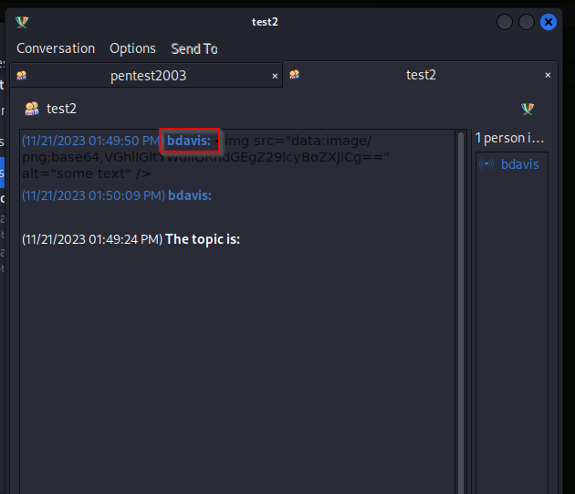
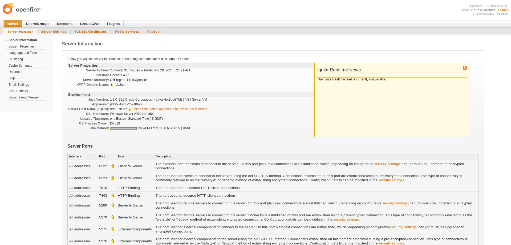

# Jab Writeup
<figure></figure>

## Target IP: 10.10.11.4
Nmap Scan: 
```
┌──(kali㉿kali)-[~]
└─$ nmap -Pn 10.10.11.4 
PORT     STATE SERVICE
53/tcp   open  d    omain
88/tcp   open  kerberos-sec
135/tcp  open  msrpc
139/tcp  open  netbios-ssn
445/tcp  open  microsoft-ds
464/tcp  open  kpasswd5
593/tcp  open  http-rpc-epmap
3268/tcp open  globalcatLDAP
3269/tcp open  globalcatLDAPssl
5222/tcp open  xmpp-client
5269/tcp open  xmpp-server
7070/tcp open  realserver
7443/tcp open  oracleas-https
7777/tcp open  cbt
```

With a more detailed nmap scan, we found `dc01.jab.htb` which I added to my `/etc/hosts` file.

I searched a bit about xmpp and found that we can use `pidgin`, so I installed it.

```
$ sudo apt update
$ sudo apt install pidgin
```

We can create an account using jab.htb.
<figure></figure>

In the advanced tab, enter the target IP address in connect server.

<figure></figure>

We also do the client registration.

<figure></figure>

Once its connected, we install the following plugins from the Tools tab.

<figure></figure>

On opening the service discovery prompt. We find chatrooms, proxy, user search etc.

We only have access to test2 chat on our account.

<figure><figure>

## User Flag

We found out the username `bdavis` and password  `Welcome1`. Logging into it once again, we find another chatroom `Pentest2003`.

I found a hash with the cracked password in the chat.

```
$krb5tgs$23$*svc_openfire$JAB.HTB$jab.htb/svc_openfire*$de17a01e2449626571bd9416dd4e3d46$4fea18693e1cb97f3e096288a76204437f115fe49b9611e339154e0effb1d0fcccfbbbb219da829b0ac70e8420f2f35a4f315c5c6f1d4ad3092e14ccd506e9a3bd3d20854ec73e62859cd68a7e6169f3c0b5ab82064b04df4ff7583ef18bbd42ac529a5747102c2924d1a76703a30908f5ad41423b2fff5e6c03d3df6c0635a41bea1aca3e15986639c758eef30b74498a184380411e207e5f3afef185eaf605f543c436cd155823b7a7870a3d5acd0b785f999facd8b7ffdafe6e0410af26efc42417d402f2819d03b3730203b59c21b0434e2e0e7a97ed09e3901f523ba52fe9d3ee7f4203de9e857761fbcb417d047765a5a01e71aff732e5d5d114f0b58a8a0df4ca7e1ff5a88c532f5cf33f2e01986ac44a353c0142b0360e1b839bb6889a54fbd9c549da23fb05193a4bfba179336e7dd69380bc4f9c3c00324e42043ee54b3017a913f84a20894e145b23b440aff9c524efb7957dee89b1e7b735db292ca5cb32cf024e9b8f5546c33caa36f5370db61a9a3facb473e741c61ec7dbee7420c188e31b0d920f06b7ffc1cb86ace5db0f9eeaf8c13bcca743b6bf8b2ece99dd58aff354f5b4a78ffcd9ad69ad8e7812a2952806feb9b411fe53774f92f9e8889380dddcb59de09320094b751a0c938ecc762cbd5d57d4e0c3d660e88545cc96e324a6fef226bc62e2bb31897670929571cd728b43647c03e44867b148428c9dc917f1dc4a0331517b65aa52221fcfe9499017ab4e6216ced3db5837d10ad0d15e07679b56c6a68a97c1e851238cef84a78754ff5c08d31895f0066b727449575a1187b19ad8604d583ae07694238bae2d4839fb20830f77fffb39f9d6a38c1c0d524130a6307125509422498f6c64adc030bfcf616c4c0d3e0fa76dcde0dfc5c94a4cb07ccf4cac941755cfdd1ed94e37d90bd1b612fee2ced175aa0e01f2919e31614f72c1ff7316be4ee71e80e0626b787c9f017504fa717b03c94f38fe9d682542d3d7edaff777a8b2d3163bc83c5143dc680c7819f405ec207b7bec51dabcec4896e110eb4ed0273dd26c82fc54bb2b5a1294cb7f3b654a13b4530bc186ff7fe3ab5a802c7c91e664144f92f438aecf9f814f73ed556dac403daaefcc7081957177d16c1087f058323f7aa3dfecfa024cc842aa3c8ef82213ad4acb89b88fc7d1f68338e8127644cfe101bf93b18ec0da457c9136e3d0efa0d094994e1591ecc4:!@#$%^&*(1qazxsw
```

Hence we found `svc_openfire:!@#$%^&*(1qazxsw`.

Got reverse shell using `dcomexec`.

<figure></figure>

The user flag can be found at the desktop.

## Root Flag

Connect the machine with chisel to get reverse proxy of the openfire service hosted on the machine.

<figure></figure>

Also we were able to login with the same `svc_openfire` credentials we found before to open the dashboard.

<figure></figure>

On uploading the malicious plugin, we were able to get the root shell by using the management tool section.

<figure></figure>

And the machine is rooted.

<figure></figure>

Thank you!! Happy Hacking :D